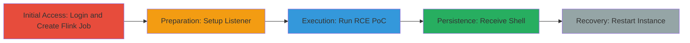

# Apache Flink RCE via Unrestricted Jar Plan API Endpoint Leading to Reverse Shell

Multi-stage attack chain demonstrating exploitation of Apache Flink's unrestricted API endpoint in Aiven to achieve RCE, deploy a reverse shell using a JavaScript gadget, and pivot within the network, though it results in instance crash.

## Chain Metrics Dashboard

| Metric | Value |
|--------|-------|
| Chain Status | Unverified |
| Total Steps | 5 |
| Execution Time | ~10 minutes |
| Skill Level | Intermediate |
| Complexity | Medium |
| Impact Level | High |

## Attack Flow Visualization



## Prerequisites & Requirements

### Required Tools

- [[tools/netcat]]
- [[tools/python]]

### Target Environment

- Aiven Cloud platform with Apache Flink service
- Access to Flink Web UI and API (ports 8081 for UI, API endpoints)
- Valid Aiven credentials

### Initial Access Requirements

- Aiven account credentials
- Network access to Aiven console and Flink instance
- No prior shell access needed, but authenticated session required

## Detailed Attack Procedures

### Step 1: Access Aiven and Create Flink Job
procedure: [[procedures/Access-Aiven-and-Create-Flink-Job]]

**Objective**: Gain access to the Aiven console, create a SQL job to deploy a Flink jar, and verify its presence for later exploitation.

**Instructions**: Log in to the Aiven console using provided credentials, then execute a SQL job to upload or create a jar file (e.g., ID: 145df7ff-c71a-4f3a-b77a-ee4055b1bede_a.jar). Open the Flink Web UI to confirm the job in the jobs panel.

**Expected Output**: Jar file created and visible in Flink UI jobs list.

**Success Indicators**:
- Successful login to Aiven
- New job appears in Flink UI

### Step 2: Setup Netcat Reverse Shell Listener
procedure: [[procedures/Setup-Netcat-Reverse-Shell-Listener]]

**Objective**: Prepare a listener on the attacker's machine to receive the incoming reverse shell from the exploited Flink server.

**Instructions**: Use [[commands/nc-reverse-shell-listener]] to start listening on port 8888:

```bash
nc -n -lvp 8888
```

**Expected Output**: Listener active, waiting for connections.

**Success Indicators**:
- Netcat process running and bound to port 8888
- No firewall blocks on port

### Step 3: Prepare and Execute Flink RCE PoC
procedure: [[procedures/Prepare-and-Execute-Flink-RCE-PoC]]

**Objective**: Customize and run the Python PoC script to send a malicious request to the /jars/{jar_id}/plan endpoint, triggering RCE via JavaScript gadget.

**Instructions**: Update the poc.py script with target details (host, jar ID, listener IP/port). Then execute using [[commands/python-poc-execution]]:

```bash
python3 poc.py
```

The script crafts a GET request with entry-class=com.sun.tools.script.shell.Main and programArg to load remote JS for reverse shell.

**Expected Output**: HTTP request sent, RCE triggered, Flink crashes.

**Success Indicators**:
- PoC script runs without errors
- Incoming connection to listener

### Step 4: Receive Reverse Shell Connection
procedure: [[procedures/Receive-Reverse-Shell-Connection]]

**Objective**: Capture the reverse shell from the exploited server and execute commands for pivoting or data exfiltration.

**Instructions**: Monitor the netcat listener for the incoming connection from the Flink server. Once connected, run commands like whoami or ls to verify access.

**Expected Output**: Interactive shell prompt from Flink server.

**Success Indicators**:
- Reverse shell established
- Commands execute on target (e.g., id command shows Flink user)

### Step 5: Restart Flink Instance After Crash
procedure: [[procedures/Restart-Flink-Instance-After-Crash]]

**Objective**: Recover the crashed Flink instance by re-running a SQL job to recreate the jar and enable further exploitation.

**Instructions**: Return to Aiven console and re-execute the SQL job to restart Flink and redeploy the jar.

**Expected Output**: Flink instance restarts, new jar ID available.

**Success Indicators**:
- Flink UI accessible again
- Job recreated without errors

## Attack Chain Summary

### Key Achievements

1. Authenticated access to Aiven Flink for job creation
2. RCE via API gadget chain leading to reverse shell
3. Network pivoting potential before instance crash
4. Ability to restart for repeated exploitation

## Technique & Tactic Coverage

### MITRE ATT&CK Techniques

- [[Exploit Public-Facing Application]]
- [[JavaScript]]

### MITRE ATT&CK Tactics

- [[Execution]]

---
*Last updated: 2023-10-01T00:00:00Z*
