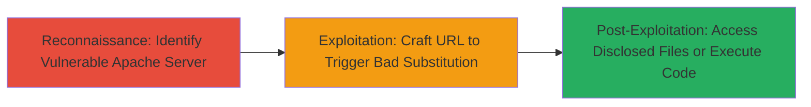

---
tags:
  - apache
  - mod_rewrite
  - path-traversal
  - source-disclosure
  - rce
  - cve-2024-38475
type: attack_chain
tools: []
tactics:
  - '[[Initial Access]]'
  - '[[Execution]]'
commands:
  - '[[commands/curl-mod_rewrite-test]]'
platforms:
  - Web
complexity: medium
procedures:
  - '[[procedures/Exploit-Apache-mod_rewrite-Improper-Escaping]]'
step_count: 1
techniques:
  - '[[Exploit Public-Facing Application]]'
description: >-
  Exploit improper output escaping in Apache HTTP Server's mod_rewrite module to
  map crafted URLs to unintended but permitted filesystem locations, enabling
  source code disclosure or code execution.
skill_level: intermediate
impact_level: high
id: f698d8e7-b32a-4393-8dee-4260ec2cfd35
created_at: '2025-12-14T17:26:21.654Z'
updated_at: '2025-12-14T17:26:21.654Z'
verified: false
validated: true
submitted: true
mitre_tactics:
  - '[[Initial Access]]'
  - '[[Execution]]'
mitre_techniques:
  - '[[Exploit Public-Facing Application]]'
---
# Apache mod_rewrite Improper Escaping for Unintended Filesystem Access (CVE-2024-38475)

Multi-stage attack chain demonstrating exploitation of CVE-2024-38475 in Apache HTTP Server versions 2.4.0 to 2.4.59, where improper escaping in mod_rewrite substitutions allows attackers to bypass access controls and serve files from unintended filesystem paths. Discovered by Orange Tsai from DEVCORE and fixed in version 2.4.60, this vulnerability targets server-context RewriteRules using backreferences (e.g., $1) or variables (e.g., %{REQUEST_URI}) as the first segment of the substitution, enabling path traversal-like behavior to disclose source code or execute arbitrary files if permissions allow.

## Chain Metrics Dashboard

| Metric | Value |
|--------|-------|
| Chain Status | Unverified |
| Total Steps | 1 |
| Execution Time | ~5 minutes |
| Skill Level | Intermediate |
| Complexity | Medium |
| Impact Level | High |

## Attack Flow Visualization



## Prerequisites & Requirements

### Required Tools

- None (uses standard HTTP client like curl)

### Target Environment

- Apache HTTP Server 2.4.0 - 2.4.59 with mod_rewrite enabled
- Server-context RewriteRules using backreferences or variables in substitutions
- Web platform with filesystem permissions allowing serving of certain paths

### Initial Access Requirements

- Network access to the public-facing Apache server (no credentials needed)
- Knowledge of existing RewriteRule configurations (infer from error responses or common setups)

## Detailed Attack Procedures

### Step 1: Exploit mod_rewrite Substitution
procedure: [[procedures/Exploit-Apache-mod_rewrite-Improper-Escaping]]

**Objective**: Craft and send an HTTP request that exploits improper escaping in mod_rewrite substitutions to map the URL to an unintended filesystem path, such as sensitive configuration files or source code directories.

**Instructions**: Identify a vulnerable endpoint influenced by a RewriteRule (e.g., one rewriting to a path using $1 or %{var} as the first segment). Use [[commands/curl-mod_rewrite-test]] to send a crafted request with path traversal elements in the URL segments that trigger the backreference or variable substitution:

```bash
curl -v "http://target.example.com/%2e%2e/%2e%2e/etc/passwd" -H "Host: vulnerable"
```

Monitor the response for served content from unintended paths. If the rule allows, escalate to accessing executable scripts for RCE by targeting CGI-enabled directories.

**Expected Output**: HTTP response serving file contents (e.g., /etc/passwd or .htaccess source) instead of a 404 or access denial.

**Success Indicators**:
- Server returns file contents not directly accessible via standard URLs
- Response headers indicate serving from an unexpected path (e.g., via error logs or verbose output)
- Potential RCE if targeted path contains executable files

## Attack Chain Summary

### Key Achievements

1. Bypassed URL-to-filesystem mapping restrictions in mod_rewrite
2. Disclosed sensitive source code or configuration files
3. Enabled potential remote code execution on misconfigured servers

## Technique & Tactic Coverage

### MITRE ATT&CK Techniques

- [[Exploit Public-Facing Application]]

### MITRE ATT&CK Tactics

- [[Initial Access]]
- [[Execution]]

---
*Last updated: 2024-10-01T00:00:00Z*
