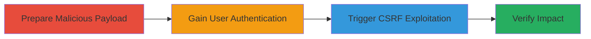

---
tags:
  - csrf
  - wordpress
  - web-vulnerability
  - theme-modification
type: attack_chain
tools: []
tactics:
  - '[[Initial Access]]'
commands: []
verified: false
platforms:
  - Web
submitted: true
complexity: low
created_at: '2023-10-01T00:00:00Z'
procedures:
  - '[[procedures/Create-Malicious-CSRF-HTML-for-WordPress-Background-Change]]'
  - '[[procedures/Authenticate-as-WordPress-Administrator]]'
  - '[[procedures/Trigger-CSRF-Form-Submission-in-WordPress]]'
  - '[[procedures/Verify-WordPress-Background-Image-Change]]'
step_count: 4
techniques:
  - '[[Exploit Public-Facing Application]]'
updated_at: '2025-12-14T17:27:42.763Z'
description: >-
  A multi-stage attack exploiting a CSRF vulnerability in the deprecated
  wp_set_background_image AJAX endpoint in WordPress to trick an authenticated
  administrator into changing the site's background image to an arbitrary media
  attachment, potentially obscuring site content.
skill_level: intermediate
impact_level: medium
id: 14b38cfb-0016-4817-937a-72db268cbcf0
validated: true
mitre_tactics:
  - '[[Initial Access]]'
mitre_techniques:
  - '[[Exploit Public-Facing Application]]'
---
# Arbitrary Background Image Change via CSRF in Deprecated WordPress Endpoint

Multi-stage attack chain demonstrating a complete attack workflow exploiting a CSRF vulnerability in WordPress's deprecated background image setting endpoint.

## Chain Metrics Dashboard

| Metric | Value |
|--------|-------|
| Chain Status | Unverified |
| Total Steps | 4 |
| Execution Time | ~5 minutes |
| Skill Level | Intermediate |
| Complexity | Low |
| Impact Level | Medium |

## Attack Flow Visualization

## Prerequisites & Requirements

### Required Tools

- Web browser (e.g., Chrome, Firefox)
- Text editor for HTML creation

### Target Environment

- WordPress site (version 3.5.0 or later, where endpoint is deprecated but still active)
- PHP-based web server hosting WordPress
- Access to the target's media library with an existing image attachment

### Initial Access Requirements

- Ability to deliver the malicious HTML to the target administrator (e.g., via email or phishing)
- No direct network access to the WordPress admin panel required beyond tricking the user
- Target user must have 'edit_theme_options' capability (typically administrators)

## Detailed Attack Procedures

### Step 1: Prepare Malicious Payload
procedure: [[procedures/Create-Malicious-CSRF-HTML-for-WordPress-Background-Change]]

**Objective**: Create a malicious HTML file that, when submitted by an authenticated user, sends a forged request to the vulnerable WordPress endpoint to change the background image.

**Instructions**: Use a text editor to craft an HTML form targeting the wp_ajax_set-background-image action. Replace [WP] with the target domain and set attachment_id to an existing media ID (e.g., 5 for a thumbnail-sized image that repeats and obscures text).

**Expected Output**: A saved HTML file (e.g., csrf-exploit.html) ready for delivery to the victim.

**Success Indicators**:
- HTML file created without syntax errors
- Form action points to the correct AJAX endpoint

### Step 2: Ensure Victim Authentication
procedure: [[procedures/Authenticate-as-WordPress-Administrator]]

**Objective**: Confirm the target administrator is logged in to the WordPress site using the same browser session that will interact with the malicious HTML.

**Instructions**: The victim must log in to the WordPress admin dashboard (e.g., https://[WP]/wp-admin/) with administrator credentials. This establishes the authenticated session cookies necessary for the CSRF to succeed.

**Expected Output**: Successful login, with the user able to access admin functions.

**Success Indicators**:
- Admin dashboard accessible
- User session active (visible in browser dev tools under cookies)

### Step 3: Trigger the Exploitation
procedure: [[procedures/Trigger-CSRF-Form-Submission-in-WordPress]]

**Objective**: Trick the authenticated administrator into opening and submitting the malicious HTML form, forging a POST request to the unprotected endpoint.

**Instructions**: Deliver the HTML file to the victim (e.g., via email link) and have them open it in the browser while logged in. The form auto-submits or prompts a click, sending POST data to https://[WP]/wp-admin/admin-ajax.php with action=set-background-image, attachment_id=5, and size=thumbnail.

**Expected Output**: The request is sent cross-origin without CSRF token validation, updating the site's background.

**Success Indicators**:
- Form submission completes without errors
- No nonce required, request succeeds due to missing protection

### Step 4: Validate the Impact
procedure: [[procedures/Verify-WordPress-Background-Image-Change]]

**Objective**: Confirm the background image has been altered to the attacker's chosen media attachment, potentially making the site unreadable.

**Instructions**: Visit the WordPress homepage (https://[WP]/) and inspect the theme's background style. Check for the repeating image from attachment_id=5 obscuring text content.

**Expected Output**: Site background changed to the specified image, repeating across the page.

**Success Indicators**:
- Background image updated in theme customizer or CSS
- Site readability impaired if image is opaque or patterned

## Attack Chain Summary

### Key Achievements

1. Bypassed CSRF protections in a deprecated but active WordPress endpoint
2. Modified site theme options without direct authentication as the attacker
3. Demonstrated potential for denial-of-service via content obscuration

## Technique & Tactic Coverage

### MITRE ATT&CK Techniques

- [[Exploit Public-Facing Application]]

### MITRE ATT&CK Tactics

- [[Initial Access]]

---
*Last updated: 2023-10-01T00:00:00Z*
