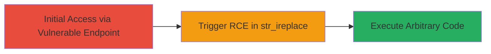

# Arbitrary Code Execution via PHP str_ireplace Vulnerability

Multi-stage attack chain demonstrating a complete attack workflow.

## Chain Metrics Dashboard

| Metric | Value |
|--------|-------|
| Chain Status | Unverified |
| Total Steps | 1 |
| Execution Time | ~5 minutes |
| Skill Level | Intermediate |
| Complexity | Medium |
| Impact Level | High |

## Attack Flow Visualization



## Prerequisites & Requirements

### Required Tools

- None specific; uses standard HTTP client like curl.

### Target Environment

- PHP web application (versions affected: prior to patch for CVE-2015-6527)
- Web server exposing PHP endpoints
- No specific ports beyond standard HTTP/HTTPS (80/443)

### Initial Access Requirements

- Network access to the web application
- Knowledge of input fields processed by str_ireplace
- No prior credentials needed for unauthenticated endpoints

## Detailed Attack Procedures

### Step 1: Trigger RCE via str_ireplace
procedure: [[procedures/Exploit-PHP-str_ireplace-RCE]]

**Objective**: Exploit the implementation flaw in PHP's str_ireplace function to execute arbitrary code on the server.

**Instructions**: Identify an endpoint that uses str_ireplace for user input processing, such as search or replacement features. Craft a malicious input payload that leverages the vulnerability to inject and execute PHP code. Send the payload via HTTP POST or GET to the vulnerable endpoint.

For example, use curl to send a request:

```bash
curl -X POST http://target.com/vulnerable-endpoint -d "search=malicious_payload_here"
```

The payload exploits the case-insensitive replacement logic in str_ireplace, which can lead to unintended code evaluation when certain patterns match PHP execution contexts.

**Expected Output**: Server response indicating code execution, such as output from system commands or file writes confirming RCE.

**Success Indicators**:
- Anomalous server response containing executed command output
- Evidence of file creation or system changes on the server (e.g., via subsequent requests)
- Logs showing PHP errors or warnings related to str_ireplace

## Attack Chain Summary

### Key Achievements

1. Gain initial access to a public-facing PHP application
2. Trigger arbitrary code execution without authentication
3. Achieve full server compromise for further persistence or data exfiltration

## Technique & Tactic Coverage

### MITRE ATT&CK Techniques

- [[Exploit Public-Facing Application]]
- [[Python]]

### MITRE ATT&CK Tactics

- [[Initial Access]]
- [[Execution]]

---
*Last updated: 2023-10-01T12:00:00Z*
