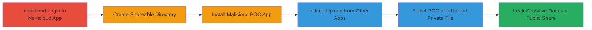

# Arbitrary File Access in Nextcloud Android App via Path Traversal Bypass in File Upload

Multi-stage attack chain demonstrating exploitation of path validation flaw in Nextcloud Android app's FileUploader.java, allowing upload of private files (e.g., /data/user/0/com.nextcloud.client/shared_prefs/com.nextcloud.client_preferences.xml) to publicly shareable folders, leading to sensitive data leakage.

## Chain Metrics Dashboard

| Metric | Value |
|--------|-------|
| Chain Status | Unverified |
| Total Steps | 5 |
| Execution Time | ~10 minutes |
| Skill Level | Intermediate |
| Complexity | Medium |
| Impact Level | High |

## Attack Flow Visualization

## Prerequisites & Requirements

### Required Tools

- Android device or emulator
- APK installer (e.g., built with Android Studio)

### Target Environment

- Android OS (tested on API 30+)
- Nextcloud Android app (com.nextcloud.client) version vulnerable to CVE or similar (pre-fix for report 1408692)
- No specific ports or services; local app interaction

### Initial Access Requirements

- Physical or emulated Android device access
- Ability to install APKs (developer mode or sideloading enabled)
- Nextcloud server account for login

## Detailed Attack Procedures

### Step 1: Install and Login to Nextcloud Android Client
procedure: [[procedures/Install-and-Login-to-Nextcloud-Android-Client]]

**Objective**: Set up the vulnerable Nextcloud app on the target device to enable file upload functionality.

**Instructions**: Download and install the Nextcloud Android app from a provider like https://us.cloudamo.com/. Open the app and authenticate with valid Nextcloud server credentials.

**Expected Output**: Successful login, app dashboard visible.

**Success Indicators**:
- App installed and logged in without errors
- Access to file management features confirmed

### Step 2: Create Shareable Directory in Nextcloud App
procedure: [[procedures/Create-Shareable-Directory-in-Nextcloud-App]]

**Objective**: Prepare a public folder in Nextcloud to receive and share the leaked private file.

**Instructions**: Within the app, navigate to the root or desired location, create a new folder (e.g., "PublicLeak"), and enable public sharing permissions via the share menu.

**Expected Output**: Folder created with public link generation option available.

**Success Indicators**:
- Folder visible in app
- Public sharing toggle enabled

### Step 3: Install Malicious POC App for File URI Provision
procedure: [[procedures/Install-Malicious-POC-App-for-File-URI-Provision]]

**Objective**: Deploy a custom APK that provides URIs to protected files, bypassing the app's path checks.

**Instructions**: Build and install an APK containing the EvilActivity class. Use Android Studio to compile the code that returns a URI like "file:///data/user/0/com.nextcloud.client/shared_prefs/com.nextcloud.client_preferences.xml".

**Expected Output**: POC app (named "poc") installed successfully.

**Success Indicators**:
- App listed in device apps
- No installation errors

### Step 4: Initiate File Upload from Other Apps in Nextcloud
procedure: [[procedures/Initiate-File-Upload-from-Other-Apps-in-Nextcloud]]

**Objective**: Trigger the file picker intent to allow selection from external apps, exploiting the upload mechanism.

**Instructions**: In the Nextcloud app, navigate to the shareable folder, tap the '+' button, and select "Upload content from other apps" to open the intent resolver.

**Expected Output**: File picker dialog opens, listing available apps.

**Success Indicators**:
- Upload menu accessed
- External app selector appears

### Step 5: Select POC App to Upload Protected File
procedure: [[procedures/Select-POC-App-to-Upload-Protected-File]]

**Objective**: Use the POC app to supply a private file URI, bypassing path validation and uploading to the public folder.

**Instructions**: From the file picker, select the "poc" app. The EvilActivity will set the result with the private URI and finish, allowing the Nextcloud app to upload the file without blocking the '/data/user/0/' path.

**Expected Output**: File (e.g., preferences.xml) appears in the shareable folder.

**Success Indicators**:
- Private file uploaded successfully
- Public share link accessible, revealing sensitive data like auth tokens

## Attack Chain Summary

### Key Achievements

1. Bypassed path validation using '/data/user/0/' instead of '/data/data/'
2. Leaked private app data (e.g., preferences.xml containing credentials) to public Nextcloud folder
3. Demonstrated arbitrary file read via intent-based file provision in Android ecosystem

## Technique & Tactic Coverage

### MITRE ATT&CK Techniques

- [[File and Directory Discovery]] File and Directory Discovery
- [[Unsecured Credentials]] Unsecured Credentials
- [[Multi-Factor Authentication Request Generation]] User Execution

### MITRE ATT&CK Tactics

- [[Discovery]] Discovery
- [[Collection]] Collection

---
*Last updated: 2023-10-01T00:00:00Z*
