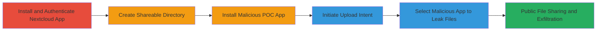

---
tags:
  - android
  - nextcloud
  - file-leak
  - intent-exploitation
  - arbitrary-read
type: attack_chain
tools:
  - '[[tools/setresultcontactphotocrop]]'
tactics:
  - '[[Discovery]]'
  - '[[Collection]]'
verified: false
platforms:
  - Android
submitted: true
complexity: medium
created_at: '2023-10-01T00:00:00Z'
procedures:
  - '[[procedures/Install-and-Authenticate-Nextcloud-Android-App]]'
  - '[[procedures/Create-Shareable-Directory-in-Nextcloud]]'
  - '[[procedures/Install-Malicious-POC-App-for-Intent-Exploitation]]'
  - '[[procedures/Initiate-File-Upload-via-GET_CONTENT-Intent]]'
  - '[[procedures/Trigger-File-Leak-by-Selecting-Malicious-App]]'
step_count: 5
techniques:
  - '[[Data from Local System]]'
  - '[[File and Directory Discovery]]'
updated_at: '2025-12-14T17:24:42.812Z'
description: >-
  Multi-stage attack exploiting the Nextcloud Android client's upload feature to
  leak sensitive files from the app's private directory using a malicious app
  that responds to GET_CONTENT intents with unauthorized file URIs.
skill_level: intermediate
impact_level: high
id: 116bd4d0-f9af-4595-bf1c-4c41c573aa52
validated: true
mitre_tactics:
  - '[[Discovery]]'
  - '[[Collection]]'
mitre_techniques:
  - '[[Data from Local System]]'
  - '[[File and Directory Discovery]]'
---
# Arbitrary File Read in Nextcloud Android Client via Malicious GET_CONTENT Intent Exploitation

Multi-stage attack chain demonstrating exploitation of the Nextcloud Android client's 'upload content from other apps' feature, allowing a malicious app to return URIs to private app files, leading to their public sharing and leakage of sensitive data like account preferences, databases, and keys.

## Chain Metrics Dashboard

| Metric | Value |
|--------|-------|
| Chain Status | Unverified |
| Total Steps | 5 |
| Execution Time | ~5 minutes |
| Skill Level | Intermediate |
| Complexity | Medium |
| Impact Level | High |

## Attack Flow Visualization

## Prerequisites & Requirements

### Required Tools

- [[tools/setresultcontactphotocrop]]

### Target Environment

- Android OS (tested on recent versions supporting Nextcloud client)
- Nextcloud Android app installed
- No specific ports or services beyond local app interactions

### Initial Access Requirements

- Physical or remote access to install apps on the target Android device
- User interaction to select the malicious app in the intent chooser
- Nextcloud account credentials for authentication

## Detailed Attack Procedures

### Step 1: Install and Authenticate Nextcloud App
procedure: [[procedures/Install-and-Authenticate-Nextcloud-Android-App]]

**Objective**: Set up the vulnerable Nextcloud Android client on the target device and authenticate to access shareable features.

**Instructions**: Download the official Nextcloud Android app from the Google Play Store or APK source. Launch the app and enter valid Nextcloud server credentials to log in, enabling access to file management and sharing functionalities.

**Expected Output**: Successful login with access to the app's file browser and upload options.

**Success Indicators**:
- App dashboard loads with user files visible
- Authentication token established in app preferences

### Step 2: Create Shareable Directory
procedure: [[procedures/Create-Shareable-Directory-in-Nextcloud]]

**Objective**: Prepare a directory within the Nextcloud app that can be used for public sharing, setting the stage for file upload exploitation.

**Instructions**: Navigate to the file browser in the Nextcloud app, create a new folder, and enable sharing permissions by toggling the share option to allow public links or external access.

**Expected Output**: A new directory appears in the app with sharing enabled, ready for file uploads.

**Success Indicators**:
- Directory listed in app with share icon active
- Share link generation possible

### Step 3: Install Malicious POC App
procedure: [[procedures/Install-Malicious-POC-App-for-Intent-Exploitation]]

**Objective**: Deploy a custom malicious app that intercepts GET_CONTENT intents and returns URIs to sensitive files in the Nextcloud app's private directory.

**Instructions**: Compile and install the POC app 'setresultcontactphotocrop' on the device. The app includes an EvilActivity that responds to android.intent.action.GET_CONTENT with a file URI like file:///data/data/com.nextcloud.client/shared_prefs/com.nextcloud.client_preferences.xml. Ensure the manifest registers the activity for mimeType '*/*' with DEFAULT and OPENABLE categories.

**Expected Output**: App installed without errors, ready to appear in intent choosers.

**Success Indicators**:
- App icon visible on device home screen
- Logcat shows "EvilActivity started!" on launch

### Step 4: Initiate File Upload via GET_CONTENT Intent
procedure: [[procedures/Initiate-File-Upload-via-GET_CONTENT-Intent]]

**Objective**: Trigger the vulnerable upload feature in Nextcloud to broadcast a GET_CONTENT intent, presenting the chooser for external apps.

**Instructions**: In the shareable directory, tap the '+' button to add files, then select 'Upload content from other apps'. This launches the Android intent chooser for selecting a content provider.

**Expected Output**: Intent chooser dialog appears listing available apps, including the malicious POC.

**Success Indicators**:
- Chooser dialog displays with multiple app options
- No immediate errors in app logs

### Step 5: Trigger File Leak by Selecting Malicious App
procedure: [[procedures/Trigger-File-Leak-by-Selecting-Malicious-App]]

**Objective**: Select the malicious app in the chooser to return a private file URI, causing Nextcloud to upload and publicly share the sensitive file.

**Instructions**: In the intent chooser, select the 'setresultcontactphotocrop' app. The EvilActivity sets the result to the private URI and finishes, allowing Nextcloud to read and upload the file (e.g., preferences.xml containing account details) to the shareable directory.

**Expected Output**: The sensitive file appears in the shareable directory and can be accessed via public share link.

**Success Indicators**:
- File uploaded to Nextcloud with contents from private directory
- Public share link exposes leaked data like tokens or keys

## Attack Chain Summary

### Key Achievements

1. Successful installation and authentication in Nextcloud Android app
2. Deployment of malicious intent responder app
3. Leakage of private files including preferences, databases, and keys via public sharing
4. Demonstration of arbitrary file read without root or additional privileges
5. Potential for further exfiltration of WebView cookies and temporary files

## Technique & Tactic Coverage

### MITRE ATT&CK Techniques

- [[Data from Local System]] Data from Local System
- [[File and Directory Discovery]] File and Directory Discovery

### MITRE ATT&CK Tactics

- [[Discovery]] Discovery
- [[Collection]] Collection

---
*Last updated: 2023-10-01T00:00:00Z*
