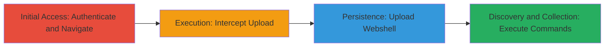

---
tags:
  - file-upload
  - rce
  - command-injection
  - webshell
  - asp
  - windows
type: attack_chain
tools:
  - '[[tools/Burp-Suite]]'
  - '[[tools/curl]]'
tactics:
  - '[[Initial Access]]'
  - '[[Execution]]'
  - '[[Discovery]]'
  - '[[Collection]]'
verified: false
platforms:
  - Web
  - Windows
submitted: true
created_at: '2023-10-01T00:00:00Z'
procedures:
  - '[[procedures/Access-and-Authenticate-to-Resume-Upload-Endpoint]]'
  - '[[procedures/Intercept-and-Modify-Upload-Request-with-Burp-Suite]]'
  - '[[procedures/Upload-Malicious-ASP-Webshell]]'
  - '[[procedures/Execute-OS-Commands-via-Webshell-with-Curl]]'
step_count: 4
techniques:
  - '[[Exploit Public-Facing Application]]'
  - '[[Remote File Copy]]'
  - '[[Windows Command Shell]]'
updated_at: '2025-12-14T05:32:22.974Z'
description: >-
  Multi-stage attack exploiting file upload restrictions on
  ecjobs.starbucks.com.cn to upload an ASP webshell, achieving remote code
  execution via OS command injection for directory listing and source code
  disclosure.
id: b186f1dc-a5a4-4053-8f7a-a2cdb0c30ca1
validated: true
mitre_tactics:
  - '[[Initial Access]]'
  - '[[Execution]]'
  - '[[Discovery]]'
  - '[[Collection]]'
mitre_techniques:
  - '[[Exploit Public-Facing Application]]'
  - '[[Remote File Copy]]'
  - '[[Windows Command Shell]]'
---
# Arbitrary File Upload Bypass Leading to ASP Webshell and RCE on Starbucks Job Portal

Multi-stage attack chain demonstrating exploitation of file type validation bypass in the resume upload functionality on ecjobs.starbucks.com.cn, leading to ASP webshell upload and remote code execution for internal file system access and source code disclosure.

## Chain Metrics Dashboard

| Metric | Value |
|--------|-------|
| Chain Status | Unverified |
| Total Steps | 4 |
| Execution Time | ~10 minutes |
| Skill Level | Intermediate |
| Complexity | Medium |
| Impact Level | High |

## Attack Flow Visualization

## Prerequisites & Requirements

### Required Tools

- [[tools/Burp-Suite]]
- [[tools/curl]]

### Target Environment

- Web application on Windows platform
- ASP.NET tech stack
- Access to https://ecjobs.starbucks.com.cn

### Initial Access Requirements

- Valid user credentials for site login
- Network access to the public-facing job portal
- No prior access needed beyond authentication

## Detailed Attack Procedures

### Step 1: Initial Access
procedure: [[procedures/Access-and-Authenticate-to-Resume-Upload-Endpoint]]

**Objective**: Gain authenticated access to the resume upload functionality to prepare for file submission.

**Instructions**: Sign in to the application using valid credentials and navigate to the resume upload section. This establishes a session for subsequent requests.

**Expected Output**: Successful login and access to the resume upload form.

**Success Indicators**:
- User dashboard visible
- Resume upload endpoint reachable

### Step 2: Intercept Upload Request
procedure: [[procedures/Intercept-and-Modify-Upload-Request-with-Burp-Suite]]

**Objective**: Capture the file upload request to enable modification for bypass.

**Instructions**: Configure Burp Suite as a proxy and submit a test file (e.g., .jpg avatar) to intercept the HTTP POST request to the resume endpoint.

**Expected Output**: Intercepted request visible in Burp Repeater or Proxy history.

**Success Indicators**:
- Request captured with multipart/form-data payload
- Session cookies preserved

### Step 3: Upload Webshell
procedure: [[procedures/Upload-Malicious-ASP-Webshell]]

**Objective**: Bypass file type restrictions to upload an executable ASP webshell.

**Instructions**: In Burp Suite, modify the filename by appending a space after .asp (e.g., shell.asp ) and inject the webshell code into the file content. Forward the modified request to upload the file to /recruitjob/tempfiles/.

**Expected Output**: HTTP 200 response indicating successful upload, with file saved as temp_uploaded_[GUID].asp.

**Success Indicators**:
- No validation error
- File accessible at uploaded path

### Step 4: Execute Commands
procedure: [[procedures/Execute-OS-Commands-via-Webshell-with-Curl]]

**Objective**: Leverage the webshell for OS command injection to list directories and disclose source code.

**Instructions**: Use curl to send GET requests to the webshell URL with ?getsc= parameter containing encoded Windows commands, such as dir for listing or type for file contents.

**Expected Output**: HTML response with command output in a textarea, including directory listings or source code.

**Success Indicators**:
- Command output displayed
- Access to internal paths like d:\TrustHX\STBKSERM101\www_app

## Attack Chain Summary

### Key Achievements

1. Bypassed file upload restrictions to deploy persistent webshell
2. Achieved remote code execution on Windows server
3. Disclosed internal directory structure and application source code
4. Demonstrated potential for further lateral movement

## Technique & Tactic Coverage

### MITRE ATT&CK Techniques

- [[Exploit Public-Facing Application]] Exploit Public-Facing Application
- [[Remote File Copy]] Ingress Tool Transfer
- [[Windows Command Shell]] Windows Command Shell

### MITRE ATT&CK Tactics

- [[Initial Access]] Initial Access
- [[Execution]] Execution
- [[Discovery]] Discovery
- [[Collection]] Collection

---

*Last updated: 2023-10-01T00:00:00Z*
