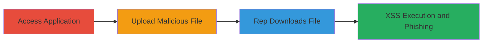

---
tags:
  - arbitrary-file-upload
  - stored-xss
  - web-vulnerability
  - dod
type: attack_chain
tools: []
tactics:
  - '[[Initial Access]]'
  - '[[Execution]]'
  - '[[Collection]]'
verified: false
platforms:
  - Web
submitted: true
complexity: medium
created_at: '2023-10-01T00:00:00Z'
procedures:
  - '[[procedures/Access-DoD-Support-Form]]'
  - '[[procedures/Upload-Malicious-File]]'
  - '[[procedures/Trigger-File-Download-by-Rep]]'
  - '[[procedures/Exploit-Stored-XSS-Payload]]'
step_count: 4
techniques:
  - '[[Remote File Copy]]'
  - '[[JavaScript]]'
  - '[[Exploit Public-Facing Application]]'
updated_at: '2025-12-14T03:16:02.475Z'
description: >-
  Multi-stage attack exploiting arbitrary file upload in a U.S. Department of
  Defense web application to upload malicious files, leading to potential remote
  code execution or stored XSS for credential theft.
skill_level: intermediate
impact_level: high
id: ea7ddfec-9c53-4a39-adb9-f263f2176665
validated: true
mitre_tactics:
  - '[[Initial Access]]'
  - '[[Execution]]'
  - '[[Collection]]'
mitre_techniques:
  - '[[Remote File Copy]]'
  - '[[JavaScript]]'
  - '[[Exploit Public-Facing Application]]'
---
# Arbitrary File Upload and Stored XSS in DoD Support Request Form

Multi-stage attack chain demonstrating a complete attack workflow.

## Chain Metrics Dashboard

| Metric | Value |
|--------|-------|
| Chain Status | Unverified |
| Total Steps | 4 |
| Execution Time | ~5 minutes |
| Skill Level | Intermediate |
| Complexity | Medium |
| Impact Level | High |

## Attack Flow Visualization

## Prerequisites & Requirements

### Required Tools

- Web browser (e.g., Chrome or Firefox)

### Target Environment

- Web application hosted by U.S. Department of Defense
- No specific ports required (standard HTTPS)
- Internet access to the redacted URL

### Initial Access Requirements

- No prior credentials needed; account creation is part of the attack
- Attacker positioned externally
- No special network access

## Detailed Attack Procedures

### Step 1: Access the Support Form
procedure: [[procedures/Access-DoD-Support-Form]]

**Objective**: Gain access to the vulnerable support request form by creating an account and navigating to the upload section.

**Instructions**: Open a web browser and navigate to the redacted DoD application URL. Register a new account by providing basic details, then log in. Click on the "Faculty/Staff IT Support" link, followed by the redacted support option to reach the form.

**Expected Output**: The support request form loads, including the file upload field.

**Success Indicators**:
- Account created and login successful
- Support form accessible with upload field visible

### Step 2: Upload Malicious File
procedure: [[procedures/Upload-Malicious-File]]

**Objective**: Exploit the arbitrary file upload vulnerability by submitting a malicious file through the form.

**Instructions**: Fill out the required form fields (e.g., name, email, description). Attach a malicious file such as an .exe executable or an .svg file containing an XSS payload (e.g., <svg onload=alert('XSS')>). Submit the form.

**Expected Output**: Form submission success message; request created with file attached.

**Success Indicators**:
- No upload restrictions encountered
- File accepted and request confirmed

### Step 3: Trigger File Download by Representative
procedure: [[procedures/Trigger-File-Download-by-Rep]]

**Objective**: Position the malicious file for download and execution by a support representative.

**Instructions**: After submission, the uploaded file becomes available in the support queue. Wait for a representative to access and download the file as part of processing the request.

**Expected Output**: Representative downloads the file (e.g., .exe runs malware, or .svg opens in browser).

**Success Indicators**:
- File listed in support dashboard for download
- Evidence of download (e.g., via logs if accessible)

### Step 4: Exploit Stored XSS Payload
procedure: [[procedures/Exploit-Stored-XSS-Payload]]

**Objective**: Execute the stored XSS payload to steal credentials or perform phishing.

**Instructions**: When the representative opens the .svg file in a browser, the XSS payload triggers. For advanced exploitation, use a payload that redirects to a fake login page or exfiltrates session data.

**Expected Output**: Alert box or redirect to phishing site; credentials captured if successful.

**Success Indicators**:
- JavaScript execution confirmed (e.g., alert pops)
- Credentials harvested or session hijacked

## Attack Chain Summary

### Key Achievements

1. Successful arbitrary file upload bypassing type validation
2. Compromise of support representative's machine via executable or XSS
3. Potential credential theft through phishing or session theft

## Technique & Tactic Coverage

### MITRE ATT&CK Techniques

- [[Remote File Copy]] Ingress Tool Transfer
- [[JavaScript]] JavaScript
- [[Exploit Public-Facing Application]] Exploit Public-Facing Application

### MITRE ATT&CK Tactics

- [[Initial Access]] Initial Access
- [[Execution]] Execution
- [[Collection]] Collection

---

*Last updated: 2023-10-01T00:00:00Z*
