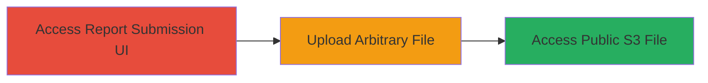

---
tags:
  - arbitrary-file-upload
  - aws-s3
  - malware-hosting
  - web-vulnerability
type: attack_chain
tools: []
tactics:
  - '[[Initial Access]]'
verified: false
platforms:
  - Web
  - AWS
submitted: true
complexity: low
created_at: '2023-10-01T00:00:00Z'
procedures:
  - '[[procedures/Arbitrary-File-Upload-via-HackerOne-Report-UI]]'
step_count: 2
techniques:
  - '[[Exploit Public-Facing Application]]'
updated_at: '2025-12-14T05:32:10.059Z'
description: >-
  Exploits lack of file validation in HackerOne's report submission UI to upload
  arbitrary files to a public AWS S3 bucket, enabling malware hosting and social
  engineering.
skill_level: intermediate
impact_level: high
id: 3c2f54f7-42d8-48f7-bab5-1a5048c2e32c
validated: true
mitre_tactics:
  - '[[Initial Access]]'
mitre_techniques:
  - '[[Exploit Public-Facing Application]]'
---
# Arbitrary File Upload to Public AWS S3 via HackerOne UI

Multi-stage attack chain demonstrating exploitation of unrestricted file uploads in the HackerOne platform's report submission UI, leading to public storage on AWS S3.

## Chain Metrics Dashboard

| Metric | Value |
|--------|-------|
| Chain Status | Unverified |
| Total Steps | 2 |
| Execution Time | ~5 minutes |
| Skill Level | Intermediate |
| Complexity | Low |
| Impact Level | High |

## Attack Flow Visualization

## Prerequisites & Requirements

### Required Tools

- Web browser (e.g., Chrome or Firefox)

### Target Environment

- HackerOne platform (web-based)
- AWS S3 service (hackerone-attachments.s3.amazonaws.com)

### Initial Access Requirements

- Valid HackerOne account (user registration may be required)
- No special credentials beyond basic user access
- Internet access to the HackerOne domain

## Detailed Attack Procedures

### Step 1: Access Report Submission UI
procedure: [[procedures/Arbitrary-File-Upload-via-HackerOne-Report-UI]]

**Objective**: Navigate to the file attachment feature in the HackerOne UI to prepare for upload.

**Instructions**: Log in to your HackerOne account and navigate to the report submission page. Locate the file attachment field typically used for submitting evidence with vulnerability reports.

**Expected Output**: UI form with file upload input visible.

**Success Indicators**:
- File attachment dialog opens
- No immediate validation errors on file selection

### Step 2: Upload and Verify Malicious File
procedure: [[procedures/Arbitrary-File-Upload-via-HackerOne-Report-UI]]

**Objective**: Upload an arbitrary file, such as a disguised malware executable, to the public S3 bucket.

**Instructions**: Select and upload a file with an innocent extension but malicious content, e.g., rename a payload executable to "msf-payload-x86.jpg.exe". Submit the report or attachment. After upload, note the generated AWS signed URL pointing to hackerone-attachments.s3.amazonaws.com.

**Expected Output**: File stored publicly on S3 with accessible URL; no upload restrictions enforced.

**Success Indicators**:
- Upload completes without errors
- File accessible via the provided S3 URL from any browser
- Potential for social engineering by sharing the URL

## Attack Chain Summary

### Key Achievements

1. Bypassed file type restrictions to store arbitrary content on public AWS S3
2. Enabled free hosting of potentially malicious files exploiting domain trust
3. Demonstrated risk of users downloading and executing disguised malware

## Technique & Tactic Coverage

### MITRE ATT&CK Techniques

- [[Exploit Public-Facing Application]]

### MITRE ATT&CK Tactics

- [[Initial Access]]

---

*Last updated: 2023-10-01T00:00:00Z*
