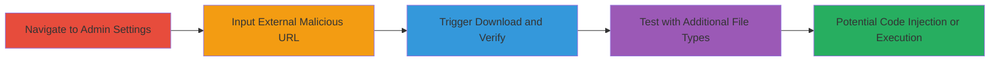

---
tags:
  - arbitrary-file-upload
  - xss
  - rce
  - expressionengine
  - php
type: attack_chain
tools:
  - '[[tools/HTTP-Proxy]]'
tactics:
  - '[[Initial Access]]'
  - '[[Execution]]'
verified: false
platforms:
  - Web
  - PHP
submitted: true
complexity: medium
created_at: '2023-10-01T00:00:00Z'
procedures:
  - '[[procedures/Navigate-to-ExpressionEngine-Admin-Profile-Settings]]'
  - '[[procedures/Input-Malicious-External-Avatar-URL]]'
  - '[[procedures/Trigger-and-Verify-File-Upload]]'
  - '[[procedures/Test-Arbitrary-File-Upload-with-Different-Types]]'
step_count: 4
techniques:
  - '[[Remote File Copy]]'
  - '[[Exploit Public-Facing Application]]'
  - '[[JavaScript]]'
updated_at: '2025-12-14T05:32:10.152Z'
description: >-
  Multi-stage attack exploiting arbitrary file upload in ExpressionEngine's
  admin avatar settings to upload malicious files like SVG with JavaScript or
  ZIP archives, enabling potential code injection or server-side execution.
skill_level: intermediate
impact_level: high
id: 827d9ea6-3661-4e55-9e21-a37df2171a9f
validated: true
mitre_tactics:
  - '[[Initial Access]]'
  - '[[Execution]]'
mitre_techniques:
  - '[[Remote File Copy]]'
  - '[[Exploit Public-Facing Application]]'
  - '[[JavaScript]]'
---
# Arbitrary File Upload via External Avatar Link in ExpressionEngine

Multi-stage attack chain demonstrating a complete attack workflow exploiting the lack of validation in ExpressionEngine's avatar upload feature, allowing arbitrary files to be downloaded and stored from external URLs.

## Chain Metrics Dashboard

| Metric | Value |
|--------|-------|
| Chain Status | Unverified |
| Total Steps | 4 |
| Execution Time | ~5 minutes |
| Skill Level | Intermediate |
| Complexity | Medium |
| Impact Level | High |

## Attack Flow Visualization

## Prerequisites & Requirements

### Required Tools

- [[tools/HTTP-Proxy]]

### Target Environment

- ExpressionEngine CMS running on PHP web server
- Administrative access to the control panel
- Network access to the target host

### Initial Access Requirements

- Valid admin credentials for ExpressionEngine
- Direct browser access to the admin interface
- No prior access needed beyond authentication

## Detailed Attack Procedures

### Step 1: Navigate to Admin Profile Settings
procedure: [[procedures/Navigate-to-ExpressionEngine-Admin-Profile-Settings]]

**Objective**: Access the avatar configuration section in the admin panel to prepare for file upload exploitation.

**Instructions**: Open a web browser and log in to the ExpressionEngine admin panel. Navigate to the profile settings page and locate the avatar change section.

**Expected Output**: The 'Change avatar' section is visible, including the 'Link to avatar' option.

**Success Indicators**:
- Admin panel loads successfully
- Avatar settings form is accessible

### Step 2: Input Malicious External Avatar URL
procedure: [[procedures/Input-Malicious-External-Avatar-URL]]

**Objective**: Supply an external URL pointing to a malicious file to bypass local upload restrictions.

**Instructions**: Select the 'Link to avatar' option in the form and enter a URL to a controlled malicious file, such as an SVG containing JavaScript (e.g., http://strukt.tk/test.svg).

**Expected Output**: The form accepts the URL without validation errors.

**Success Indicators**:
- URL input field populated
- No immediate rejection of the external link

### Step 3: Trigger and Verify File Upload
procedure: [[procedures/Trigger-and-Verify-File-Upload]]

**Objective**: Initiate the download process and confirm the file is stored on the server with executable content.

**Instructions**: Submit the form to trigger the avatar update. After redirection, monitor network traffic using [[tools/HTTP-Proxy]] or directly access the uploaded file URL (e.g., http://[HOST]/images/avatars/test_1.svg) in a browser to execute the payload.

**Expected Output**: An alert box pops up if using SVG with JavaScript, confirming XSS-like execution.

**Success Indicators**:
- File request observed in proxy or browser
- Malicious payload executes (e.g., alert triggered)

### Step 4: Test Arbitrary File Upload with Different Types
procedure: [[procedures/Test-Arbitrary-File-Upload-with-Different-Types]]

**Objective**: Demonstrate the vulnerability's scope by uploading non-image files to confirm arbitrary extension handling.

**Instructions**: Repeat the process with a different file type, such as a ZIP archive (e.g., https://ellislab.com/asset/file/ee_server_wizard.zip), and verify the file appears in the avatars directory with its original extension.

**Expected Output**: A .zip file is created and accessible at http://[HOST]/images/avatars/[filename].zip.

**Success Indicators**:
- Non-image file stored without content-type checks
- Potential for further exploitation like archive extraction leading to RCE

## Attack Chain Summary

### Key Achievements

1. Bypassed file upload validation using external links
2. Uploaded and executed JavaScript via SVG for client-side impact
3. Demonstrated arbitrary file storage, enabling server-side attacks like code injection

## Technique & Tactic Coverage

### MITRE ATT&CK Techniques

- [[Remote File Copy]]
- [[Exploit Public-Facing Application]]
- [[JavaScript]]

### MITRE ATT&CK Tactics

- [[Initial Access]]
- [[Execution]]

---
*Last updated: 2023-10-01T00:00:00Z*
