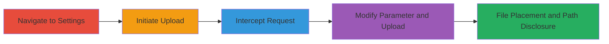

---
tags:
  - arbitrary-file-upload
  - information-disclosure
  - nextcloud
  - web-vulnerability
type: attack_chain
tools:
  - '[[tools/Burp-Suite]]'
tactics:
  - '[[Initial Access]]'
  - '[[Discovery]]'
verified: false
platforms:
  - Web
submitted: true
created_at: '2024-01-01T00:00:00Z'
procedures:
  - '[[procedures/Navigate-to-Nextcloud-Theming-Settings]]'
  - '[[procedures/Initiate-Logo-or-Favicon-Upload]]'
  - '[[procedures/Intercept-Upload-Request-with-Burp-Suite]]'
  - '[[procedures/Modify-Key-Parameter-for-Arbitrary-Filename]]'
step_count: 4
techniques:
  - '[[Exploit Public-Facing Application]]'
  - '[[Gather Victim Host Information]]'
updated_at: '2025-12-14T17:28:51.883Z'
description: >-
  Authenticated administrator exploits Nextcloud's theming upload to control
  filenames, enabling arbitrary file placement and path disclosure.
id: cfe189ec-f57a-4a06-86a6-afbe7ef0436e
validated: true
mitre_tactics:
  - '[[Initial Access]]'
  - '[[Discovery]]'
mitre_techniques:
  - '[[Exploit Public-Facing Application]]'
  - '[[Gather Victim Host Information]]'
---
# Arbitrary File Upload via Nextcloud Theming Key Parameter Manipulation

Multi-stage attack chain demonstrating exploitation of Nextcloud's theming feature to control uploaded file names, allowing arbitrary file placement in the web directory and revealing server paths via error responses.

## Chain Metrics Dashboard

| Metric | Value |
|--------|-------|
| Chain Status | Unverified |
| Total Steps | 4 |
| Execution Time | ~5 minutes |
| Skill Level | Intermediate |
| Complexity | Medium |
| Impact Level | High |

## Attack Flow Visualization

## Prerequisites & Requirements

### Required Tools

- [[tools/Burp-Suite]]

### Target Environment

- Nextcloud instance (PHP-based web application)
- Authenticated administrator access
- Web browser and proxy setup

### Initial Access Requirements

- Valid admin credentials for Nextcloud
- Local or network access to the Nextcloud server (e.g., http://localhost)
- Burp Suite configured as proxy

## Detailed Attack Procedures

### Step 1: Navigate to Theming Settings
procedure: [[procedures/Navigate-to-Nextcloud-Theming-Settings]]

**Objective**: Access the admin interface for theming to prepare for file upload.

**Instructions**: Open a web browser and log in as an administrator. Navigate directly to the theming settings page.

**Expected Output**: Theming settings interface loads, showing options for logo and favicon uploads.

**Success Indicators**:
- Admin theming page accessible at /settings/admin/theming
- Upload sections visible for logo or favicon

### Step 2: Initiate Logo or Favicon Upload
procedure: [[procedures/Initiate-Logo-or-Favicon-Upload]]

**Objective**: Trigger the file upload process to generate the vulnerable POST request.

**Instructions**: In the theming settings, select an image file (e.g., PNG or ICO) and initiate the upload for logo or favicon.

**Expected Output**: Upload request is sent, but intercepted if proxy is active.

**Success Indicators**:
- File selection dialog opens
- POST request to upload endpoint initiated

### Step 3: Intercept Upload Request with Burp Suite
procedure: [[procedures/Intercept-Upload-Request-with-Burp-Suite]]

**Objective**: Capture the HTTP POST request to inspect and modify parameters.

**Instructions**: Configure your browser to proxy through Burp Suite. During upload, intercept the request containing the file and 'key' parameter.

**Expected Output**: Request details visible in Burp, including multipart form data with 'key'.

**Success Indicators**:
- Request intercepted successfully
- 'key' parameter present in POST body

### Step 4: Modify Key Parameter for Arbitrary Filename
procedure: [[procedures/Modify-Key-Parameter-for-Arbitrary-Filename]]

**Objective**: Alter the filename control to place files arbitrarily and observe path disclosure.

**Instructions**: In the intercepted request, change the 'key' value to a desired filename (e.g., '../../etc/passwd' for traversal). Forward the request and check for error responses revealing paths.

**Expected Output**: File uploaded with controlled name; errors may disclose server paths like /var/www/nextcloud/.

**Success Indicators**:
- File stored with attacker-specified name in web directory
- Error messages reveal internal paths for reconnaissance

## Attack Chain Summary

### Key Achievements

1. Controlled filename upload bypassing standard storage logic
2. Placement of arbitrary files in web root for potential further exploits
3. Path disclosure aiding reconnaissance and traversal attacks

## Technique & Tactic Coverage

### MITRE ATT&CK Techniques

- [[Exploit Public-Facing Application]] Exploit Public-Facing Application
- [[Gather Victim Host Information]] Gather Victim Host Information

### MITRE ATT&CK Tactics

- [[Initial Access]] Initial Access
- [[Discovery]] Discovery

---
*Last updated: 2024-01-01T00:00:00Z*
