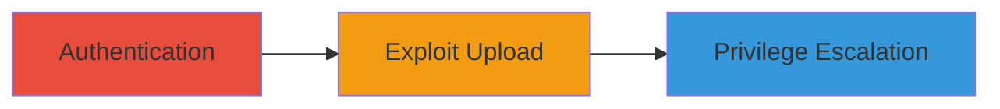

---
tags:
  - arbitrary-file-upload
  - privilege-escalation
  - directory-traversal
  - web-vulnerability
type: attack_chain
tools: []
tactics:
  - '[[Privilege Escalation]]'
verified: false
platforms:
  - Web
submitted: true
created_at: '2024-10-01T00:00:00Z'
procedures:
  - '[[procedures/Exploit-Arbitrary-File-Upload-via-Profile-Photo]]'
step_count: 1
techniques:
  - '[[Exploit Public-Facing Application]]'
  - '[[Hijack Execution Flow]]'
updated_at: '2025-12-14T05:32:22.911Z'
description: >-
  Authenticated users exploit the profile photo upload vulnerability in Stripo
  Inc to upload files to arbitrary directories, including other users' folders,
  with any extension, leading to critical privilege escalation through file
  overwrites or malicious content placement.
id: 10893ddc-cc47-4fdc-a309-5fa9777f1b82
validated: true
mitre_tactics:
  - '[[Privilege Escalation]]'
mitre_techniques:
  - '[[Exploit Public-Facing Application]]'
  - '[[Hijack Execution Flow]]'
---
---

# Arbitrary File Upload via Profile Photo Feature for Privilege Escalation

Multi-stage attack chain demonstrating a complete attack workflow exploiting the Stripo Inc profile photo upload feature to achieve privilege escalation by uploading files to unauthorized directories.

## Chain Metrics Dashboard

| Metric | Value |
|--------|-------|
| Chain Status | Unverified |
| Total Steps | 1 |
| Execution Time | ~5 minutes |
| Skill Level | Intermediate |
| Complexity | Medium |
| Impact Level | High |

## Attack Flow Visualization

## Prerequisites & Requirements

### Required Tools

- [[tools/Burp-Suite]]

### Target Environment

- Web application (Stripo Inc platform)
- Required services/ports: HTTPS on port 443
- Network access requirements: Direct access to the web application

### Initial Access Requirements

- Valid authenticated session (user credentials required)
- Network position: Internal or external with login access
- Prior access needed: None beyond authentication

## Detailed Attack Procedures

### Step 1: Exploit Arbitrary File Upload
procedure: [[procedures/Exploit-Arbitrary-File-Upload-via-Profile-Photo]]

**Objective**: Manipulate the profile photo upload request to place a file in an arbitrary directory, such as another user's folder, to overwrite files or inject malicious content, achieving privilege escalation.

**Instructions**: Authenticate to the Stripo Inc application, navigate to the profile photo upload feature, intercept the upload request using a proxy tool like Burp Suite, modify the path parameter to include directory traversal sequences (e.g., ../../users/otheruser/), and submit a file with a dangerous extension like .php or .js. For example, use a Burp Repeater to alter the request body or parameters specifying the upload path.

**Expected Output**: Successful upload confirmation, with the file appearing in the target directory (verifiable via application logs or direct access if possible).

**Success Indicators**:
- File upload succeeds without errors
- Target directory contains the uploaded file
- Potential signs of privilege escalation, such as altered user data or executed malicious content

## Attack Chain Summary

### Key Achievements

1. Bypassed upload path restrictions to access arbitrary directories
2. Enabled file overwrites in other users' spaces
3. Achieved critical privilege escalation impacting multiple users

## Technique & Tactic Coverage

### MITRE ATT&CK Techniques

- [[Exploit Public-Facing Application]]
- [[Hijack Execution Flow]]

### MITRE ATT&CK Tactics

- [[Privilege Escalation]]

---

*Last updated: 2024-10-01T00:00:00Z*
