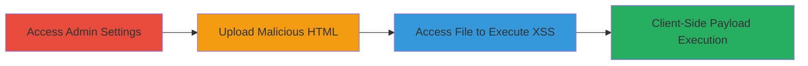

---
tags:
  - arbitrary-file-upload
  - xss
  - nextcloud
  - theming
  - client-side-execution
type: attack_chain
tools: []
tactics:
  - '[[Execution]]'
  - '[[Collection]]'
verified: false
platforms:
  - Web
submitted: true
complexity: medium
created_at: '2023-10-01T00:00:00Z'
procedures:
  - '[[procedures/Access-Nextcloud-Theming-Settings]]'
  - '[[procedures/Upload-Malicious-HTML-File-via-Theming]]'
  - '[[procedures/Trigger-XSS-by-Accessing-Uploaded-File]]'
step_count: 3
techniques:
  - '[[Exploit Public-Facing Application]]'
  - '[[JavaScript]]'
updated_at: '2025-12-14T05:32:09.970Z'
description: >-
  An attack chain exploiting the lack of file validation in Nextcloud's theming
  upload feature to upload malicious HTML files disguised as images, enabling
  client-side XSS execution when accessed via data directory paths. Requires
  administrative access.
skill_level: intermediate
impact_level: medium
id: 9a1081be-1d1a-4b04-9dd4-ab2c21279418
validated: true
mitre_tactics:
  - '[[Execution]]'
  - '[[Collection]]'
mitre_techniques:
  - '[[Exploit Public-Facing Application]]'
  - '[[JavaScript]]'
---
# Arbitrary HTML Upload via Nextcloud Theming Settings Leading to Client-Side XSS

Multi-stage attack chain demonstrating exploitation of Nextcloud's theming upload vulnerability to achieve client-side XSS without server-side code execution.

## Chain Metrics Dashboard

| Metric | Value |
|--------|-------|
| Chain Status | Unverified |
| Total Steps | 3 |
| Execution Time | ~5 minutes |
| Skill Level | Intermediate |
| Complexity | Medium |
| Impact Level | Medium |

## Attack Flow Visualization

## Prerequisites & Requirements

### Required Tools

- Web browser (e.g., Chrome or Firefox with developer tools for payload testing)

### Target Environment

- Nextcloud instance (any version prior to patch for this issue)
- Web platform with PHP backend
- Administrative access to Nextcloud

### Initial Access Requirements

- Valid admin credentials for Nextcloud login
- Direct network access to the Nextcloud web interface
- No prior access beyond admin privileges needed

## Detailed Attack Procedures

### Step 1: Access Theming Settings
procedure: [[procedures/Access-Nextcloud-Theming-Settings]]

**Objective**: Gain entry to the administrative theming interface to prepare for file upload.

**Instructions**: Log in to the Nextcloud instance as an administrator and navigate to the theming settings. This step establishes the foothold in the admin panel required for the upload feature.

**Expected Output**: Theming settings page loaded, showing options for logo and login background image uploads.

**Success Indicators**:
- Admin dashboard accessible
- Upload fields visible for logo and login images

### Step 2: Upload Malicious HTML File
procedure: [[procedures/Upload-Malicious-HTML-File-via-Theming]]

**Objective**: Exploit the unvalidated upload to store a malicious HTML file in the data directory, disguised as an image.

**Instructions**: Prepare an HTML file containing JavaScript payload (e.g., alert('XSS') or session-stealing script). Upload it through the logo or login image field, even renaming it with a .png extension. The file will be saved without validation to paths like ../data/themedinstancelogo.

**Expected Output**: Upload success message; file stored in the specified data directory.

**Success Indicators**:
- No upload errors
- File verifiable in server data directory (if accessible)

### Step 3: Trigger XSS Execution
procedure: [[procedures/Trigger-XSS-by-Accessing-Uploaded-File]]

**Objective**: Access the uploaded file directly to execute the embedded HTML/JS client-side, demonstrating XSS impact.

**Instructions**: Construct and visit a URL pointing to the uploaded file, such as http://example.com/nextcloud/data/themedinstancelogo/malicious.html or with .png extension. The browser will render it as HTML, executing any scripts.

**Expected Output**: Malicious script executes in the browser (e.g., alert popup or network request for exfiltration).

**Success Indicators**:
- HTML content loads and scripts run
- No server-side errors; client-side execution confirmed

## Attack Chain Summary

### Key Achievements

1. Bypassed file type validation in Nextcloud theming uploads
2. Stored and served arbitrary HTML as an image file
3. Achieved client-side XSS execution via direct data path access

## Technique & Tactic Coverage

### MITRE ATT&CK Techniques

- [[Exploit Public-Facing Application]] Exploit Public-Facing Application
- [[JavaScript]] JavaScript

### MITRE ATT&CK Tactics

- [[Execution]] Execution
- [[Collection]] Collection

---
*Last updated: 2023-10-01T00:00:00Z*
