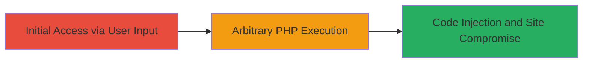

---
tags:
  - php
  - unserialize
  - rce
  - code-injection
  - web
type: attack_chain
tools: []
tactics:
  - '[[Execution]]'
verified: false
platforms:
  - Web
submitted: true
complexity: medium
created_at: '2023-10-01T00:00:00Z'
procedures:
  - '[[procedures/Exploit-PHP-Unserialize-Arbitrary-Function-Invocation]]'
step_count: 1
techniques:
  - '[[Exploit Public-Facing Application]]'
  - '[[Python]]'
updated_at: '2025-12-14T17:28:44.257Z'
description: >-
  A critical vulnerability in the PHP backend of www.rockstargames.com allowing
  arbitrary PHP function invocation through unsafe unserialization of
  user-controlled input, leading to potential code injection and site
  compromise.
skill_level: intermediate
impact_level: high
id: 989a5394-b202-4331-80c9-ebf81d841980
validated: true
mitre_tactics:
  - '[[Execution]]'
mitre_techniques:
  - '[[Exploit Public-Facing Application]]'
  - '[[Python]]'
---
---

# Arbitrary PHP Function Invocation via Unsafe Unserialize on Rockstar Games

Multi-stage attack chain demonstrating a complete attack workflow exploiting unsafe PHP unserialize for arbitrary function calls.

## Chain Metrics Dashboard

| Metric | Value |
|--------|-------|
| Chain Status | Unverified |
| Total Steps | 1 |
| Execution Time | ~5 minutes |
| Skill Level | Intermediate |
| Complexity | Medium |
| Impact Level | High |

## Attack Flow Visualization



## Prerequisites & Requirements

### Required Tools

- None (uses standard HTTP client like curl)

### Target Environment

- Web platform with PHP backend
- Exposed user input endpoint vulnerable to unserialize
- Network access to www.rockstargames.com

### Initial Access Requirements

- No credentials required (public-facing)
- Direct HTTP access to the target site
- No prior access needed

## Detailed Attack Procedures

### Step 1: Exploit Unserialize Vulnerability
procedure: [[procedures/Exploit-PHP-Unserialize-Arbitrary-Function-Invocation]]

**Objective**: Craft and submit a malicious serialized payload to invoke arbitrary PHP functions, demonstrating code injection.

**Instructions**: Identify the user input field (e.g., via form or API endpoint) that is unserialized in the PHP backend. Craft a serialized object that triggers function invocation upon unserialization, such as using a class with __wakeup or __destruct magic methods. Send the payload using [[commands/curl-send-unserialize-payload]]:

```bash
curl -X POST -d "user_input=O:21:\"Security\"":1:{s:4:\"_ake\";s:6:\"system\";s:4:\"_exe\";s:7:\"id\";}" https://www.rockstargames.com/vulnerable-endpoint
```

Validate the response for signs of execution, such as output from the invoked function (e.g., 'uid=33(www-data)' if 'id' was called).

**Expected Output**: Server response containing output from the arbitrary function, indicating successful invocation.

**Success Indicators**:
- Response includes executed command output
- No serialization errors; function runs despite disabled harmful functions

## Attack Chain Summary

### Key Achievements

1. Successful arbitrary PHP function invocation via unserialize
2. Demonstration of code injection potential on a public-facing web application
3. Highlighting critical impact even with mitigated dangerous functions

## Technique & Tactic Coverage

### MITRE ATT&CK Techniques

- [[Exploit Public-Facing Application]]
- [[Python]]

### MITRE ATT&CK Tactics

- [[Execution]]

---

*Last updated: 2023-10-01T00:00:00Z*
