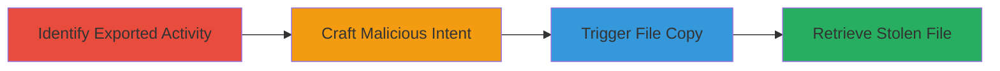

---
tags:
  - android
  - file-theft
  - exported-activity
  - improper-access-control
  - intent-injection
type: attack_chain
tools:
  - '[[tools/Android-Debug-Bridge-ADB]]'
tactics:
  - '[[Initial Access]]'
  - '[[Collection]]'
verified: false
platforms:
  - Android
submitted: true
complexity: medium
created_at: '2023-10-01T00:00:00Z'
procedures:
  - '[[procedures/Identify-Exported-Activity-in-Android-App]]'
  - '[[procedures/Craft-Malicious-Intent-for-Private-File-Targeting]]'
  - '[[procedures/Trigger-File-Copy-via-Exported-Activity]]'
  - '[[procedures/Retrieve-Copied-File-from-Public-Directory]]'
step_count: 4
techniques:
  - '[[Exploit Public-Facing Application]]'
  - '[[Data from Cloud Storage]]'
updated_at: '2025-12-14T17:24:42.075Z'
description: >-
  Multi-stage attack exploiting an exported Android activity in LINE Lite
  (versions before 2.17.0) to steal arbitrary private files by copying them to
  public storage without URI validation.
skill_level: intermediate
impact_level: high
id: 3752dce7-5583-431c-974a-799c9b550c80
validated: true
mitre_tactics:
  - '[[Initial Access]]'
  - '[[Collection]]'
mitre_techniques:
  - '[[Exploit Public-Facing Application]]'
  - '[[Data from Cloud Storage]]'
---
# Arbitrary Private File Theft in LINE Lite Android Client via Unverified Exported Activity

Multi-stage attack chain demonstrating exploitation of an exported activity in the LINE Lite Android app (versions before 2.17.0) to steal sensitive private files from the app's internal storage. A malicious app sends a crafted intent with an unverified URI, causing the target app to copy private files to external public storage, enabling unauthorized access to user data like chat histories or media.

## Chain Metrics Dashboard

| Metric | Value |
|--------|-------|
| Chain Status | Unverified |
| Total Steps | 4 |
| Execution Time | ~10 minutes |
| Skill Level | Intermediate |
| Complexity | Medium |
| Impact Level | High |

## Attack Flow Visualization

## Prerequisites & Requirements

### Required Tools

- [[tools/Android-Debug-Bridge-ADB]]

### Target Environment

- Target OS/Platform: Android device with LINE Lite app (versions < 2.17.0) installed
- Required services/ports: USB debugging enabled for ADB access; no network ports needed
- Network access requirements: Local device access (same physical device or emulator)

### Initial Access Requirements

- Credential requirements: None (requires physical or ADB access to device)
- Network position: Local (device-level)
- Prior access needed: Installed malicious app or ADB shell access

## Detailed Attack Procedures

### Step 1: Identify Exported Activity

procedure: [[procedures/Identify-Exported-Activity-in-Android-App]]

**Objective**: Locate the vulnerable exported activity in the LINE Lite app to understand the entry point for intent injection.

**Instructions**: Use ADB to pull and analyze the AndroidManifest.xml or employ app analysis tools to list exported components.

**Expected Output**: Confirmation of com.linecorp.linelite.ui.android.share.SelectShareActivity as exported without URI checks.

**Success Indicators**:
- Exported activity identified in manifest
- No validation logic noted in activity handling

### Step 2: Craft Malicious Intent for Private File Targeting

procedure: [[procedures/Craft-Malicious-Intent-for-Private-File-Targeting]]

**Objective**: Prepare a crafted Android Intent targeting a private file URI in LINE Lite's internal storage.

**Instructions**: Develop a simple malicious app or use ADB to construct the intent with a content URI like content://com.linecorp.linelite.file_provider/path/to/private/file, requiring user interaction to launch.

**Expected Output**: Intent ready for sending, pointing to a sensitive file such as a chat database or media.

**Success Indicators**:
- Intent crafted without errors
- URI resolves to private app storage path

### Step 3: Trigger File Copy via Exported Activity

procedure: [[procedures/Trigger-File-Copy-via-Exported-Activity]]

**Objective**: Send the intent to the exported activity, causing it to copy the private file to public external storage.

**Instructions**: Launch the intent via the malicious app or ADB shell, simulating user share action to invoke SelectShareActivity.

**Expected Output**: Private file copied to a public directory like /sdcard/Download/ without validation.

**Success Indicators**:
- Activity launches successfully
- File appears in public storage

### Step 4: Retrieve Copied File from Public Directory

procedure: [[procedures/Retrieve-Copied-File-from-Public-Directory]]

**Objective**: Access and exfiltrate the copied private file from the public directory.

**Instructions**: Use the malicious app or ADB to read the file from external storage and optionally send it off-device.

**Expected Output**: Sensitive data extracted, such as user messages or files.

**Success Indicators**:
- File readable from public path
- Data contents match expected private information

## Attack Chain Summary

### Key Achievements

1. Identification of vulnerable exported component in LINE Lite
2. Successful injection of crafted intent to bypass URI validation
3. Copying of arbitrary private files to accessible storage
4. Unauthorized access to sensitive user data

## Technique & Tactic Coverage

### MITRE ATT&CK Techniques

- [[Exploit Public-Facing Application]] Exploit Public-Facing Application
- [[Data from Cloud Storage]] Data from Cloud Storage (adapted for local app storage access)

### MITRE ATT&CK Tactics

- [[Initial Access]] Initial Access
- [[Collection]] Collection

---
*Last updated: 2023-10-01T00:00:00Z*
