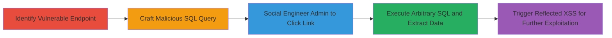

# Arbitrary SQL Execution and Reflected XSS via Tricked Admin in ExpressionEngine SQL Query Form

Multi-stage attack chain demonstrating exploitation of the ExpressionEngine SQL Query Form module, allowing arbitrary SQL execution limited to SELECT and SHOW queries for data extraction, combined with reflected XSS via unencoded MySQL errors for JavaScript execution in the admin's browser. The attack relies on social engineering to trick an authenticated admin into accessing a crafted URL, potentially leading to full database disclosure and session hijacking.

## Chain Metrics Dashboard

| Metric | Value |
|--------|-------|
| Chain Status | Unverified |
| Total Steps | 4 |
| Execution Time | ~5 minutes |
| Skill Level | Intermediate |
| Complexity | Medium |
| Impact Level | High |

## Attack Flow Visualization



## Prerequisites & Requirements

### Required Tools

- Browser or [[commands/curl-send-query]] for testing

### Target Environment

- ExpressionEngine CMS (version vulnerable to CVE or similar, e.g., pre-patch for this issue)
- Web platform with admin access to /admin.php
- MySQL database backend
- No specific ports beyond standard HTTP/HTTPS (80/443)

### Initial Access Requirements

- Knowledge of target domain
- Ability to communicate with admin (e.g., via email for phishing)
- No prior credentials needed, but attack executes in admin's authenticated session

## Detailed Attack Procedures

### Step 1: Identify Vulnerable Endpoint
procedure: [[procedures/Identify-and-Craft-SQL-Query-for-ExpressionEngine]]

**Objective**: Locate the SQL Query Form module endpoint in the ExpressionEngine admin interface to prepare for exploitation.

**Instructions**: Access the admin panel and navigate to the utilities section. The vulnerable endpoint is at `/admin.php?/cp/utilities/query/run-query`, which processes GET requests with Base64-encoded SQL in the `thequery` parameter without validation.

**Expected Output**: Confirmation of the endpoint URL, e.g., `http://target.com/admin.php?/cp/utilities/query/run-query`.

**Success Indicators**:
- Endpoint accessible in admin interface
- Parameter `thequery` accepted in GET requests

### Step 2: Craft Malicious SQL Query
procedure: [[procedures/Identify-and-Craft-SQL-Query-for-ExpressionEngine]]

**Objective**: Encode a malicious SQL query (e.g., SELECT from sensitive tables) in Base64 to bypass direct input restrictions.

**Instructions**: Use [[commands/base64-encode-query]] to encode a query like `SELECT * FROM exp_members`:

```bash
echo -n 'SELECT * FROM exp_members' | base64 -w 0
```

This outputs `c2VsZWN0ICogZnJvbSBleHBfbWVtYmVycw==`. Append to the URL: `http://target.com/admin.php?/cp/utilities/query/run-query&thequery=c2VsZWN0ICogZnJvbSBleHBfbWVtYmVycw==`.

**Expected Output**: Base64-encoded string ready for URL injection.

**Success Indicators**:
- Valid Base64 string generated
- Query decodes correctly when tested locally

### Step 3: Deliver Malicious Link to Admin
procedure: [[procedures/Deliver-Malicious-Link-to-Admin]]

**Objective**: Trick an authenticated admin into clicking the crafted URL to execute the SQL in their session.

**Instructions**: Send the URL via phishing email or social engineering, e.g., "Check this query report: [URL]". When clicked, it executes in the admin's browser session.

**Expected Output**: Admin accesses the URL, running the SQL and displaying results (e.g., member table data).

**Success Indicators**:
- Admin reports clicking or unexpected query results appear
- Data from database tables visible in response

### Step 4: Trigger Reflected XSS
procedure: [[procedures/Trigger-Reflected-XSS-in-Query-Form]]

**Objective**: Exploit unencoded MySQL errors by submitting a malformed query to execute JavaScript in the admin's browser.

**Instructions**: Encode an XSS payload like `SELECT <svg onload=alert(1)>` using [[commands/base64-encode-query]]:

```bash
echo -n 'SELECT <svg onload=alert(1)>' | base64 -w 0
```

Output: `c2VsZWN0IDxzdmcgb25sb2FkPWFsZXJ0KDEpPg==`. Use in URL: `http://target.com/admin.php?/cp/utilities/query/run-query&thequery=c2VsZWN0IDxzdmcgb25sb2FkPWFsZXJ0KDEpPg==`. The malformed query triggers a MySQL error that reflects the payload unencoded.

**Expected Output**: JavaScript alert or executed code in browser, e.g., alert(1) pops up.

**Success Indicators**:
- XSS payload executes (e.g., alert fires)
- Potential for stealing cookies or further JS-based attacks

## Attack Chain Summary

### Key Achievements

1. Bypassed validation to execute arbitrary read-only SQL queries, extracting sensitive data like user tables.
2. Leveraged social engineering for initial execution without direct access.
3. Chained with reflected XSS to enable browser-based attacks like session theft.
4. Demonstrated high impact on admin sessions and database integrity.

## Technique & Tactic Coverage

### MITRE ATT&CK Techniques

- [[Exploit Public-Facing Application]] Exploit Public-Facing Application
- [[JavaScript]] JavaScript
- [[T1566.001]] Phishing: Spearphishing Link

### MITRE ATT&CK Tactics

- [[Initial Access]] Initial Access
- [[Execution]] Execution
- [[Collection]] Collection

---
*Last updated: 2023-10-01T00:00:00Z*
