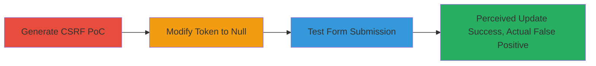

# Attempted CSRF Bypass in Files.com Configuration Form via Authenticity Token Nullification

This attack chain outlines the process of testing for a Cross-Site Request Forgery (CSRF) vulnerability in the Files.com (BrickFTP) site configuration general form. The perceived vulnerability involved bypassing the authenticity_token by setting it to null, potentially allowing unauthorized changes to sensitive settings like site name, email, subdomain, and security policies. The PoC was generated using Burp Suite, modified, and tested via JavaScript submission. However, the attempt failed due to a application bug sending duplicate authenticity_tokens, where the unmodified second token enforced protection, resulting in a false positive. Despite this, the report earned a $100 bounty for highlighting the issue.

## Chain Metrics Dashboard

| Metric | Value |
|--------|-------|
| Chain Status | Unverified |
| Total Steps | 3 |
| Execution Time | ~5 minutes |
| Skill Level | Intermediate |
| Complexity | Medium |
| Impact Level | Medium |

## Attack Flow Visualization

## Prerequisites & Requirements

### Required Tools

- [[tools/Burp-Suite-Professional]]

### Target Environment

- Web platform
- Files.com (BrickFTP) service
- Ruby on Rails application (inferred from CSRF token usage)
- Access to a logged-in session (cookies required for withCredentials)

### Initial Access Requirements

- Valid user session on the target Files.com instance (e.g., https://gaming2.brickftp.com)
- Network access to the target endpoint
- Browser or JavaScript environment to host and execute the PoC HTML

## Detailed Attack Procedures

### Step 1: Generate CSRF PoC
procedure: [[procedures/Generate-CSRF-POC-with-Burp-Suite]]

**Objective**: Capture the legitimate form submission and generate a malicious HTML PoC to simulate CSRF against the configuration endpoint.

**Instructions**: Use Burp Suite to intercept the POST request to the site update endpoint and generate the PoC form.

**Expected Output**: An HTML file with a form that replicates the multipart/form-data submission, including the authenticity_token.

**Success Indicators**:
- PoC HTML generated successfully
- Form includes all original parameters like site[name], site[email], etc.

### Step 2: Modify Authenticity Token
procedure: [[procedures/Modify-Authenticity-Token-to-Null]]

**Objective**: Alter the CSRF protection by setting the authenticity_token to null, simulating a bypass attempt while keeping other parameters for testing unauthorized changes.

**Instructions**: Edit the generated HTML PoC to replace the token value with an empty string, and optionally modify payload parameters like site name and email for verification.

**Expected Output**: Modified HTML PoC with empty authenticity_token and altered site settings.

**Success Indicators**:
- Token field updated to empty value
- Payload parameters changed (e.g., site[name] = 'gamingtoooorrrrr')

### Step 3: Test Modified CSRF Form
procedure: [[procedures/Test-Modified-CSRF-Form-Submission]]

**Objective**: Execute the PoC to submit the forged request and observe if site configurations update without user interaction, confirming the perceived bypass.

**Instructions**: Load the PoC in a browser, ensure cookies are included via withCredentials, and trigger the submission function.

**Expected Output**: Apparent successful update (e.g., site name changed), but actual prevention by duplicate token.

**Success Indicators**:
- Request sent with 200 OK response
- Initial illusion of updated settings (false positive confirmed on investigation)

## Attack Chain Summary

### Key Achievements

1. Successfully generated and modified a CSRF PoC targeting Files.com's configuration form.
2. Demonstrated apparent bypass of authenticity_token, leading to perceived unauthorized updates.
3. Highlighted a application bug with duplicate tokens, earning a bounty despite false positive.

## Technique & Tactic Coverage

### MITRE ATT&CK Techniques

- [[Exploit Public-Facing Application]] Exploit Public-Facing Application
- [[Drive-by Compromise]] Drive-by Compromise

### MITRE ATT&CK Tactics

- [[Initial Access]] Initial Access
- [[Execution]] Execution

---
*Last updated: 2023-10-01T00:00:00Z*
