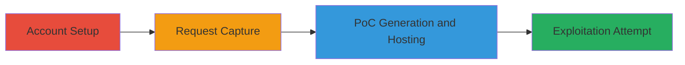

---
tags:
  - csrf
  - web
  - glassdoor
  - token-binding
type: attack_chain
tools:
  - '[[tools/Burp-Suite]]'
tactics:
  - '[[Initial Access]]'
verified: false
platforms:
  - Web
submitted: true
complexity: medium
created_at: '2023-10-01T00:00:00Z'
procedures:
  - '[[procedures/Account-Setup-for-CSRF-Testing]]'
  - '[[procedures/Capture-and-Analyze-Request-with-Burp-Suite]]'
  - '[[procedures/Generate-and-Host-CSRF-PoC]]'
  - '[[procedures/Attempt-Exploitation-on-Victim-Session]]'
step_count: 4
techniques:
  - '[[Drive-by Compromise]]'
updated_at: '2025-12-14T17:27:23.017Z'
description: >-
  An attempted multi-step attack to exploit a potential CSRF vulnerability in
  Glassdoor's demographic settings by capturing a legitimate request and
  crafting a PoC HTML form with an attacker's token, though ultimately
  ineffective due to browser-specific token binding.
skill_level: intermediate
impact_level: low
id: 7d58462e-267a-4578-b298-bb513dd3731a
validated: true
mitre_tactics:
  - '[[Initial Access]]'
mitre_techniques:
  - '[[Drive-by Compromise]]'
---
# Attempted CSRF Exploitation on Glassdoor Demographic Settings Using Cross-Account Token

Multi-stage attack chain attempting to exploit a potential CSRF vulnerability in Glassdoor's user demographic settings by reusing an attacker's gdToken in a crafted form to alter a victim's birth year, gender, and education details. The attack involves account creation, request interception with Burp Suite, PoC generation, and submission in a shared browser session. However, the exploit fails across different browsers or sessions due to the token's binding to a browser-specific gdId cookie and a ~10-minute expiration, rendering it not applicable as a vulnerability.

## Chain Metrics Dashboard

| Metric | Value |
|--------|-------|
| Chain Status | Unverified |
| Total Steps | 4 |
| Execution Time | ~15 minutes |
| Skill Level | Intermediate |
| Complexity | Medium |
| Impact Level | Low |

## Attack Flow Visualization

## Prerequisites & Requirements

### Required Tools

- [[tools/Burp-Suite]]

### Target Environment

- Web platform (Glassdoor application)
- Required services/ports: HTTPS on port 443
- Network access requirements: Internet access to Glassdoor.com

### Initial Access Requirements

- Attacker and victim email accounts (e.g., Attacker@mail.com, Victim@mail.com)
- Same browser session for testing (cross-browser fails due to gdId cookie)
- Valid Glassdoor accounts with login credentials

## Detailed Attack Procedures

### Step 1: Account Setup
procedure: [[procedures/Account-Setup-for-CSRF-Testing]]

**Objective**: Establish attacker and victim accounts to simulate the cross-account token reuse scenario.

**Instructions**: Create two separate Glassdoor accounts using distinct email addresses. Log in to the attacker account and navigate to the demographic settings page to prepare for request capture.

**Expected Output**: Two authenticated accounts ready for testing.

**Success Indicators**:
- Attacker account logged in at https://www.glassdoor.com/member/home/index.htm
- Victim account created but not yet logged in

### Step 2: Request Capture and Analysis
procedure: [[procedures/Capture-and-Analyze-Request-with-Burp-Suite]]

**Objective**: Intercept a legitimate demographic change request from the attacker's session to extract the gdToken and form parameters.

**Instructions**: Configure Burp Suite to intercept traffic, log in to the attacker account, modify demographic settings (e.g., change gender to FEMALE and birth year to 1940), and capture the POST request. Forward it to Repeater for inspection.

**Expected Output**: Captured POST request showing parameters like newGender=FEMALE, birthYear=1940, highestEducation=HIGH_SCHOOL, and gdToken.

**Success Indicators**:
- Request intercepted successfully in Burp Suite
- gdToken value extracted (e.g., a session-specific string tied to gdId cookie)

### Step 3: Generate and Host CSRF PoC
procedure: [[procedures/Generate-and-Host-CSRF-PoC]]

**Objective**: Craft an HTML form mimicking the captured request using the attacker's gdToken to target the victim's session.

**Instructions**: Use Burp Suite's CSRF PoC generator to create an HTML file that submits to https://www.glassdoor.com/member/account/settings_changeUserInformation.htm with the extracted parameters. Host the HTML file on a local or remote web server accessible via the victim's browser.

**Expected Output**: HTML form code ready for submission, e.g., <form action="https://www.glassdoor.com/member/account/settings_changeUserInformation.htm" method="POST"> with hidden inputs for parameters.

**Success Indicators**:
- PoC HTML file generated and hosted (e.g., at http://attacker-server/csrf-poc.html)
- Form loads correctly in browser without errors

### Step 4: Exploitation Attempt on Victim Session
procedure: [[procedures/Attempt-Exploitation-on-Victim-Session]]

**Objective**: Trick the victim into submitting the PoC form while authenticated in their session to alter demographics using the attacker's token.

**Instructions**: In the same browser, log in to the victim account, navigate to the hosted PoC page, and submit the form. Observe if the demographic changes apply (succeeds only in same browser/session due to token binding).

**Expected Output**: Form submission; in same browser, potential change to victim's settings (e.g., birth year updated to 1940); cross-browser fails with 403 or invalid token error.

**Success Indicators**:
- Form submits without CSRF errors in same session
- No changes occur across browsers, confirming mitigation

## Attack Chain Summary

### Key Achievements

1. Successfully captured and analyzed a legitimate demographic update request using Burp Suite.
2. Generated a functional CSRF PoC HTML form reusing the attacker's gdToken.
3. Demonstrated session-bound token behavior, highlighting why the vulnerability is not exploitable cross-session.

## Technique & Tactic Coverage

### MITRE ATT&CK Techniques

- [[Drive-by Compromise]]

### MITRE ATT&CK Tactics

- [[Initial Access]]

---
*Last updated: 2023-10-01T00:00:00Z*
