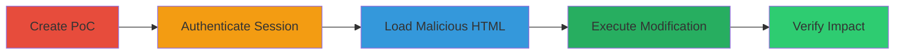

# Authenticated CSRF to Modify User Profile in LGTM Platform

Multi-stage attack chain demonstrating an authenticated CSRF exploit in the LGTM platform's savePublicInformation endpoint, allowing unauthorized profile changes that can facilitate phishing or malware distribution.

## Chain Metrics Dashboard

| Metric | Value |
|--------|-------|
| Chain Status | Unverified |
| Total Steps | 4 |
| Execution Time | ~5 minutes |
| Skill Level | Intermediate |
| Complexity | Medium |
| Impact Level | High |

## Attack Flow Visualization

## Prerequisites & Requirements

### Required Tools

- [[tools/Burp-Suite-Professional]]

### Target Environment

- Web platform: LGTM (https://lgtm-com.pentesting.semmle.net/)
- Required services/ports: HTTPS (443)
- Network access requirements: Direct internet access to LGTM domain

### Initial Access Requirements

- Valid attacker-controlled browser
- Target user's credentials for authentication (or social engineering to lure victim to PoC)
- No prior access needed beyond ability to host or deliver HTML PoC

## Detailed Attack Procedures

### Step 1: Create CSRF PoC HTML
procedure: [[procedures/Create-CSRF-PoC-HTML-with-Burp-Suite]]

**Objective**: Generate an HTML form that exploits the vulnerable savePublicInformation endpoint by capturing and modifying a legitimate request.

**Instructions**: Use Burp Suite to intercept a profile save request, then craft the PoC HTML with malicious values for profile fields and the reusable nonce.

**Expected Output**: A saved HTML file containing the POST form targeting https://lgtm-com.pentesting.semmle.net/internal_api/v0.2/savePublicInformation.

**Success Indicators**:
- HTML file created with hidden inputs for name, username, location, website, organization, nonce, and apiVersion
- Form ready for submission in an authenticated session

### Step 2: Authenticate to LGTM Platform
procedure: [[procedures/Login-to-LGTM-Platform]]

**Objective**: Establish an active session on the target platform to enable authenticated requests from the CSRF PoC.

**Instructions**: Navigate to the LGTM login page and enter valid credentials to create session cookies.

**Expected Output**: Successful login redirect to the dashboard with active session cookies.

**Success Indicators**:
- Access to https://lgtm-com.pentesting.semmle.net/ dashboard
- Session cookies present in browser developer tools

### Step 3: Load CSRF PoC in Authenticated Browser
procedure: [[procedures/Load-CSRF-PoC-in-Authenticated-Browser]]

**Objective**: Open the malicious HTML in the browser with the active LGTM session to prepare for form submission using existing authentication.

**Instructions**: With the LGTM session active, load the local HTML file via file:// protocol or a simple web server.

**Expected Output**: HTML page loads, displaying the hidden form ready for auto- or manual submission.

**Success Indicators**:
- Form elements populated with malicious data
- Browser remains authenticated to LGTM

### Step 4: Submit Form to Modify Profile
procedure: [[procedures/Submit-CSRF-Form-to-Modify-Profile]]

**Objective**: Trigger the POST request to alter the user's profile, exploiting the reusable nonce for repeated attacks.

**Instructions**: Click the submit button on the PoC page, sending the request with session cookies to bypass CSRF checks.

**Expected Output**: Profile updated on LGTM (e.g., website changed to malicious URL); verifiable by visiting the user's profile page.

**Success Indicators**:
- Profile fields modified (e.g., website set to attacker-controlled link)
- Nonce reusable for multiple submissions without regeneration

## Attack Chain Summary

### Key Achievements

1. Successful creation of a reusable CSRF PoC targeting account settings
2. Unauthorized profile modification in an authenticated session
3. Potential for social engineering via injected malicious links

## Technique & Tactic Coverage

### MITRE ATT&CK Techniques

- [[Exploit Public-Facing Application]]

### MITRE ATT&CK Tactics

- [[Initial Access]]

---
*Last updated: 2023-10-01T00:00:00Z*
