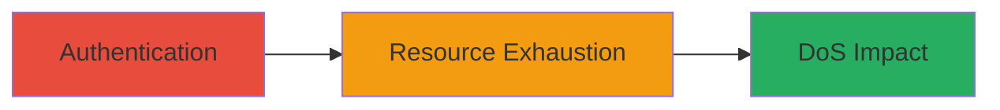

# Authenticated DoS on TikTok Ads Instance Page via Uncontrolled Resource Consumption

Multi-stage attack chain demonstrating a complete attack workflow targeting the TikTok Ads platform.

## Chain Metrics Dashboard

| Metric | Value |
|--------|-------|
| Chain Status | Unverified |
| Total Steps | 1 |
| Execution Time | ~5 minutes |
| Skill Level | Intermediate |
| Complexity | Low |
| Impact Level | Low |

## Attack Flow Visualization

## Prerequisites & Requirements

### Required Tools

- Web browser or API client for authenticated requests

### Target Environment

- TikTok Ads platform
- Web-based services
- No specific ports required beyond standard HTTPS (443)

### Initial Access Requirements

- Valid authenticated Operator credentials for the target organization
- Access to the Instance Page service within TikTok Ads

## Detailed Attack Procedures

### Step 1: Trigger Resource Consumption
procedure: [[procedures/Exploit-Uncontrolled-Resource-Consumption-for-DoS]]

**Objective**: Authenticate as an Operator and perform actions that lead to excessive resource usage, disrupting front-end availability for the organization.

**Instructions**: Log in to the TikTok Ads dashboard with Operator credentials. Navigate to the Instance Page service and initiate requests or operations that exploit improper resource handling, such as loading large datasets or triggering unbounded computations without limits.

**Expected Output**: Front-end services become unresponsive or slow for the organization, confirming DoS.

**Success Indicators**:
- Increased resource utilization observed (e.g., via monitoring tools)
- Front-end pages fail to load or respond with errors for organizational users

## Attack Chain Summary

### Key Achievements

1. Successful authentication and access to vulnerable service
2. Induction of resource exhaustion leading to front-end disruption
3. Limited impact confined to the attacker's organization without broader compromise

## Technique & Tactic Coverage

### MITRE ATT&CK Techniques

- [[Endpoint Denial of Service]]

### MITRE ATT&CK Tactics

- [[Impact]]

---
*Last updated: 2023-10-01T00:00:00Z*
