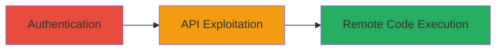

---
tags:
  - rce
  - php
  - code-injection
  - authenticated
  - expressionengine
type: attack_chain
tools: []
tactics:
  - '[[Execution]]'
  - '[[Initial Access]]'
verified: false
platforms:
  - Web
submitted: true
complexity: medium
created_at: '2024-10-01T00:00:00Z'
procedures:
  - '[[procedures/Exploit-Authenticated-RCE-via-Page-Title]]'
step_count: 1
techniques:
  - '[[Exploit Public-Facing Application]]'
  - '[[Command-Line Interface]]'
updated_at: '2025-12-14T17:23:35.983Z'
description: >-
  An authenticated remote code execution vulnerability in ExpressionEngine
  exploited by injecting PHP code into the page title parameter of an API call
  due to lack of sanitization.
skill_level: intermediate
impact_level: high
id: 37037cd0-fae2-465e-bf01-d2b105a709be
validated: true
mitre_tactics:
  - '[[Execution]]'
  - '[[Initial Access]]'
mitre_techniques:
  - '[[Exploit Public-Facing Application]]'
  - '[[Command-Line Interface]]'
---
---
id: attack-chain-authenticated-rce-expressionengine
name: Authenticated RCE in ExpressionEngine via Unsanitized Page Title
type: attack_chain
description: An authenticated remote code execution vulnerability in ExpressionEngine exploited by injecting PHP code into the page title parameter of an API call due to lack of sanitization.
verified: false
submitted: false
step_count: 1
created_at: 2024-10-01T00:00:00Z
updated_at: 2024-10-01T00:00:00Z
procedures: [[procedures/Exploit-Authenticated-RCE-via-Page-Title]]
techniques: [[Exploit Public-Facing Application]], [[Command-Line Interface]]
tactics: [[Execution]], [[Initial Access]]
tags: rce, php, code-injection, authenticated, expressionengine
platforms: Web
tools: []
---

# Authenticated RCE in ExpressionEngine via Unsanitized Page Title

Multi-stage attack chain demonstrating a complete attack workflow.

## Chain Metrics Dashboard

| Metric | Value |
|--------|-------|
| Chain Status | Unverified |
| Total Steps | 1 |
| Execution Time | ~5 minutes |
| Skill Level | Intermediate |
| Complexity | Medium |
| Impact Level | High |

## Attack Flow Visualization



## Prerequisites & Requirements

### Required Tools

- None (uses standard HTTP client like curl)

### Target Environment

- Web platform running ExpressionEngine (PHP-based CMS)
- Required services/ports: HTTP/HTTPS on port 80/443
- Network access requirements: Ability to reach the target web server

### Initial Access Requirements

- Valid authenticated credentials for an ExpressionEngine user account
- Network position: Remote access to the web application
- Prior access needed: User login session or API token

## Detailed Attack Procedures

### Step 1: Exploit RCE via API Page Title
procedure: [[procedures/Exploit-Authenticated-RCE-via-Page-Title]]

**Objective**: Leverage the lack of input sanitization in the page title parameter to inject and execute arbitrary PHP code on the server.

**Instructions**: Authenticate to the ExpressionEngine instance to obtain a session or API token. Then, craft a malicious payload injecting PHP code into the page title field of the specific API endpoint (typically a POST request to create or update a page). Use [[commands/curl-exploit-page-title-rce]] to send the request:

```bash
curl -X POST -H "Cookie: exp_session=your_session_cookie" -H "Content-Type: application/x-www-form-urlencoded" -d "title=<?php system('whoami'); ?>&other_params=values" https://target.example.com/admin.php?/cp/addons/api/pages
```

Replace the session cookie or use Bearer token if API-based auth. The payload executes PHP code server-side upon processing.

**Expected Output**: Successful HTTP 200 response indicating page creation/update, with evidence of code execution (e.g., command output in response, file creation, or server logs showing execution).

**Success Indicators**:
- HTTP response confirms page processed without errors
- Arbitrary command output appears (e.g., 'www-data' from whoami) or a test file is created on the server
- No sanitization errors or rejection of the payload

## Attack Chain Summary

### Key Achievements

1. Gain authenticated access to the vulnerable API endpoint
2. Inject PHP code via unsanitized page title parameter
3. Achieve remote code execution on the PHP server, potentially leading to full compromise

## Technique & Tactic Coverage

### MITRE ATT&CK Techniques

- [[Exploit Public-Facing Application]]
- [[Command-Line Interface]]

### MITRE ATT&CK Tactics

- [[Execution]]
- [[Initial Access]]

---
*Last updated: 2024-10-01T00:00:00Z*
