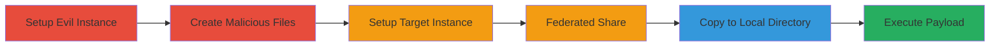

# Authenticated RCE in Nextcloud via .htaccess Blacklist Bypass Using Federated Sharing

Multi-stage attack chain demonstrating a complete attack workflow for achieving remote code execution in Nextcloud by exploiting federated sharing to bypass file blacklists.

## Chain Metrics Dashboard

| Metric | Value |
|--------|-------|
| Chain Status | Unverified |
| Total Steps | 6 |
| Execution Time | ~30 minutes |
| Skill Level | Intermediate |
| Complexity | Medium |
| Impact Level | High |

## Attack Flow Visualization

## Prerequisites & Requirements

### Required Tools

- None (relies on Nextcloud administrative access and web browser)

### Target Environment

- Nextcloud or OwnCloud instance version vulnerable to the Storage::copyFromStorage flaw (pre-patch for CVE-2016-XXXX equivalent)
- Apache web server with PHP enabled
- Data directory inside webroot
- Federated sharing enabled

### Initial Access Requirements

- Authenticated user account on both attacker-controlled (evil) and target Nextcloud instances
- Administrative access on evil instance to modify core files
- Network access to both instances for sharing

## Detailed Attack Procedures

### Step 1: Setup Evil Nextcloud Instance
procedure: [[procedures/Disable-File-Blacklist-in-Nextcloud]]

**Objective**: Prepare an attacker-controlled Nextcloud instance by disabling file blacklists to allow creation of restricted files like .htaccess.

**Instructions**: Access the evil instance's codebase and modify the Filesystem.php file to bypass blacklist enforcement. This enables uploading blacklisted files.

**Expected Output**: Modified Nextcloud instance capable of hosting blacklisted files without restrictions.

**Success Indicators**:
- File upload succeeds for .htaccess without errors
- Blacklist check logs show disabled enforcement

### Step 2: Create Malicious Folder
procedure: [[procedures/Create-Malicious-Folder-with-HTAccess-and-PHP-Payload]]

**Objective**: Construct a folder containing a permissive .htaccess file and a PHP script with RCE payload to override Apache protections.

**Instructions**: In the evil instance, create a folder named 'sharefolder/attack' and place files inside: .htaccess with 'AllowOverride All' and 'php_flag engine on' directives, and attack.php with system command execution like `<?php system($_GET['cmd']); ?>`.

**Expected Output**: Folder ready for sharing, with files verifiable via Nextcloud file manager.

**Success Indicators**:
- .htaccess file uploaded successfully
- attack.php contains executable PHP code

### Step 3: Setup Target Nextcloud Instance
procedure: [[procedures/Set-Up-Target-Nextcloud-Instance]]

**Objective**: Configure the victim Nextcloud instance with default settings that place the data directory inside the webroot, enabling direct web access to copied files.

**Instructions**: Install or use an existing Nextcloud instance with Apache, ensuring the data directory (e.g., /var/www/nextcloud/data/) is within the webroot and .htaccess protections are active but bypassable.

**Expected Output**: Target instance running with federated sharing enabled and data dir web-accessible.

**Success Indicators**:
- Instance accessible via browser
- Default .htaccess in data dir blocks PHP by default

### Step 4: Federated Share the Malicious Folder
procedure: [[procedures/Federate-Share-Malicious-Folder-to-Target]]

**Objective**: Share the malicious folder from the evil instance to the target using Nextcloud's federated sharing feature.

**Instructions**: In the evil instance, use the sharing interface to federate 'sharefolder' to a user on the target instance, providing the remote server URL and share token.

**Expected Output**: Share accepted on target instance, folder visible in target's file manager as external storage.

**Success Indicators**:
- Folder appears in target's shares
- Contents (including .htaccess) visible but not yet local

### Step 5: Copy Shared Folder to Local Directory
procedure: [[procedures/Copy-Shared-Folder-to-Local-Data-Directory]]

**Objective**: Move the shared folder contents to the local data directory, exploiting the Storage::copyFromStorage function's failure to check blacklisted files in folders.

**Instructions**: In the target instance, use the file manager to copy 'sharefolder/attack' to a local path like /files/attack/, triggering the copy operation that bypasses blacklist validation for folder contents.

**Expected Output**: Malicious files now in local data dir (e.g., /data/userid/files/attack/), including .htaccess and attack.php.

**Success Indicators**:
- Copy completes without errors
- Files appear in local directory via file manager

### Step 6: Execute the Payload
procedure: [[procedures/Execute-Malicious-PHP-Payload-via-Web-Access]]

**Objective**: Trigger execution of the PHP payload by accessing it via the web, now permitted due to the copied .htaccess overriding defaults.

**Instructions**: Navigate to http://target-nextcloud/data/userid/files/attack/attack.php?cmd=whoami in a browser, executing the RCE payload.

**Expected Output**: Command output displayed, confirming RCE (e.g., server username or arbitrary command results).

**Success Indicators**:
- PHP executes without 403 errors
- Payload runs, showing system access

## Attack Chain Summary

### Key Achievements

1. Bypassed .htaccess blacklist via external storage copy flaw
2. Achieved authenticated RCE without direct upload restrictions
3. Demonstrated supply chain-like attack using federated features

## Technique & Tactic Coverage

### MITRE ATT&CK Techniques

- [[Exploit Public-Facing Application]] Exploit Public-Facing Application
- [[Python]] PHP
- [[Upload Malware]] Dynamic Library Injection (adapted for web file placement)

### MITRE ATT&CK Tactics

- [[Execution]] Execution

---

*Last updated: 2023-10-01T00:00:00Z*
