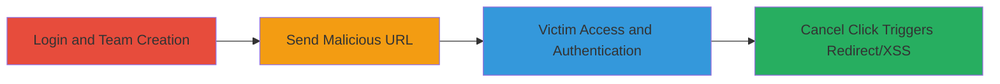

# Authenticated Reflected XSS via Open Redirect in Liberapay Team Leave Endpoint

Multi-stage attack chain demonstrating exploitation of an authenticated open redirect vulnerability in Liberapay's team membership leave endpoint, which can be escalated to reflected XSS using javascript: URIs. The attack requires the victim to be an authenticated team member and click the cancel button on the leave page, leading to redirection to attacker-controlled sites for phishing or limited JS execution (e.g., alert popups), with restrictions from CSP but feasible in older browsers like IE11.

## Chain Metrics Dashboard

| Metric | Value |
|--------|-------|
| Chain Status | Unverified |
| Total Steps | 4 |
| Execution Time | ~5 minutes |
| Skill Level | Intermediate |
| Complexity | Medium |
| Impact Level | High |

## Attack Flow Visualization

## Prerequisites & Requirements

### Required Tools

- Web browser (e.g., IE11 for full XSS exploitation)
- Attacker-controlled domain for phishing

### Target Environment

- Liberapay web application (https://liberapay.com)
- Authenticated user account
- Team membership

### Initial Access Requirements

- Valid Liberapay credentials for attacker setup
- Victim's email or social engineering to share URL
- No prior network access beyond public internet

## Detailed Attack Procedures

### Step 1: Login to Liberapay Account
procedure: [[procedures/Login-to-Liberapay-Account]]

**Objective**: Authenticate as an attacker to set up the team and prepare the malicious URL.

**Instructions**: Access the login page and enter valid credentials to gain an authenticated session.

**Expected Output**: Successful login redirect to the dashboard.

**Success Indicators**:
- Authenticated session established
- Access to team management features

### Step 2: Create Liberapay Team
procedure: [[procedures/Create-Liberapay-Team]]

**Objective**: Establish a team that the victim can join, enabling the leave endpoint exploitation.

**Instructions**: Navigate to the teams page and create a new team with a simple name like 'test-team'.

**Expected Output**: Team created successfully, with a unique URL like https://liberapay.com/test-team.

**Success Indicators**:
- Team profile accessible
- Invitation or membership possible for victim

### Step 3: Send Malicious Leave Team URL
procedure: [[procedures/Send-Malicious-Leave-Team-URL]]

**Objective**: Craft and deliver a URL with a malicious back_to parameter to the victim, who must be a team member.

**Instructions**: Construct the URL with an external or javascript: back_to value and send via email or messaging.

**Expected Output**: Victim receives and clicks the URL, accessing the leave page.

**Success Indicators**:
- Victim authenticates on the leave page
- Malicious parameter reflected in the page

### Step 4: Exploit Redirect for XSS
procedure: [[procedures/Exploit-Redirect-for-XSS]]

**Objective**: Trigger the redirect or JS execution when the victim clicks cancel on the leave page.

**Instructions**: Victim clicks the cancel button, causing redirection to the back_to URL, enabling phishing or XSS payload execution.

**Expected Output**: Redirect to attacker site or JS alert (e.g., alert(document.domain)) in IE11.

**Success Indicators**:
- Victim redirected to phishing site
- JS payload executes despite CSP limitations

## Attack Chain Summary

### Key Achievements

1. Bypassed redirect validation to enable open redirects for phishing.
2. Escalated to reflected XSS using javascript: URIs in the back_to parameter.
3. Achieved limited JS execution in authenticated contexts, potentially leading to session hijacking.

## Technique & Tactic Coverage

### MITRE ATT&CK Techniques

- [[Drive-by Compromise]] Drive-by Compromise (open redirect for phishing)
- [[JavaScript]] JavaScript (XSS execution)

### MITRE ATT&CK Tactics

- [[Initial Access]] Initial Access (phishing via redirect)
- [[Execution]] Execution (JS in browser context)

---
*Last updated: 2023-10-01T00:00:00Z*
