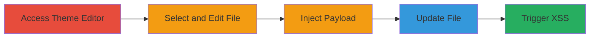

---
tags:
  - xss
  - stored-xss
  - wordpress
  - authenticated
  - javascript
type: attack_chain
tools:
  - '[[tools/Google-Chrome]]'
tactics:
  - '[[Execution]]'
  - '[[Collection]]'
verified: false
platforms:
  - Web
  - PHP
submitted: true
complexity: medium
created_at: '2023-10-01T00:00:00Z'
procedures:
  - '[[procedures/Access-WordPress-Theme-Editor]]'
  - '[[procedures/Select-Theme-File-for-Editing]]'
  - '[[procedures/Inject-Malicious-Template-Name-Payload]]'
  - '[[procedures/Update-WordPress-Theme-File]]'
  - '[[procedures/Trigger-Stored-XSS-Execution]]'
step_count: 5
techniques:
  - '[[JavaScript]]'
updated_at: '2025-12-14T03:47:12.643Z'
description: >-
  An authenticated stored XSS vulnerability in WordPress theme editor allows
  injection of malicious JavaScript via template names in PHP comments, leading
  to execution in the admin panel.
skill_level: intermediate
impact_level: high
id: 38e90456-a578-4f88-98a5-09a83fd6b6d2
validated: true
mitre_tactics:
  - '[[Execution]]'
  - '[[Collection]]'
mitre_techniques:
  - '[[JavaScript]]'
---
# Authenticated Stored XSS in WordPress Theme Editor via Malicious Template Name

Multi-stage attack chain demonstrating exploitation of an authenticated stored XSS in WordPress's theme editor by injecting a malicious template name into a PHP file comment, leading to JavaScript execution in the admin panel.

## Chain Metrics Dashboard

| Metric | Value |
|--------|-------|
| Chain Status | Unverified |
| Total Steps | 5 |
| Execution Time | ~5 minutes |
| Skill Level | Intermediate |
| Complexity | Medium |
| Impact Level | High |

## Attack Flow Visualization

## Prerequisites & Requirements

### Required Tools

- [[tools/Google-Chrome]]

### Target Environment

- WordPress CMS (latest version at time of discovery)
- PHP-based theme files
- Authenticated access to WordPress admin dashboard

### Initial Access Requirements

- Valid authenticated user credentials (e.g., contributor or higher role with theme editor access)
- Direct network access to the WordPress admin interface
- No prior access needed beyond authentication

## Detailed Attack Procedures

### Step 1: Access Theme Editor
procedure: [[procedures/Access-WordPress-Theme-Editor]]

**Objective**: Gain entry to the WordPress theme editor interface to begin file modifications.

**Instructions**: Log in to the WordPress admin dashboard and navigate to the theme editor.

**Expected Output**: Theme editor page loads, displaying available theme files.

**Success Indicators**:
- Theme editor interface is accessible
- List of editable PHP files is visible

### Step 2: Select Theme File for Editing
procedure: [[procedures/Select-Theme-File-for-Editing]]

**Objective**: Choose a suitable PHP file without conflicting template names for payload injection.

**Instructions**: Select a file like back-compat.php from the file list in the theme editor.

**Expected Output**: The selected file's content loads in the editor textarea.

**Success Indicators**:
- File content is displayed for editing
- No pre-existing template name conflicts

### Step 3: Inject Malicious Template Name Payload
procedure: [[procedures/Inject-Malicious-Template-Name-Payload]]

**Objective**: Insert a JavaScript payload into the file's template name comment to enable stored XSS.

**Instructions**: Add the payload comment at the top of the file content.

**Expected Output**: Payload is visible in the editor as a comment.

**Success Indicators**:
- Malicious comment is added without syntax errors
- File remains valid PHP

### Step 4: Update WordPress Theme File
procedure: [[procedures/Update-WordPress-Theme-File]]

**Objective**: Save the modified file to store the XSS payload on the server.

**Instructions**: Click the Update File button to persist changes.

**Expected Output**: Success message confirms file update.

**Success Indicators**:
- File updates without errors
- Changes are saved to the theme directory

### Step 5: Trigger Stored XSS Execution
procedure: [[procedures/Trigger-Stored-XSS-Execution]]

**Objective**: Execute the injected JavaScript by interacting with the unescaped output in the editor.

**Instructions**: Click the file link in the theme editor list to reload and trigger the payload.

**Expected Output**: JavaScript alert or confirm dialog displays, e.g., showing document.cookie.

**Success Indicators**:
- XSS payload executes in the browser
- Potential for cookie theft or further client-side attacks

## Attack Chain Summary

### Key Achievements

1. Successful injection of stored XSS payload via theme template name
2. Persistence of malicious code in WordPress theme files
3. Execution of arbitrary JavaScript in the authenticated admin context, enabling session hijacking

## Technique & Tactic Coverage

### MITRE ATT&CK Techniques

- [[JavaScript]]

### MITRE ATT&CK Tactics

- [[Execution]]
- [[Collection]]

---
*Last updated: 2023-10-01T00:00:00Z*
