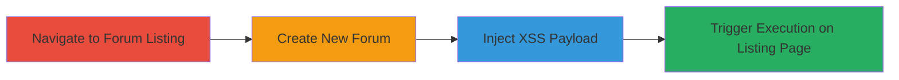

# Authenticated Stored XSS in bbPress Forum Creation Leading to WordPress Admin Dashboard Compromise

Multi-stage attack chain demonstrating a complete attack workflow exploiting a stored XSS vulnerability in the bbPress plugin.

## Chain Metrics Dashboard

| Metric | Value |
|--------|-------|
| Chain Status | Unverified |
| Total Steps | 4 |
| Execution Time | ~5 minutes |
| Skill Level | Intermediate |
| Complexity | Medium |
| Impact Level | High |

## Attack Flow Visualization

## Prerequisites & Requirements

### Required Tools

- Web browser (e.g., Chrome with developer tools for payload testing)

### Target Environment

- WordPress site with bbPress plugin installed and active
- Access to /wp-admin with administrator or editor role
- Forum post type enabled

### Initial Access Requirements

- Valid authenticated session as administrator or editor
- No special network access beyond standard HTTP/HTTPS to the WordPress site
- Prior access to the WordPress dashboard

## Detailed Attack Procedures

### Step 1: Navigate to the Forum Listing Page

procedure: [[procedures/Exploit-Stored-XSS-in-bbPress-Forum-Content]]

**Objective**: Access the admin interface to begin forum management.

**Instructions**: Log in to the WordPress admin dashboard and visit the forum listing page.

**Expected Output**: Display of existing forums or empty list if none created.

**Success Indicators**:
- Successful navigation to /wp-admin/edit.php?post_type=forum
- No errors or access denied messages

### Step 2: Start Creating a New Forum

procedure: [[procedures/Exploit-Stored-XSS-in-bbPress-Forum-Content]]

**Objective**: Initiate the forum creation process to access the input fields.

**Instructions**: On the forum listing page, click the 'Add New' button to open the forum creation editor.

**Expected Output**: Forum creation form loads with title and content fields.

**Success Indicators**:
- Editor interface appears
- Fields for title and content are editable

### Step 3: Enter XSS Payload in Content

procedure: [[procedures/Exploit-Stored-XSS-in-bbPress-Forum-Content]]

**Objective**: Inject malicious JavaScript into the forum content without sanitization.

**Instructions**: Enter a benign title like 'Test Forum'. Switch the editor from Visual to Text mode, then insert an XSS payload such as `` in the content field. Click 'Publish' to save the forum.

**Expected Output**: Forum is created and published successfully.

**Success Indicators**:
- No validation errors on publish
- Forum appears in the listing (though payload not yet triggered)

### Step 4: View the Forum Listing Page to Trigger Execution

procedure: [[procedures/Exploit-Stored-XSS-in-bbPress-Forum-Content]]

**Objective**: Trigger the stored payload execution in the dashboard context.

**Instructions**: Return to the forum listing page at /wp-admin/edit.php?post_type=forum. The preview of the injected content will render and execute the JavaScript.

**Expected Output**: Alert box or other JS execution (e.g., alert('XSS')) pops up in the browser.

**Success Indicators**:
- JavaScript executes in the context of the admin dashboard
- Potential for session theft if payload is modified to exfiltrate cookies

## Attack Chain Summary

### Key Achievements

1. Successful injection of unsanitized JavaScript via authenticated forum creation
2. Storage of payload in the bbPress database without filtering
3. Execution of arbitrary JS in the WordPress admin dashboard for any viewing user
4. Potential for session hijacking or dashboard manipulation targeting other admins

## Technique & Tactic Coverage

### MITRE ATT&CK Techniques

- [[JavaScript]]

### MITRE ATT&CK Tactics

- [[Execution]]
- [[Collection]]

---
*Last updated: 2023-10-01T12:00:00Z*
