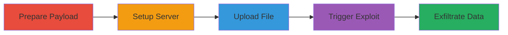

---
tags:
  - xxe
  - wordpress
  - php
  - file-upload
  - ssrf
  - dos
type: attack_chain
tools:
  - '[[tools/Hex-Editor]]'
  - '[[tools/Web-Server]]'
tactics:
  - '[[Initial Access]]'
  - '[[Collection]]'
commands: []
platforms:
  - Web
  - PHP 8
complexity: medium
procedures:
  - '[[procedures/Prepare-XXE-Payload-in-WAV-File]]'
  - '[[procedures/Setup-External-DTD-Server]]'
  - '[[procedures/Upload-Malicious-WAV-to-WordPress]]'
  - '[[procedures/Exfiltrate-Data-via-XXE]]'
step_count: 5
techniques:
  - '[[Exploit Public-Facing Application]]'
description: >-
  Exploitation of an authenticated XXE vulnerability in WordPress core Media
  Library on PHP 8 by uploading a malicious .wav file to read sensitive files,
  perform DoS, SSRF, or potential RCE.
skill_level: intermediate
impact_level: high
id: 6b543dde-7937-45e1-b4ac-2f50a5977243
created_at: '2025-12-13T09:00:27.991Z'
updated_at: '2025-12-13T09:00:27.991Z'
verified: false
validated: true
submitted: true
mitre_tactics:
  - '[[Initial Access]]'
  - '[[Collection]]'
mitre_techniques:
  - '[[Exploit Public-Facing Application]]'
---
# Authenticated XXE in WordPress Media Library via Malicious WAV Upload

Multi-stage attack chain demonstrating exploitation of an XXE vulnerability in WordPress on PHP 8, allowing authenticated users to upload malicious .wav files embedding XML payloads. This leads to reading sensitive files like /etc/passwd, DoS attacks, SSRF, or potential RCE via Phar Deserialization.

## Chain Metrics Dashboard

| Metric | Value |
|--------|-------|
| Chain Status | Unverified |
| Total Steps | 5 |
| Execution Time | ~10 minutes |
| Skill Level | Intermediate |
| Complexity | Medium |
| Impact Level | High |

## Attack Flow Visualization

## Prerequisites & Requirements

### Required Tools

- [[tools/Hex-Editor]]
- [[tools/Web-Server]]

### Target Environment

- WordPress 5.6 on PHP 8 with libxml >2.9 and SimpleXML
- Services: WordPress Media Library
- Ports: Standard HTTP/HTTPS

### Initial Access Requirements

- Authenticated WordPress account with author privileges (ability to upload media)
- Network access to the WordPress site and attacker's server reachable from the target

## Detailed Attack Procedures

### Step 1: Adapt PoC Files for Attacker Server
procedure: [[procedures/Prepare-XXE-Payload-in-WAV-File]]

**Objective**: Modify the PoC files to point to the attacker's controlled web server for data exfiltration.

**Instructions**: Extract the xxe.zip archive and modify the two files to include the URL of your reachable web server controlled by the attacker for retrieving leaked data.

**Expected Output**: Updated PoC files with attacker's server URL.

**Success Indicators**:
- Files modified without errors
- Server URL correctly inserted

### Step 2: Edit WAV File with Hex Editor
procedure: [[procedures/Prepare-XXE-Payload-in-WAV-File]]

**Objective**: Insert the attacker's server address into the .wav file at a specific offset without corrupting it.

**Instructions**: Use [[tools/Hex-Editor]] to edit the xxe.wav file at offset 0x000338CD and adapt the address to your server.

**Expected Output**: Modified .wav file ready for upload.

**Success Indicators**:
- File remains valid and playable
- Address correctly embedded

### Step 3: Place External DTD on Web Server
procedure: [[procedures/Setup-External-DTD-Server]]

**Objective**: Host the external DTD file on the attacker's web server to facilitate the XXE payload.

**Instructions**: Place the xxe.dtd file at the root of your controlled [[tools/Web-Server]], ensuring it is reachable from the target WordPress installation.

**Expected Output**: DTD file accessible via HTTP from the target.

**Success Indicators**:
- Server logs show successful hosting
- DTD retrievable via curl or browser

### Step 4: Upload Malicious WAV to WordPress
procedure: [[procedures/Upload-Malicious-WAV-to-WordPress]]

**Objective**: Login as an author and upload the crafted .wav file to trigger the XXE during XML parsing.

**Instructions**: Login to the WordPress site with author credentials and upload the modified xxe.wav file to the Media Library.

**Expected Output**: File uploaded successfully, triggering XXE.

**Success Indicators**:
- Upload confirmation in WordPress
- Server-side parsing occurs

### Step 5: Check Server Logs for Leaked Data
procedure: [[procedures/Exfiltrate-Data-via-XXE]]

**Objective**: Retrieve exfiltrated data from the attacker's web server logs.

**Instructions**: Monitor the access logs of your [[tools/Web-Server]] for base64-encoded content of /etc/passwd or other targeted files.

**Expected Output**: Leaked data appears in logs.

**Success Indicators**:
- Base64-encoded file contents in logs
- Successful exfiltration confirmed

## Attack Chain Summary

### Key Achievements

1. Successful preparation and upload of malicious payload
2. Exploitation of XXE for file reading and potential further attacks
3. Data exfiltration via attacker's server

## Technique & Tactic Coverage

### MITRE ATT&CK Techniques

- [[Exploit Public-Facing Application]]

### MITRE ATT&CK Tactics

- [[Initial Access]]
- [[Collection]]

*Last updated: 2023-10-01*
