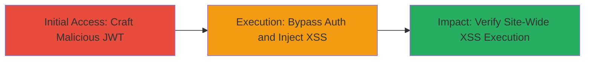

---
tags:
  - jwt
  - auth-bypass
  - stored-xss
  - tiktok-ads
type: attack_chain
tools:
  - '[[tools/Burp-Suite]]'
tactics:
  - '[[Initial Access]]'
  - '[[Execution]]'
  - '[[Collection]]'
commands:
  - '[[commands/generate-jwt-token]]'
  - '[[commands/inject-xss-payload]]'
platforms:
  - Web
complexity: medium
procedures:
  - '[[procedures/JWT-Authentication-Bypass]]'
  - '[[procedures/Stored-XSS-Injection-via-Bypassed-Access]]'
  - '[[procedures/Verify-XSS-Execution-and-Impact]]'
step_count: 3
techniques:
  - '[[Exploit Public-Facing Application]]'
  - '[[JavaScript]]'
description: >-
  A chained vulnerability exploiting improper JWT verification to bypass
  authentication and inject persistent XSS payloads across the TikTok Ads
  platform.
skill_level: intermediate
impact_level: high
id: d707b580-c81a-46e8-a69a-1de6c77ecfb9
created_at: '2025-12-14T17:30:58.277Z'
updated_at: '2025-12-14T17:30:58.277Z'
verified: false
validated: true
submitted: true
mitre_tactics:
  - '[[Initial Access]]'
  - '[[Execution]]'
  - '[[Collection]]'
mitre_techniques:
  - '[[Exploit Public-Facing Application]]'
  - '[[JavaScript]]'
---
# Authentication Bypass and Site-Wide Stored XSS via Improper JWT Verification in TikTok Ads

## Overview

This attack chain exploits a critical vulnerability in the TikTok Ads platform where JSON Web Tokens (JWT) are not properly verified, allowing attackers to craft malicious tokens for authentication bypass and subsequent injection of persistent cross-site scripting (XSS) payloads. The bypass grants unauthorized access to protected resources, enabling the storage of XSS scripts that execute site-wide, potentially compromising user sessions, stealing data, or performing actions on behalf of affected users. Discovered via HackerOne report #1328546, this led to a $15,000 bounty due to its severe impact on authentication and content integrity.

## Chain Metrics Dashboard

| Metric | Value |
|--------|-------|
| Chain Status | Unverified |
| Total Steps | 3 |
| Execution Time | ~10 minutes |
| Skill Level | Intermediate |
| Complexity | Medium |
| Impact Level | High |

## Attack Flow Visualization



## Prerequisites & Requirements

### Required Tools

- [[tools/Burp-Suite]]

### Target Environment

- Web platform (TikTok Ads)
- Required services/ports: HTTPS (443)
- Network access requirements: Internet access to TikTok Ads endpoints

### Initial Access Requirements

- No prior credentials needed due to bypass
- Network position: External attacker
- Prior access needed: None

## Detailed Attack Procedures

### Step 1: Craft Malicious JWT for Authentication Bypass
procedure: [[procedures/JWT-Authentication-Bypass]]

**Objective**: Generate an invalid but accepted JWT token to bypass authentication checks and gain unauthorized access to protected TikTok Ads resources.

**Instructions**: Use a JWT crafting tool or command to create a token without proper signature verification. Intercept a legitimate request with Burp Suite and replace the Authorization header.

Execute [[commands/generate-jwt-token]] to create the payload:

```bash
ejwt -alg none -i attacker@example.com -s '' -header '{"typ":"JWT","alg":"none"}' -payload '{"sub":"admin","iat":1234567890,"exp":1234567899}' > malicious.jwt
```

Then, in Burp Suite, modify the request header: `Authorization: Bearer $(cat malicious.jwt)` and forward to the TikTok Ads API endpoint (e.g., /api/protected).

**Expected Output**: Successful response (200 OK) with access to restricted features, such as user dashboards or ad management.

**Success Indicators**:
- Access granted without valid credentials
- API returns protected data

### Step 2: Inject Stored XSS Payload Using Bypassed Access
procedure: [[procedures/Stored-XSS-Injection-via-Bypassed-Access]]

**Objective**: Leverage the bypassed authentication to submit a form or API request containing a persistent XSS payload, storing it site-wide for execution on user visits.

**Instructions**: With authenticated access, navigate to a vulnerable input field (e.g., ad description or comment section) and inject the payload. Use Burp Suite to tamper with POST requests.

Execute [[commands/inject-xss-payload]] to simulate the injection:

```bash
curl -X POST -H "Authorization: Bearer $(cat malicious.jwt)" -d 'description=<script>alert("XSS via JWT Bypass")</script>' https://ads.tiktok.com/api/submit-ad
```

Monitor the response for successful storage, then visit a page where the content is rendered (e.g., ad preview).

**Expected Output**: Payload stored without sanitization, visible in the response or database.

**Success Indicators**:
- Payload persists across sessions
- No error on submission

### Step 3: Verify XSS Execution and Site-Wide Impact
procedure: [[procedures/Verify-XSS-Execution-and-Impact]]

**Objective**: Confirm the stored XSS executes in browsers of other users, demonstrating site-wide compromise and potential data exfiltration.

**Instructions**: Access a page rendering the injected content from an unauthenticated browser. Observe alert or hook into session cookies for theft.

Use Burp Suite to capture any executed JS interactions. Test by loading the affected page: https://ads.tiktok.com/preview/injected-ad.

**Expected Output**: JavaScript alert pops up or console logs payload execution; potential cookie theft via network requests.

**Success Indicators**:
- XSS alert triggers on load
- Site-wide pages affected, impacting multiple users

## Attack Chain Summary

### Key Achievements

1. Bypassed JWT-based authentication to access protected TikTok Ads features.
2. Injected and stored malicious XSS payload persistently.
3. Demonstrated critical impact with site-wide execution, leading to session hijacking risks.

## Technique & Tactic Coverage

### MITRE ATT&CK Techniques

- [[Exploit Public-Facing Application]]
- [[JavaScript]]

### MITRE ATT&CK Tactics

- [[Initial Access]]
- [[Execution]]
- [[Collection]]

---
*Last updated: 2023-10-01*
