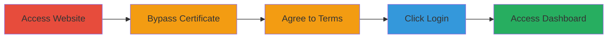

---
tags:
  - auth-bypass
  - dod
  - web
  - sensitive-data-exposure
  - certificate-bypass
type: attack_chain
tools:
  - '[[tools/Microsoft-Edge]]'
  - '[[tools/Google-Chrome]]'
  - '[[tools/Brave-Browser]]'
tactics:
  - '[[Initial Access]]'
verified: false
platforms:
  - Web
submitted: true
complexity: low
created_at: '2023-10-01T00:00:00Z'
procedures:
  - '[[procedures/Bypass-Certificate-Authentication-in-DoD-App]]'
step_count: 5
techniques:
  - '[[Valid Accounts]]'
  - '[[Exploit Public-Facing Application]]'
updated_at: '2025-12-14T17:29:44.669Z'
description: >-
  A multi-step authentication bypass in a U.S. Department of Defense web
  application that allows unauthorized access to user dashboards and sensitive
  profile information by canceling certificate selection.
skill_level: beginner
impact_level: high
id: fda6064c-4e33-4a45-81d3-f9e06cb408f7
validated: true
mitre_tactics:
  - '[[Initial Access]]'
mitre_techniques:
  - '[[Valid Accounts]]'
  - '[[Exploit Public-Facing Application]]'
---
# Authentication Bypass in DoD Web Application Exposing Sensitive User Data

Multi-stage attack chain demonstrating a complete attack workflow for bypassing authentication in a DoD web app to access sensitive user profiles.

## Chain Metrics Dashboard

| Metric | Value |
|--------|-------|
| Chain Status | Unverified |
| Total Steps | 5 |
| Execution Time | ~2 minutes |
| Skill Level | Beginner |
| Complexity | Low |
| Impact Level | High |

## Attack Flow Visualization

## Prerequisites & Requirements

### Required Tools

- [[tools/Microsoft-Edge]]
- [[tools/Google-Chrome]]
- [[tools/Brave-Browser]]

### Target Environment

- Web application hosted at https://████/
- No specific ports or services required beyond standard HTTPS (port 443)
- Publicly accessible DoD web app

### Initial Access Requirements

- Internet access to the target URL
- No credentials needed due to bypass
- Browser with certificate handling support

## Detailed Attack Procedures

### Step 1: Access the Main Website
procedure: [[procedures/Bypass-Certificate-Authentication-in-DoD-App]]

**Objective**: Navigate to the target DoD web application to initiate the authentication flow.

**Instructions**: Open a browser in incognito mode and navigate to the target site.

**Expected Output**: Browser loads the initial page, potentially prompting for certificate selection.

**Success Indicators**:
- Page loads without errors
- Certificate prompt appears (if applicable)

### Step 2: Bypass Certificate Selection
procedure: [[procedures/Bypass-Certificate-Authentication-in-DoD-App]]

**Objective**: Cancel the certificate prompt to avoid the 403 Forbidden response and continue without proper authentication.

**Instructions**: When the browser prompts to select a certificate, click 'Cancel' to bypass authentication enforcement.

**Expected Output**: Prompt dismissed, and the page proceeds without blocking access.

**Success Indicators**:
- No 403 Forbidden error
- Flow continues to terms agreement

### Step 3: Agree to Terms and Proceed
procedure: [[procedures/Bypass-Certificate-Authentication-in-DoD-App]]

**Objective**: Accept the terms of service to advance in the login process without credentials.

**Instructions**: On the terms page, agree to the agreement and click the proceed button (████████████), which redirects to https://█████/███████/.

**Expected Output**: Redirect to the login page.

**Success Indicators**:
- Successful redirect
- Login interface appears

### Step 4: Click Login
procedure: [[procedures/Bypass-Certificate-Authentication-in-DoD-App]]

**Objective**: Trigger the login action, which due to the bypass, grants access without verification.

**Instructions**: Click the 'Login' button on the page.

**Expected Output**: Automatic redirect to the dashboard.

**Success Indicators**:
- No authentication challenge
- Immediate dashboard access

### Step 5: Access Dashboard
procedure: [[procedures/Bypass-Certificate-Authentication-in-DoD-App]]

**Objective**: View the unauthorized user dashboard exposing sensitive data.

**Instructions**: Upon redirect, observe the dashboard at https://████/███████/Dashboard, where user profile details are visible.

**Expected Output**: Display of sensitive information including name, email, and EDIPI; potential access to update functions.

**Success Indicators**:
- Sensitive data (name, email, EDIPI) visible
- Ability to manipulate profile data

## Attack Chain Summary

### Key Achievements

1. Bypassed certificate-based authentication without credentials
2. Gained unauthorized access to protected user dashboard
3. Exposed critical personal identifiers (name, email, EDIPI) and enabled potential data manipulation

## Technique & Tactic Coverage

### MITRE ATT&CK Techniques

- [[Valid Accounts]]
- [[Exploit Public-Facing Application]]

### MITRE ATT&CK Tactics

- [[Initial Access]]

---

*Last updated: 2023-10-01T00:00:00Z*
