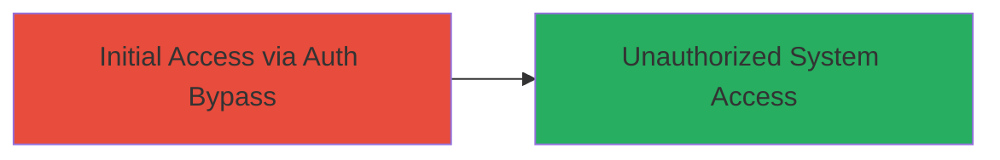

---
tags:
  - auth-bypass
  - ibm-maximo
  - cve-2023-32333
  - access-control
type: attack_chain
tools: []
tactics:
  - '[[Initial Access]]'
commands: []
platforms:
  - Web
complexity: low
procedures:
  - '[[procedures/Bypass-Authentication-in-IBM-Maximo-Asset-Management]]'
step_count: 1
techniques:
  - '[[Valid Accounts]]'
  - '[[Exploit Public-Facing Application]]'
description: >-
  A remote authentication bypass vulnerability in IBM Maximo Asset Management
  allowing unauthorized access to asset management functions due to improper
  access controls, assigned CVE-2023-32333.
skill_level: intermediate
impact_level: high
id: af884ec7-20c8-42a3-be37-e69207af4c0a
created_at: '2025-12-14T17:31:42.694Z'
updated_at: '2025-12-14T17:31:42.694Z'
verified: false
validated: true
submitted: true
mitre_tactics:
  - '[[Initial Access]]'
mitre_techniques:
  - '[[Valid Accounts]]'
  - '[[Exploit Public-Facing Application]]'
---
# Authentication Bypass in IBM Maximo Asset Management via Improper Access Controls

Multi-stage attack chain demonstrating a complete attack workflow.

## Chain Metrics Dashboard

| Metric | Value |
|--------|-------|
| Chain Status | Unverified |
| Total Steps | 1 |
| Execution Time | ~1 minutes |
| Skill Level | Intermediate |
| Complexity | Low |
| Impact Level | High |

## Attack Flow Visualization

## Prerequisites & Requirements

### Required Tools

- None (standard web browser or HTTP client sufficient)

### Target Environment

- Target OS/Platform: Web application (IBM Maximo Asset Management)
- Required services/ports: HTTP/HTTPS on standard web ports (80/443)
- Network access requirements: Remote internet access to the Maximo instance

### Initial Access Requirements

- Credential requirements: None (bypass exploits lack of auth)
- Network position: External/remote
- Prior access needed: None

## Detailed Attack Procedures

### Step 1: Authentication Bypass
procedure: [[procedures/Bypass-Authentication-in-IBM-Maximo-Asset-Management]]

**Objective**: Exploit improper access controls to gain unauthorized access to protected IBM Maximo Asset Management resources without valid credentials.

**Instructions**: Identify the vulnerable endpoint in the IBM Maximo web application (specific endpoint details may vary by version, but typically involves direct access to asset management functions). Use a web browser or HTTP client to send a request to the protected resource without including authentication headers or tokens. For example, navigate directly to the asset management dashboard URL or API endpoint that should require login.

If the application is exposed publicly, attempt to access it via:

- Direct URL navigation to sensitive pages (e.g., `/maximo/ui/maximo.jsp` or similar login-protected paths).
- Omit any session cookies or auth parameters in the request.

Monitor the response for successful access indicators, such as loading of the dashboard or data retrieval.

**Expected Output**: The application grants access to restricted features, displaying asset management data or allowing administrative functions without prompting for credentials.

**Success Indicators**:
- Access to protected UI elements or API responses containing sensitive data.
- No authentication challenge or redirect to login page.

## Attack Chain Summary

### Key Achievements

1. Bypassed authentication controls to achieve unauthorized remote access.
2. Potential exposure of asset management data and system functions.
3. Demonstrated impact on confidentiality and integrity of the IBM Maximo environment.

## Technique & Tactic Coverage

### MITRE ATT&CK Techniques

- [[Valid Accounts]]
- [[Exploit Public-Facing Application]]

### MITRE ATT&CK Tactics

- [[Initial Access]]

---
*Last updated: 2023-10-01T00:00:00Z*
