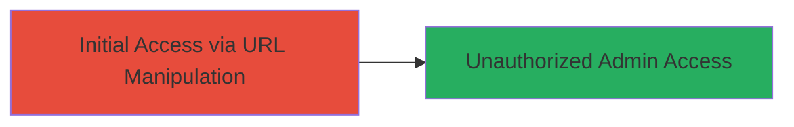

# Authentication Bypass via Admin Endpoint Extension on Shopify Subdomains

Multi-stage attack chain demonstrating a complete attack workflow.

## Chain Metrics Dashboard

| Metric | Value |
|--------|-------|
| Chain Status | Unverified |
| Total Steps | 1 |
| Execution Time | ~1 minute |
| Skill Level | Beginner |
| Complexity | Low |
| Impact Level | High |

## Attack Flow Visualization



## Prerequisites & Requirements

### Required Tools

- Web browser or [[commands/curl-fetch-admin-page]]

### Target Environment

- Web platform with PHP-based routing
- Exposed subdomains using Okta for authentication
- Network access to public-facing Shopify subdomains

### Initial Access Requirements

- No credentials required
- Direct internet access to target subdomains
- No prior access needed

## Detailed Attack Procedures

### Step 1: Bypass Authentication and Access Admin Dashboard
procedure: [[procedures/Bypass-Authentication-by-Appending-PHP-to-Admin-URL]]

**Objective**: Manipulate the admin URL to evade the Okta authentication redirect and load the admin dashboard directly.

**Instructions**: Identify target subdomains such as datastories.shopify.com or data-stories-website.shopifycloud.com. Then, append '.php' to the /admin endpoint to bypass authentication checks. Use a web browser to navigate to the modified URL or execute [[commands/curl-fetch-admin-page]] to fetch the page content:

```bash
curl -s https://datastories.shopify.com/admin.php
```

Verify the response does not redirect to https://shopify.okta.com/login and instead returns admin dashboard HTML, including the authenticity_token in the source.

**Expected Output**: HTML content of the admin dashboard, viewable in browser or curl output, showing administrative elements without login prompt.

**Success Indicators**:
- No redirect to Okta login page
- Admin dashboard loads with visible administrative information
- authenticity_token exposed in page source (e.g., via curl -s | grep authenticity_token)

## Attack Chain Summary

### Key Achievements

1. Unauthorized access to admin dashboard on multiple Shopify subdomains
2. Exposure of CSRF token (authenticity_token) for potential follow-on attacks
3. Demonstration of routing misconfiguration in PHP-based application

## Technique & Tactic Coverage

### MITRE ATT&CK Techniques

- [[Exploit Public-Facing Application]]

### MITRE ATT&CK Tactics

- [[Initial Access]]

---
*Last updated: 2023-10-01T00:00:00Z*
