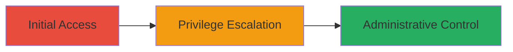

# Authentication Bypass via Direct Admin URL Access Leading to Full Administrative Privileges

Multi-stage attack chain demonstrating a complete attack workflow.

## Chain Metrics Dashboard

| Metric | Value |
|--------|-------|
| Chain Status | Unverified |
| Total Steps | 1 |
| Execution Time | ~1 minute |
| Skill Level | Beginner |
| Complexity | Low |
| Impact Level | High |

## Attack Flow Visualization

## Prerequisites & Requirements

### Required Tools

- Web browser (e.g., Chrome, Firefox)

### Target Environment

- ASP.NET web application
- Exposed administration endpoint
- No prior authentication required

### Initial Access Requirements

- Network access to the target URL
- No credentials needed
- Direct HTTP/HTTPS connectivity

## Detailed Attack Procedures

### Step 1: Bypass Authentication and Gain Admin Access
procedure: [[procedures/Access-Administration-URL-for-Automatic-Sys-Admin-Login]]

**Objective**: Exploit improper access control to automatically log in as the system administrator without credentials, gaining full control over user management, file uploads, and data manipulation.

**Instructions**: Open a web browser and navigate directly to the administration URL, such as `https://target.com/Administration/Administration.aspx`. No login form or credentials are required; the application will automatically authenticate the session as the sys admin user.

**Expected Output**: The browser loads the administration dashboard, displaying options for user management, file uploads, permission changes, and data editing, with the logged-in user shown as the sys admin (e.g., '████████').

**Success Indicators**:
- No authentication prompt appears
- Admin dashboard is accessible
- User profile indicates sys admin privileges

## Attack Chain Summary

### Key Achievements

1. Unauthorized access to administrative functions
2. Ability to add/delete users and modify permissions
3. Potential for data integrity compromise through file uploads and injections

## Technique & Tactic Coverage

### MITRE ATT&CK Techniques

- [[Exploit Public-Facing Application]]

### MITRE ATT&CK Tactics

- [[Initial Access]]

---
*Last updated: 2023-10-01T12:00:00Z*
