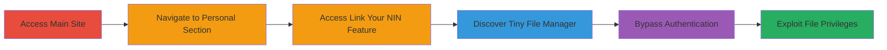

# Authentication Bypass via Exposed Tiny File Manager with Default Credentials

Multi-stage attack chain demonstrating a complete attack workflow via web navigation to an exposed file manager.

## Chain Metrics Dashboard

| Metric | Value |
|--------|-------|
| Chain Status | Unverified |
| Total Steps | 5 |
| Execution Time | ~5 minutes |
| Skill Level | Beginner |
| Complexity | Low |
| Impact Level | High |

## Attack Flow Visualization

## Prerequisites & Requirements

### Required Tools

- Web browser (e.g., Chrome, Firefox)

### Target Environment

- Web platform
- Exposed PHP-based file manager (Tiny File Manager)
- No specific ports or services required beyond HTTP/HTTPS

### Initial Access Requirements

- Public internet access to the target site
- No prior credentials needed
- Knowledge of site structure (e.g., MTN main site)

## Detailed Attack Procedures

### Step 1: Access Main Site and Navigate to Personal Section
procedure: [[procedures/Access-Main-Site-and-Navigate-to-Personal-Section]]

**Objective**: Gain initial entry to the target application and locate the personal section for further navigation.

**Instructions**: Open a web browser and visit the main site (█████). Click on the 'personal' link to initiate redirection.

**Expected Output**: Redirection to the personal site (██████████).

**Success Indicators**:
- Successful redirection to personal section
- No access restrictions encountered

### Step 2: Access Link Your NIN Feature
procedure: [[procedures/Access-Link-Your-NIN-Feature]]

**Objective**: Explore the redirected site to identify features that may expose administrative interfaces.

**Instructions**: On the redirected site (██████████), navigate to the 'link your NIN' section.

**Expected Output**: Access to the 'link your NIN' page or feature.

**Success Indicators**:
- Page loads without errors
- Feature is publicly accessible

### Step 3: Discover Tiny File Manager Instance
procedure: [[procedures/Discover-Tiny-File-Manager-Instance]]

**Objective**: Identify the presence of an exposed file management tool during site exploration.

**Instructions**: While browsing the 'link your NIN' section, inspect URLs, directories, or linked resources to locate the Tiny File Manager interface.

**Expected Output**: URL or path revealing the Tiny File Manager login page.

**Success Indicators**:
- File manager interface detected
- Login prompt visible

### Step 4: Bypass Authentication with Default Credentials
procedure: [[procedures/Bypass-Authentication-with-Default-Credentials]]

**Objective**: Gain unauthorized access to the file manager using unchanged default login details.

**Instructions**: Enter the default credentials 'user' as username and '12345' as password (or redacted variant ████/████) into the login form.

**Expected Output**: Successful authentication and dashboard access.

**Success Indicators**:
- Login succeeds without custom credentials
- Admin panel loads

### Step 5: Exploit File Manager Privileges
procedure: [[procedures/Exploit-File-Manager-Privileges]]

**Objective**: Leverage full administrative privileges to manipulate the file system.

**Instructions**: Once logged in, use the interface to browse, upload, modify, or delete files as needed.

**Expected Output**: Ability to perform file operations on the server.

**Success Indicators**:
- Files can be uploaded/downloaded
- Sensitive data accessible or modifiable

## Attack Chain Summary

### Key Achievements

1. Discovered exposed Tiny File Manager via site navigation
2. Bypassed authentication with default credentials
3. Gained full file system control, enabling data compromise

## Technique & Tactic Coverage

### MITRE ATT&CK Techniques

- [[Default Accounts]]

### MITRE ATT&CK Tactics

- [[Initial Access]]

---
*Last updated: 2023-10-01T12:00:00Z*
