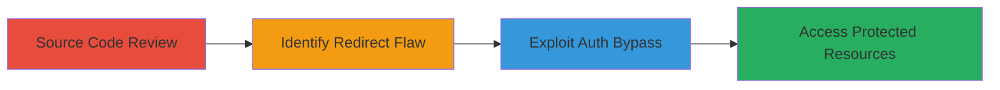

---
tags:
  - auth-bypass
  - php
  - redirect-misconfig
  - shopify
type: attack_chain
tools: []
tactics:
  - '[[Initial Access]]'
verified: false
platforms:
  - Web
  - PHP
submitted: true
complexity: medium
created_at: '2023-10-01T00:00:00Z'
procedures:
  - '[[procedures/Review-Source-Code-for-Authentication-Checks]]'
  - '[[procedures/Identify-Redirect-Handling-Vulnerability]]'
  - '[[procedures/Demonstrate-Authentication-Bypass-via-Browser]]'
step_count: 3
techniques:
  - '[[Exploit Public-Facing Application]]'
  - '[[Valid Accounts]]'
updated_at: '2025-12-14T17:32:02.018Z'
description: >-
  Multi-stage attack chain exploiting a PHP header redirect misconfiguration in
  Shopify's API to bypass authentication and access protected resources.
skill_level: intermediate
impact_level: high
id: a7950bd5-b2b9-4005-91b8-6050903384a1
validated: true
mitre_tactics:
  - '[[Initial Access]]'
mitre_techniques:
  - '[[Exploit Public-Facing Application]]'
  - '[[Valid Accounts]]'
---
# Authentication Bypass via Incomplete PHP Header Redirect in Shopify API

Multi-stage attack chain demonstrating a complete attack workflow for bypassing authentication in Shopify's PHP API due to a misconfigured header redirect without script termination.

## Chain Metrics Dashboard

| Metric | Value |
|--------|-------|
| Chain Status | Unverified |
| Total Steps | 3 |
| Execution Time | ~5 minutes |
| Skill Level | Intermediate |
| Complexity | Medium |
| Impact Level | High |

## Attack Flow Visualization

## Prerequisites & Requirements

### Required Tools

- Web browser (e.g., Chrome, Firefox)
- Access to GitHub repository

### Target Environment

- Web platform with PHP backend
- Exposed API endpoints (e.g., Shopify PHP API)
- No special ports required; standard HTTP/HTTPS

### Initial Access Requirements

- Public access to source code (e.g., GitHub)
- Network access to the target web application
- No prior credentials needed due to bypass

## Detailed Attack Procedures

### Step 1: Source Code Review
procedure: [[procedures/Review-Source-Code-for-Authentication-Checks]]

**Objective**: Examine the target application's source code to identify authentication mechanisms and potential weaknesses.

**Instructions**: Navigate to the GitHub repository and inspect the index.php file for session checks.

**Expected Output**: Identification of the authentication logic in index.php.

**Success Indicators**:
- Authentication check code located (e.g., session variable verification)
- Redirect statement noted without termination

### Step 2: Identify Redirect Handling Vulnerability
procedure: [[procedures/Identify-Redirect-Handling-Vulnerability]]

**Objective**: Analyze the redirect implementation to confirm the lack of script termination, enabling bypass.

**Instructions**: Review the header redirect code and test its behavior in a PHP environment to verify continuation of execution.

**Expected Output**: Confirmation that the script does not exit after the redirect header.

**Success Indicators**:
- No exit() or die() after header('Location: ...')
- Page content renders despite redirect attempt

### Step 3: Demonstrate Authentication Bypass
procedure: [[procedures/Demonstrate-Authentication-Bypass-via-Browser]]

**Objective**: Exploit the vulnerability by accessing protected pages without valid sessions, leading to unauthorized access and potential information disclosure.

**Instructions**: Open a browser and navigate to the protected endpoint (e.g., index.php) without authentication; observe that the redirect is ignored and content loads.

**Expected Output**: Full page content, including potential path disclosure, without login prompt enforcement.

**Success Indicators**:
- Access to protected API pages without session
- Sensitive information or paths exposed in response

## Attack Chain Summary

### Key Achievements

1. Discovered authentication flaw through static code analysis
2. Confirmed redirect misconfiguration allowing script continuation
3. Achieved unauthorized access to Shopify PHP API resources

## Technique & Tactic Coverage

### MITRE ATT&CK Techniques

- [[Exploit Public-Facing Application]] Exploit Public-Facing Application
- [[Valid Accounts]] Valid Accounts

### MITRE ATT&CK Tactics

- [[Initial Access]] Initial Access

---

*Last updated: 2023-10-01T00:00:00Z*
