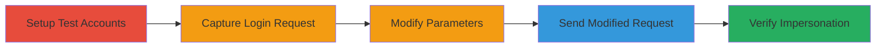

# Authentication Bypass via Login Parameter Manipulation for Account Takeover

Multi-stage attack chain demonstrating a complete workflow for bypassing authentication in a web application login endpoint. The vulnerability stems from the backend overly trusting user-submitted parameters without proper validation, allowing attackers to impersonate any user by changing the email and setting a 'gateway' parameter to true. This leads to full account takeover, enabling mass enumeration, deletions, modifications, and data leaks affecting up to 100,000 accounts.

## Chain Metrics Dashboard

| Metric | Value |
|--------|-------|
| Chain Status | Unverified |
| Total Steps | 5 |
| Execution Time | ~5 minutes |
| Skill Level | Intermediate |
| Complexity | Medium |
| Impact Level | High |

## Attack Flow Visualization

## Prerequisites & Requirements

### Required Tools

- [[tools/Burp-Suite]]

### Target Environment

- Web application with vulnerable login endpoint (e.g., POST /app/login)
- No specific ports required beyond standard HTTPS (443)
- Tech stack includes nginx as reverse proxy

### Initial Access Requirements

- Valid network access to the target application (e.g., https://████████)
- No prior credentials needed for the bypass itself, but test accounts for setup
- Burp Suite configured as a proxy to intercept traffic

## Detailed Attack Procedures

### Step 1: Setup Test Environment
procedure: [[procedures/Register-Test-Accounts-for-Attacker-and-Victim]]

**Objective**: Create attacker and victim accounts to simulate the impersonation scenario.

**Instructions**: Register two accounts on the target application, one for the attacker and one for the intended victim.

**Expected Output**: Confirmation of account creation with emails like attacker@example.com and victim@example.com.

**Success Indicators**:
- Attacker account registered successfully
- Victim account registered successfully

### Step 2: Capture Legitimate Login Request
procedure: [[procedures/Intercept-Legitimate-Login-Request-with-Burp-Suite]]

**Objective**: Intercept a normal login request to understand the request structure.

**Instructions**: Configure Burp Suite to proxy traffic, navigate to the login page, and submit credentials for the attacker account. Capture the POST request to /app/login.

**Expected Output**: Intercepted HTTP POST request with JSON body containing 'userEmail' and 'gateway' parameters.

**Success Indicators**:
- Request captured in Burp Suite Proxy or Repeater
- Request includes attacker's email and gateway set to false

### Step 3: Modify Request Parameters
procedure: [[procedures/Modify-Login-Request-Parameters-to-Bypass-Authentication]]

**Objective**: Alter the email to the victim's and set gateway to true to bypass checks.

**Instructions**: In Burp Suite, change the 'userEmail' parameter to the victim's email and update 'gateway' value to true in the 'updates' array of the JSON body.

**Expected Output**: Modified request ready for forwarding, with victim's email and gateway: true.

**Success Indicators**:
- Parameters updated without syntax errors in JSON
- Request body reflects changes (e.g., {"updates":[{"param":"userEmail","value":"victim@example.com"},{"param":"gateway","value":true}]})

### Step 4: Send Modified Request
procedure: [[procedures/Send-Modified-Login-Request-for-Account-Impersonation]]

**Objective**: Submit the tampered request to achieve authentication as the victim.

**Instructions**: Forward the modified request from Burp Suite to the server.

**Expected Output**: 200 OK response with victim's account details.

**Success Indicators**:
- Server accepts request without credential validation
- Response includes victim's user ID, name, and type

### Step 5: Verify Successful Impersonation
procedure: [[procedures/Verify-Successful-Authentication-as-Victim]]

**Objective**: Confirm full access to the victim's account.

**Instructions**: Inspect the response and perform actions like viewing profile or changing settings to validate takeover.

**Expected Output**: Access to victim's dashboard or API endpoints without password.

**Success Indicators**:
- Logged in as victim
- Ability to enumerate, delete, or modify accounts at scale

## Attack Chain Summary

### Key Achievements

1. Bypassed authentication without knowing passwords
2. Achieved complete account takeover for any user
3. Enabled mass exploitation affecting up to 100,000 accounts with data leaks and modifications

## Technique & Tactic Coverage

### MITRE ATT&CK Techniques

- [[Valid Accounts]]

### MITRE ATT&CK Tactics

- [[Initial Access]]

---
*Last updated: 2023-10-01T00:00:00Z*
