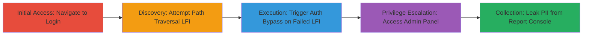

# Authentication Bypass via Path Traversal in BMC Remedy AR System Leading to Admin Takeover and PII Leakage

Multi-stage attack chain demonstrating exploitation of improper input validation in the x-urlpath parameter to bypass authentication in BMC Remedy AR System, a web-based ITSM platform used by the U.S. Department of Defense. The attack begins with a failed Local File Inclusion (LFI) attempt via path traversal, which unexpectedly grants full admin access post-login, enabling unauthorized viewing and potential modification of the ticket database containing sensitive Personally Identifiable Information (PII) such as DoD IDs, emails, and names. This leads to risks of mass user data compromise, ticket alterations, user info changes, and permission escalations.

## Chain Metrics Dashboard

| Metric | Value |
|--------|-------|
| Chain Status | Unverified |
| Total Steps | 5 |
| Execution Time | ~5 minutes |
| Skill Level | Intermediate |
| Complexity | Medium |
| Impact Level | High |

## Attack Flow Visualization

## Prerequisites & Requirements

### Required Tools

- Web browser (e.g., Firefox or Chrome with developer tools for URL manipulation)

### Target Environment

- BMC Remedy AR System web application (e.g., DoD ITSM portal)
- Accessible via HTTPS on standard web ports (443)
- No prior credentials required due to bypass

### Initial Access Requirements

- Direct network access to the target web application
- Ability to interact with login forms and manipulate URL parameters
- No authentication needed upfront

## Detailed Attack Procedures

### Step 1: Navigate to Initial Login Page
procedure: [[procedures/Navigate-to-Login-Page]]

**Objective**: Access the target application's login interface to set up the exploitation vector.

**Instructions**: Open a web browser and navigate to the login URL of the BMC Remedy AR System, which includes parameters like x-app=itsm and x-urlpath pointing to the login JSP page. For example, construct the URL as: https://[redacted]?x-app=itsm&x-urlpath=/arsys/shared/login.jsp&x-redir=%2Farsys%2Fforms%2Fedgelb-itsm-ar%2FRKM%253AKnowledgeArticleManager%2FDisplay%2BView%2F%3Feid%3DKBA000000024701%26cacheid%3Ddf8e1567. This loads the standard login form.

**Expected Output**: The login page renders, displaying fields for username and password, with a redirect parameter set.

**Success Indicators**:
- Login form is visible and interactive
- No immediate errors or redirects

### Step 2: Modify URL for Path Traversal LFI Attempt
procedure: [[procedures/Attempt-Path-Traversal-LFI]]

**Objective**: Inject path traversal sequences into the x-urlpath parameter to attempt reading sensitive files like /passwd, probing for LFI vulnerabilities.

**Instructions**: Alter the x-urlpath parameter in the URL to include directory traversal payloads, such as ../../../../../../../../passwd, resulting in: https://[redacted]?x-app=itsm&x-urlpath=../../../../../../../../passwd. Submit or load this modified URL to trigger the file read attempt.

**Expected Output**: The application attempts to access the traversed path but fails to display file contents (LFI does not succeed), often resulting in a 404 or generic error page.

**Success Indicators**:
- URL modification is accepted without server rejection
- Error indicates failed file access but no security block

### Step 3: Trigger Authentication Bypass After Failed LFI
procedure: [[procedures/Trigger-Authentication-Bypass]]

**Objective**: Leverage the failed LFI traversal to disrupt normal authentication flows, bypassing login checks upon form submission.

**Instructions**: After the LFI attempt fails and the error page loads, return to or refresh the login form and click the login button without entering valid credentials. The improper handling of the traversal in x-urlpath causes the application to skip authentication validation.

**Expected Output**: The user is redirected to the application dashboard without requiring successful login, granting unauthorized session.

**Success Indicators**:
- Access granted post-failed LFI without credentials
- No authentication error prompts

### Step 4: Gain Full Admin Panel Access
procedure: [[procedures/Access-Admin-Panel]]

**Objective**: Confirm and utilize the bypassed authentication to enter the admin interface for elevated operations.

**Instructions**: Once logged in via the bypass, navigate directly to admin sections. The session now has full admin privileges, allowing access to management consoles and forms.

**Expected Output**: Admin dashboard loads, displaying options for user management, ticket editing, and permission controls.

**Success Indicators**:
- Admin menus and tools are accessible
- Ability to view restricted forms and data

### Step 5: Leak PII from Report Console
procedure: [[procedures/Leak-PII-from-Report-Console]]

**Objective**: Extract sensitive data from the ticket database, including PII, to achieve data compromise.

**Instructions**: From the admin panel, go to Applications > Quick Links > AR System Report Console. Select a report querying the ticket database and click 'Run' in the bottom left to execute and view results.

**Expected Output**: Report displays ticket details with PII such as DoD IDs, emails, names, and other user information.

**Success Indicators**:
- PII visible in report output
- No access restrictions on database queries

## Attack Chain Summary

### Key Achievements

1. Bypassed authentication using path traversal in x-urlpath, gaining admin access without credentials.
2. Accessed and viewed the entire DoD ITSM ticket database, leaking PII for thousands of users.
3. Enabled potential for data modification, user account takeovers, and permission escalations.

## Technique & Tactic Coverage

### MITRE ATT&CK Techniques

- [[Exploit Public-Facing Application]] Exploit Public-Facing Application
- [[File and Directory Discovery]] File and Directory Discovery

### MITRE ATT&CK Tactics

- [[Initial Access]] Initial Access

---

*Last updated: 2024-10-01T00:00:00Z*
