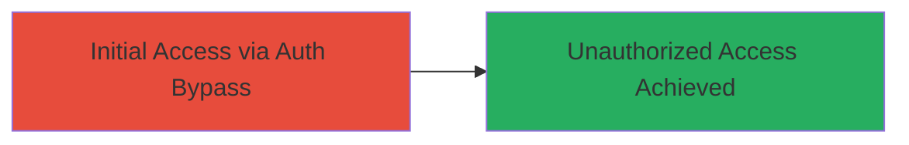

# Authentication Bypass via Vulnerable WordPress Social Login Plugin (CVE-2023-2982)

Multi-stage attack chain demonstrating a complete attack workflow.

## Chain Metrics Dashboard

| Metric | Value |
|--------|-------|
| Chain Status | Unverified |
| Total Steps | 1 |
| Execution Time | ~5 minutes |
| Skill Level | Intermediate |
| Complexity | Low |
| Impact Level | High |

## Attack Flow Visualization

## Prerequisites & Requirements

### Required Tools

- Web browser or proxy tool like Burp Suite

### Target Environment

- WordPress platform with vulnerable plugin version
- Web access to the target blog

### Initial Access Requirements

- Public network access to the target site
- No prior credentials needed due to bypass

## Detailed Attack Procedures

### Step 1: Exploit Authentication Bypass
procedure: [[procedures/Exploit-Auth-Bypass-in-WordPress-Social-Login-Plugin]]

**Objective**: Bypass authentication using an alternate path in the social login plugin to gain unauthorized access to user accounts on the WordPress site.

**Instructions**: Identify the vulnerable WordPress Social Login and Register plugin on the target site (cs.money blog). Use a web browser or intercepting proxy to manipulate the authentication flow, exploiting the alternate channel that skips proper validation in older plugin versions.

**Expected Output**: Successful login without valid credentials, granting access to the dashboard or user profile.

**Success Indicators**:
- Access to restricted areas without providing social login credentials
- Session established as an authenticated user

## Attack Chain Summary

### Key Achievements

1. Bypassed authentication controls in the social login plugin
2. Gained unauthorized access to the WordPress blog
3. Demonstrated potential for further privilege escalation or data access

## Technique & Tactic Coverage

### MITRE ATT&CK Techniques

- [[Valid Accounts]]

### MITRE ATT&CK Tactics

- [[Initial Access]]

---
*Last updated: 2023-12-02T00:00:00Z*
