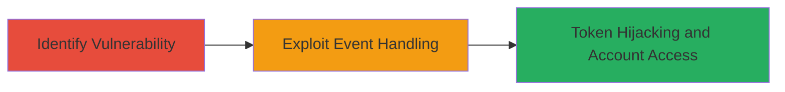

# Authentication Token Hijacking via Improper Event Handling in VK.com Android App Marusya Widgets

Multi-stage attack chain demonstrating exploitation of improper event handling in the VK.com Android application, specifically involving Marusya widgets, to hijack user authentication tokens and gain unauthorized access to accounts.

## Chain Metrics Dashboard

| Metric | Value |
|--------|-------|
| Chain Status | Unverified |
| Total Steps | 2 |
| Execution Time | ~5 minutes |
| Skill Level | Intermediate |
| Complexity | Medium |
| Impact Level | High |

## Attack Flow Visualization

## Prerequisites & Requirements

### Required Tools

- Android device or emulator with VK.com app installed
- Debugging tools like ADB (Android Debug Bridge)
- App analysis tools (e.g., Frida for dynamic analysis)

### Target Environment

- VK.com Android application (version vulnerable to the issue)
- Marusya widgets enabled in the app
- Network access to VK.com services

### Initial Access Requirements

- Installed VK.com app on a test device
- User account for authentication (for demonstration)
- No elevated privileges required, but app debugging permissions needed

## Detailed Attack Procedures

### Step 1: Identify Improper Event Handling
procedure: [[procedures/Identify-Improper-Event-Handling-in-Marusy-Widgets]]

**Objective**: Analyze the VK.com Android app to identify flaws in event processing for Marusya widgets that fail to validate authentication token interactions.

**Instructions**: Install the VK.com app on an Android device or emulator. Use debugging tools to monitor event flows during widget interactions. Examine the app's code or network traffic to spot unvalidated events that expose token handling.

**Expected Output**: Identification of vulnerable event processing logic in Marusya widgets, such as lack of token validation during widget callbacks.

**Success Indicators**:
- Detection of insecure event handlers in app analysis
- Confirmation of token exposure risk in widget interactions

### Step 2: Exploit Event Handling to Hijack Tokens
procedure: [[procedures/Exploit-Event-Handling-to-Hijack-Auth-Tokens]]

**Objective**: Leverage the identified vulnerability to intercept and steal authentication tokens via manipulated Marusya widget events, enabling unauthorized access.

**Instructions**: Trigger Marusya widget interactions in the app while monitoring events. Manipulate event payloads to bypass validation and extract tokens. Replay the stolen token in a separate session to access the victim's account.

**Expected Output**: Successful extraction of authentication token, demonstrated by unauthorized login or data access using the token.

**Success Indicators**:
- Token captured and validated
- Unauthorized account access achieved

## Attack Chain Summary

### Key Achievements

1. Uncovered improper event validation in Marusya widgets
2. Hijacked authentication tokens for account takeover
3. Highlighted privacy risks in Android app authentication flows

## Technique & Tactic Coverage

### MITRE ATT&CK Techniques

- [[Steal Web Session Cookie]] Steal Web Session Cookie
- [[Unsecured Credentials]] Unsecured Credentials

### MITRE ATT&CK Tactics

- [[Initial Access]] Initial Access
- [[Credential Access]] Credential Access

---
*Last updated: 2023-10-01T00:00:00Z*
